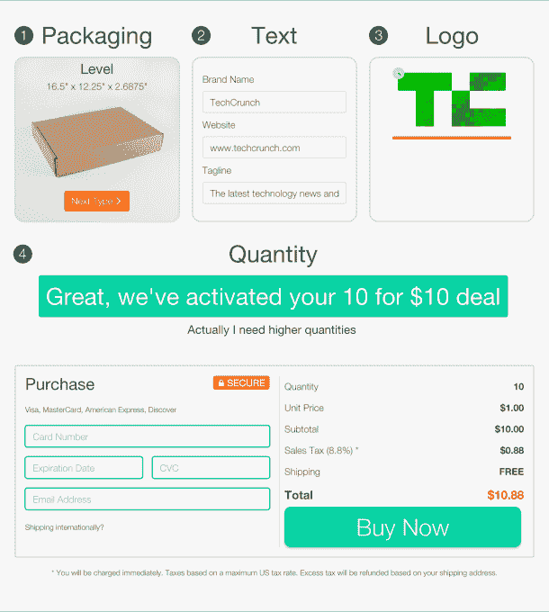
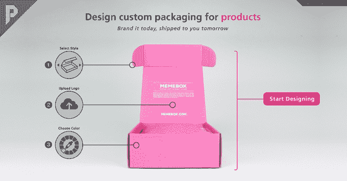

# YC 支持的 Pakible 让企业设计、运输包装变得非常简单 

> 原文：<https://web.archive.org/web/https://techcrunch.com/2015/03/16/yc-backed-pakible-makes-it-dead-simple-for-businesses-to-design-ship-packaging/>

随着电子商务创业公司进入眼镜、美容、剃须、月度订阅产品等领域，将会有大量对盒子和包装的需求。

这就是 Y Combinator 支持的初创公司 [Pakible](https://web.archive.org/web/20230216193049/https://pakible.com/) 希望进入的领域。

该公司由曾经为 iPhone 和 iPad 维修初创公司 iCracked 工作的[尼克·卡森](https://web.archive.org/web/20230216193049/https://www.linkedin.com/in/nrcarson)和[菲利普·阿克萨尔](https://web.archive.org/web/20230216193049/https://www.linkedin.com/profile/view?id=51058482&authType=name&authToken=sOM4&trk=prof-sb-browse_map-name)创建，让任何企业都可以轻松制作原型，然后运送产品包装。

在 iCracked 的时候，他们为手机和平板电脑回购项目做过包装，但发现这很乏味。

“这要花很长时间，”卡森说，他说他不得不在几十家供应商之间打电话来找合适的。“这是一场噩梦，我们想让它变得简单。我们假设会有一个包装的 Teespring。但是没有，所以我们决定继续做下去。”

Akhzar 补充说，“制造商有这个高度优化的过程与机器生产的包装。一旦一切准备就绪，他们就以每小时数千台的速度快速生产。他们在这方面投入了大量资金。但感觉他们中没有一个人在业务的客户方面进行投资，以真正帮助人们轻松起步。这部分充斥着传真和电子邮件。”

卡森和阿克萨尔相互发誓，他们将用六个月的时间来修补这个想法。在此期间，他们获得了价值 4 万美元的意向书。现在，他们有 80 万台的订单。

如果你去他们的网站，有一些在线的盒子设计软件，你可以选择包装的类型和大小，然后用你自己的文字，标志和颜色定制它。

他们以 1 美元一盒的价格开始向客户推销，他们强调这比你在不同的包装制造商那里试运行的价格要低得多。这种定价的目的是为了吸引更多的顾客。该公司可以处理的数量小到 10 个，大到 10，000 个单位。

他们也有一个内部设计师来满足更复杂的需求，比如定制标志设计。他们与多种包装制造商建立了伙伴关系，这些制造商拥有不同的技术，专门从事平版印刷或摄影。

“我们的部分愿景是让人们有多种选择。现在，我们的产品专注于早期创业者，比如推出自己品牌的公司，”卡森说，他指的是 Pakible 的 LaunchPAK 系列。“但我们将提升服务水平。”

在他们最初的客户中有[级相框](https://web.archive.org/web/20230216193049/https://www.levelframes.com/)，它可以按需定制尺寸的相框。然后是另一个由 Y Combinator 支持的非营利组织 [Sirum](https://web.archive.org/web/20230216193049/http://www.sirum.org/) ，它重新分配未使用的处方药。

