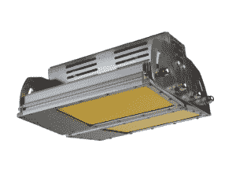

# YC 支持的创见为室内农民推出一款超高效 LED 灯

> 原文：<https://web.archive.org/web/https://techcrunch.com/2015/07/08/yc-backed-transcend-launches-an-extra-efficient-led-light-for-indoor-farmers/>

Y Combinator 最新一批创业公司之一的创见照明公司(Transcend Lighting)今天推出 beta 版，将节能 LED 灯带给各地的室内农民。

创始人 Brian Bennett 是一名训练有素的光学工程师，在他的父亲要求他为纽约北部的家庭农场制造一些 LED 灯后，他发明了第一个 Transcend 原型。

当他设计的灯获得成功时，贝内特参加了哥伦比亚大学的商业计划竞赛，赢得了一些钱来继续发展这个想法，并被 Y Combinator 的 2015 年春季班录取。

“一般来说，今天的农场使用高压钠灯，这种灯和路灯一样，”Bennett 说。"这很有效，植物在它们下面生长得相当好，但是它浪费了很多能量."

Trancend 的灯泡不同于典型的 LED 灯，因为它们只使用蓝光。该公司开发了一种波长转换系统，使用磷将蓝色光子(最有效的光子类型)转换为任何其他颜色的光子。

“荧光粉已经存在很长时间了，”Bennett 说。“我们与众不同的是，我们有专门针对光合作用的磷光体，而其他人都根据人类来调整它们，因此光线看起来更亮。”

Bennett 告诉我，通过改用 Transcend 的灯，农民已经能够减少高达 70%的能源消耗。

信不信由你，大麻不是唯一一种室内或水培种植的植物。Bennett 说，Transcend 的早期客户中有一半是大麻种植者，但另一半包括主要在东海岸种植莴苣、番茄和胡椒的农民。

根据 Bennett 的说法，随着干旱条件的恶化，室内农业为一些农民提供了一个有吸引力的替代方案，因为水培种植只需要室外农业消耗的 10%的水。

通过在室内种植，农民可以控制整个环境——温度、湿度、二氧化碳水平、光照水平——这意味着他们可以全年种植。

“室内种植业务是一项价值数十亿美元的业务，目前正在蓬勃发展，尤其是随着技术的发展，”布莱恩说。“有了像我们这样能显著降低能耗的产品，在室内种植会更有利可图。”

Transcend 的灯具售价为 999 美元，该公司预计每盏灯在一年内都会节省能源。

Bennett 说，他们已经收到了商业农业运营的订单，并计划在今年夏天晚些时候为第二种照明产品推出 Indiegogo 活动。