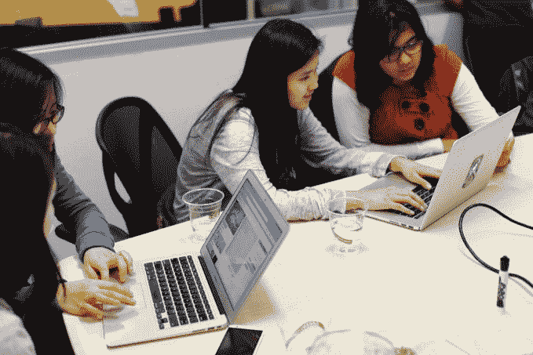
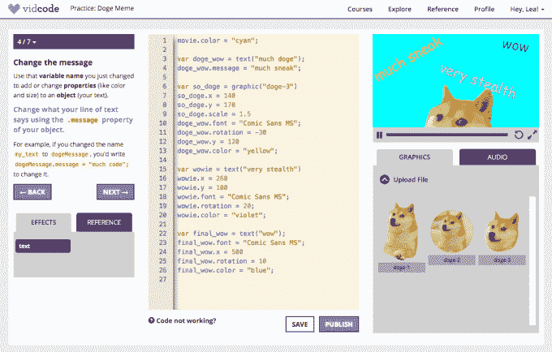

# YC 支持的 Vidcode 筹集了 150 万美元，用于教青少年使用 Snapchat 过滤器、视频、模因等进行编码 

> 原文：<https://web.archive.org/web/https://techcrunch.com/2017/07/07/yc-backed-vidcode-raises-1-5m-to-teach-teens-to-code-using-snapchat-filters-videos-memes-and-more/>

Y Combinator 支持的初创公司 Vidcode 专注于教青少年如何编程，已经为其课程筹集了 150 万美元的种子资金。虽然现在有许多学习编码的平台，但 Vidcode 的方法是通过将编码与青少年现有的兴趣联系起来，让他们对编码更感兴趣——像 Snapchat 过滤器和 memes 一样[——同时也允许年轻的程序员在他们的项目中利用他们自己的照片、视频和音频。](https://web.archive.org/web/20221208043046/https://beta.techcrunch.com/2016/08/15/vidcode-and-snapchat-team-up-on-a-contest-aimed-at-getting-teens-to-code/)

例如，去年夏天，[公司发起了 Snapchat geofilter 大赛](https://web.archive.org/web/20221208043046/https://beta.techcrunch.com/2016/08/15/vidcode-and-snapchat-team-up-on-a-contest-aimed-at-getting-teens-to-code/)，有超过 10，000 个参赛作品，获胜者将他们的过滤器上传到流行的社交应用程序。(当然，这是在 Snapchat 允许你在它的应用程序中创建自己的地理过滤器之前—[这是它上周刚刚推出的功能](https://web.archive.org/web/20221208043046/https://beta.techcrunch.com/2017/06/28/snapchat-now-lets-you-create-custom-geofilters-right-in-the-app/)。)

如今，学生通过他们最喜欢的爱好之一——视频制作，使用 Vidcode 学习基本到高级的面向对象编程，而其他面向项目的课程则教他们如何使用真正的编程语言创建迷因、视频过滤器、交互式游戏、gif 等。

课程本身包括各种课程，旨在成为视觉块编码之后的下一步。例如，Vidcode 提供从初级到高级 JavaScript、设计思维和交互设计的课程。他们现在也在钻研新技术，比如 VR，Vidcode 可以成为迈向 Unity 之类的东西的第一步。

这家初创公司由亚历山德拉·迪拉克里斯(Alexandra Diracles)、利安德拉·特耶多尔(Leandra Tejedor)和梅丽莎·哈尔丰(Melissa Halfon)共同创立，在纽约和旧金山都有一个小型团队。

它最初开始于 2014 年的一个创业周末黑客马拉松项目，该团队在那里首次会面。赢得比赛后，他们继续工作，意识到需要这样的解决方案。

该团队指出，到 2020 年，计算机编程领域将有 100 万个工作岗位没有完成，但是[只有 40%的学校教授这项技能](https://web.archive.org/web/20221208043046/http://www.gallup.com/poll/196511/computer-science-classes-teach-programming-coding.aspx)。

去年，Vidcode 的解决方案已被 1000 所学校采用；它现在已经发展到 25，000 多所学校，主要在纽约、加利福尼亚、阿肯色州、堪萨斯州和得克萨斯州。

在阿肯色州，这个解决方案正被用来帮助学校满足一个新的州要求，即每个 7、8 年级学生在中学期间必须有一个 4 到 5 周的编码模块。

学校中最受欢迎的用例之一是 Vidcode 的一套为期五周的跨学科课程。

“在全国范围内，由于各州、政府、家长和教师都在努力让每个学生都获得代码，他们实际上是在寻找一种跨学科的方法，”Diracles 解释道。“因为没有足够的老师，而且在很多年内都不会有足够的老师。”Vidcode 的解决方案允许教师将为期五周的课程嵌入他们的课堂。

除了直接向学校销售软件、课程和培训，Vidcode 还通过战略合作伙伴关系进行销售，最近与教育技术公司 BrainPOP 合作，brain pop 现在既是合作伙伴也是投资者。

Vidcode 在 BrainPOP 上推出了一个创造性的编码工具，该工具使用 Vidcode 的底层技术和编码风格，允许孩子们在 BrainPOP 提供的数百个主题中进行任何类型的项目。

该团队表示，Vidcode 的更大目标是到 2020 年通过学校和战略合作伙伴关系覆盖 2000 万学生，其中 1000 万是女孩。

Vidcode 去年夏天参与了 Y Combinator，现在已经从包括 ZhenFund、Rethink Education、NYU 风险投资公司、CoVenture、Evan Korth Syndicate、Stephano Kim 和 Cherry Ventures 在内的投资者那里筹集了 150 万美元的种子资金。

该团队计划利用新的资金，通过更多的战略合作伙伴关系来进一步扩大销售，并将课程扩展到 AR 和 VR 等更新的领域，以及更高级的编码。