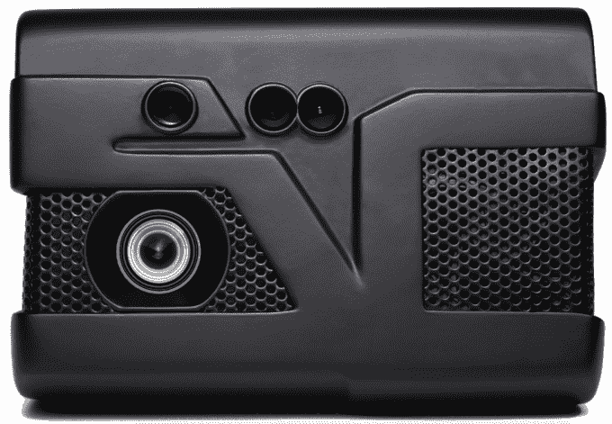
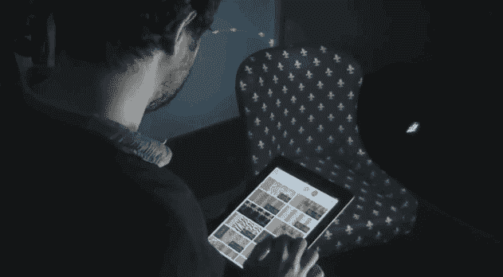

# YC 支持的 VizeraLabs 将新材料投射到任何表面

> 原文：<https://web.archive.org/web/https://techcrunch.com/2014/08/13/yc-backed-vizeralabs-projects-new-materials-onto-any-surface/>

# YC 支持的 VizeraLabs 将新材料投射到任何表面

假设你在一家家具店看到一个你喜欢的沙发。客厅里有你需要的座位数量，靠垫也很舒适。但是商店里的型号是棉的，那是不行的——你想要皮革的。你怎么知道你是否喜欢它本人的样子？

在安装了 Y Combinator 支持的 [VizeraLabs 的](https://web.archive.org/web/20230315095316/http://www.vizeralabs.com/)投影仪的商店里，你可以立即在展示模型上看到每种面料的样子。该公司希望用一台配有微软 Kinect 硬件的投影仪和几乎任何可以连接到其不断增长的材料和图案数据库的设备来取代家具零售商的书籍，你可以在这些书籍中浏览各种不同的面料:

至少，是这样的想法。这与能够感受材料的体验不太一样，虽然从几英尺外看起来很好，但你不会在近处被愚弄。

在 VizeraLabs 对未来的展望中，大多数家具店变得更加紧凑。展厅将使用更少的模型，以这样的方式安排它们，顾客可以通过他们的投影系统看到任何椅子或沙发上的任何材料。你找到你想要的型号，找到你喜欢的外观，然后提交你的订单进行在线交付。

最终，该公司希望其 3D 地图技术不仅仅用于家具。有相当多的使用案例，在你购买之前看看某样东西是什么样子可能会有帮助，比如墙纸和油漆。除此之外，该公司还设想将他们的技术用于通过将 CAD 渲染投影到 3D 打印模型上来查看正在开发的产品的外观，并在展厅中以不同的颜色展示汽车，以及其他用途。

我很好奇 VizeraLabs 的扩张进展如何。该公司已经在土耳其(创业公司成立的地方)和海湾地区的零售点安排了试用，并将很快开始向其早期用户收取订阅费。它还不愿意公开讨论其定价的细节，但据 VizeraLabs 的联合创始人 Ali evik 称，它的目标是使零售商能够以每月大约三次的额外销售来证明其费用的合理性。

你可以在下面的视频中看到 VizeraLabs 的投影仪: