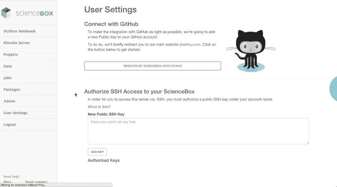

# YC 支持的 Yhat 让数据科学团队领先 

> 原文：<https://web.archive.org/web/https://techcrunch.com/2015/02/07/yc-backed-yhat-gives-data-science-teams-a-head-start/>

Yhat 的创始人 Greg Lamp 和 Austin Ogilvie 正与一个数据科学家团队在一家成功的小型企业贷款创业公司 [OnDeck](https://web.archive.org/web/20230216193357/https://www.ondeck.com/) 工作，他们注意到了一个问题。

数据科学团队提出了一些很酷的想法，但工程师们无法像生产应用程序那样快地实现这些应用程序，原因很简单，他们缺少工具。就在那时，他们决定创造一种工具，让这些团队在提高工作效率方面领先一步。该工具将成为 Yhat(发音为 Y-hat)。

“我们有一个数据科学家团队，他们创造了新的、创造性的业务和决策方式，而工程技术跟不上数据科学团队的步伐。奥斯汀和我都在这中间工作，看着 OnDeck 的所有这些分析工作只是坐在架子上，”Lamp 解释说。

他们认为，必须有更好的方式从数据科学家产生的工作中获取价值。

在他们的第一个产品 ScienceOps 中，他们开发了一个解决方案，旨在帮助数据科学家团队在流行的数据科学工具(如 R 和 Python)上构建项目时更有效地工作和交流，但他们并没有就此止步。

他们还想让工程师和业务部门更轻松地实施这些应用程序，通过更快地将想法付诸实施来让公司受益。

他们的日常工作持续了很短时间，但到了 2013 年 6 月，他们看到了如此大的需求，他们离开了 OnDeck，开始了 Yhat。有一段时间，他们在布鲁克林的公寓里工作，但他们很快就住不下了，搬进了他们今天在曼哈顿的共用办公室。

该公司在 2013 年获得了 100 万美元的种子资金，开始认真发展，目前他们是 [Y Combinator](https://web.archive.org/web/20230216193357/https://www.ycombinator.com/) 2015 年冬季班的一部分。

Lamp 说，因为他们已经有些名气，甚至有了客户，他们不确定 YC 能给他们什么。正如 Lamp 所说，“我们比两个有想法的黑客走得更远。”他们担心这实际上可能会分散注意力，但“到目前为止感觉很棒，”他说。

两位创始人都认为这是一次很棒的经历，他们的团队成员帮助他们集中精力。他们现在意识到，作为新的企业家，他们不知道自己不知道什么，YC 已经帮助他们处理了任何新公司都必须处理的一系列问题，并客观地过滤这些问题，以专注于最重要的问题。

对于 Yhat 这样一家有着更成熟想法的初创公司来说，这意味着要致力于销售和前景，而一些较新的初创公司可能会更专注于营销和产品开发。

Yhat 在 2014 年 6 月宣布了第二个产品 ScienceBox，这是一个成本更低的替代产品，旨在帮助数据科学家创建和共享数据科学项目。

Yhat 有一些有趣的客户，包括一个 NASCAR 车队，该车队正在试图找出如何使用数据通过增强维修站决策来获得优势。

Lamp 解释说:“纳斯卡团队将[大数据]视为他们知道应该做的新事物，但他们知道自己落后了，并希望走在曲线的前面。

另一个客户是康泰纳仕。你可能不会想到一家出版公司是数据驱动的，但它有一个由 40 或 50 名数据科学家组成的团队，分布在几个不同的地点，所以 Yhat 的产品对他们很有吸引力。

Lamp 表示，ScienceBox 也很受数据科学教授的欢迎，作为一种提供参与者上课所需的所有工具的方式。在使用科学盒子之前，需要做大量的工作来让所有的学生都准备好。

Lamp 和 Ogilvie 承认，虽然他们已经能够建立一个不错的客户群，但他们可能有点领先于许多公司只有两名或更少数据科学家的行业。他们承认他们考虑过这个问题，但是到目前为止，对于一个只有 7 名员工的公司来说，他们有很多业务。

此外，Lamp 表示，数据科学是增长最快的本科专业，学术界的许多人都离开了工业界，去从事利润丰厚的工作。我们可能还没有进入数据科学的黄金时代，但这个时机似乎非常好。

如果你想知道公司的名字——我知道我是——它实际上来自德国的统计测量，有点像数据科学家的玩笑。

Lamp 说，他们的目标受众理解这个笑话，即使他们必须向其他所有人解释。