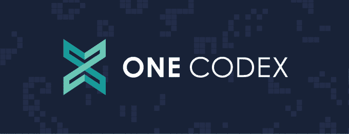

# YC 演示日会议 4:产品狩猎，Aptible，一个法典，牵引，呼喊，和其他！

> 原文：<https://web.archive.org/web/https://techcrunch.com/2014/08/19/yc-demo-day-session-4/>

你兴奋吗？今年的 Y Combinator 夏季演示日终于要结束了，它将我们带到了一天中最精彩的部分——也就是包括啤酒和网络的部分。对于这里的一些初创公司来说，从投资者那里获得支票(或者至少是投资的握手协议)。

但在我们结束之前，这里是作为该计划一部分的最后一组公司，这将是今天的最后一场会议:

**[产品搜索](https://web.archive.org/web/20221209002636/http://www.producthunt.com/) :** 产品搜索是一个每日列出的新兴科技产品清单，作为一种寻找新的创业公司的方式，吸引了硅谷投资者的关注。在过去 30 天里，该网站产品的访问量达到 180 万次，吸引了 53 000 名电子邮件订户。“尽管 ProductHunt 看起来像一个链接列表，但它的特别之处在于它背后有一个投资者、创始人和创作者的社区，”首席执行官瑞安·胡佛说。“他们对产品很感兴趣。创始人回答问题，并直接与我们的社区互动。”他说，读者围绕 ProductHunt 创建了 Chrome 扩展和移动应用。但是这个愿景不仅仅是科技。胡佛希望将 ProductHunt 扩展到书籍、电影等领域。“ProductHunt 将是一个创作者可以直接与观众互动的地方。”

**:**这家公司帮助为医疗保健构建云产品的公司遵守 HIPAA 关于隐私和安全的规定。Aptible 的云平台可以托管整个产品，提供服务器、安全性、加密和备份，而“合规引擎”会生成文档和审计日志，以证明政策、风险分析、事件响应、应用安全性和培训在 HIPAA 下是足够的。自 8 月 5 日推出以来，Aptible 已经获得了 30 万美元的合同收入，从长远来看，该公司计划将其部署和合规平台扩展到其他监管广泛的行业。

**[One Codex](https://web.archive.org/web/20221209002636/https://onecodex.com/):**One Codex 为搜索建立了一个基因组平台，据报道，它索引的数据比其他任何一家都多 10 倍。它正在进军生物技术、人类健康和食品安全领域。联合创始人 Nik Krumm 表示，它将成为病原体鉴定的搜索平台，特别是在食品安全领域。这意味着在餐馆里检测像大肠杆菌这样的东西。Beta 用户包括 FDA、CDC、NIH 和其他许多机构。One Codex 目前处于公开测试阶段，可以搜索超过 30，000 种细菌、病毒和真菌，并在几分钟内识别数据集，而其他搜索需要几天时间。它计划将这项技术推向临床传染病市场。

**[牵引力](https://web.archive.org/web/20221209002636/http://gotraction.com/) :** 牵引力是数字营销人员的按需市场。该公司已经拥有 310 万美元的运营成本，并以每月 80%的速度增长，为许多大型财富 100 强品牌提供服务，包括迪士尼和联合利华等品牌。该公司使用软件来削减代理中间人，并用软件和自动化来取代他们。它认为现有客户的潜在潜在市场价值为 150 亿美元，如果它瞄准中小型企业市场，这一数字将高达 570 亿美元。

**:**号称“处理两个人之间交换的整个生命周期”，Shout 已经建立了一个实时分类服务，让个人与其他人交换任何东西。本质上是一种现代化的 Craigslist 与 TaskRabbit 的结合，增加了实时的扭曲，Shout 有一个用于 iOS 和 Android 的应用程序，让人们提供一些销售的东西，或者请求一项任务，如送货。每一声呼喊都链接到一个地点、一个价格和一个简短的描述——并且可以选择是免费的还是特定价格的。目前，Shout 仅在纽约市可用。[点击此处阅读更多关于呼的内容](https://web.archive.org/web/20221209002636/https://beta.techcrunch.com/2014/08/13/shout-is-a-real-time-classifieds-app-that-lets-you-exchange-anything/)。

泽纳明斯 : 泽纳明斯有点像网上的 GNC。但它不仅仅是一个订购补品的地方。它提供了一个平台，计划让专业人士品牌自己的健康和美容维生素和产品。例如，金·卡戴珊可以拥有自己的维生素品牌，或者蒂姆·费里斯可以拥有四小时身体订阅补充品递送服务。这家初创公司附有一本指南和每日推荐剂量。它还需要关于你、血液、遗传和其他东西的数据来建议如何改善你的健康。

**[BlockSpring](https://web.archive.org/web/20221209002636/https://www.blockspring.com/) :** 如果说 Github 是一个允许任何人分享代码的平台，那么 BlockSpring 就是让任何人运行代码。现在，用户无需与 BlockSpring 交互，就可以访问 block spring，获取代码并构建界面，而无需网络开发人员在运行代码之前搭建服务器并构建 API。

**[南丁格尔](https://web.archive.org/web/20221209002636/http://www.nightingaleapp.com/) :** 南丁格尔在云端提供追踪行为治疗电子病历的手机 app。该应用程序帮助行为治疗师跟踪和报告与他们的客户的会议相关的数据。美国目前约有 150 万自闭症患者接受行为治疗，这是一个 24 亿美元的市场，南丁格尔希望进入该市场。该公司于 8 周前推出，并表示迄今为止看到了 40%的周环比增长，增长的主要推动力是治疗师之间的口碑相传。客户可以创建日历，管理数据收集方式，并实时监控行为。也可用于言语和职业治疗。

Women.com:从脸书到 Pinterest，互联网上许多最受欢迎的社交网站的大部分活动都是由女性负责的。但据 Women.com 的联合创始人苏珊·约翰逊称，大多数女性在网上分享她们的大部分想法和观点时仍有所保留——她说，可能是因为她们在男女同校的环境中感觉不太舒服。因此，她创建了 Women.com，一个类似 Reddit 的仅面向女性的在线讨论中心(男性在使用该服务时被过滤掉)，希望欢迎女性自由分享她们尚未在现有社交平台上分享的所有事情——从恋爱建议、饮食和健康建议，到政治信仰等等。目前 women 的[只被邀请](https://web.archive.org/web/20221209002636/https://beta.techcrunch.com/2014/08/18/women-com/)，并且在未来计划使用脸书连接来确保它的社区只有女性。

Sarah Buhr、Kim-Mai Cutler、Ryan Lawler、Kyle Russell 和 Colleen Taylor 对本文均有报道贡献。

[照片来源](https://web.archive.org/web/20221209002636/https://twitter.com/davemcclure/status/501853165507989504) : [戴夫·麦克卢尔](https://web.archive.org/web/20221209002636/https://twitter.com/davemcclure)