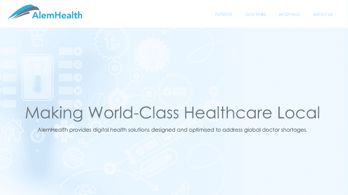
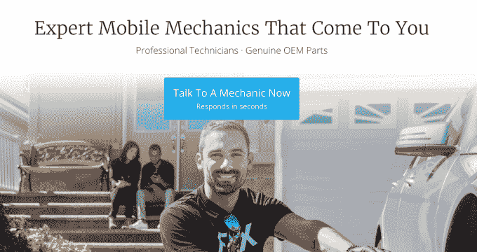

# 在 Y Combinator W17 演示日第一天推出的 52 家创业公司

> 原文：<https://web.archive.org/web/https://techcrunch.com/2017/03/20/yc-demo-day-winter-2017/>

今天是 Y Combinator 的第 24 个演示日，加速器向投资者展示了它的新公司。国际、人工智能和硬件产品是 52 家公司在第一天推出的新兴主题。你可以[查看我们从今天](https://web.archive.org/web/20230328200935/https://techcrunch.com/gallery/y-combinator/)开始挑选的 7 大创业公司。

“国际巡演似乎很有效，”YC 大学校长萨姆·奥尔特曼(Sam Altman)说，他帮助在全球各地举办创业学校活动，以促进加速器的招募。“我们访问的国家比以往任何时候都多，”奥尔特曼指出。“这些都是来自世界各地的优秀公司。如果我们成功了，那么这些公司就不会因为签证问题而想来美国创造就业机会，这对美国来说是多大的损失。”

由于椅子变小了，山景城计算机历史博物馆的展示室比以往任何时候都挤满了投资者。YC 对员工和公司多样性的强调显而易见。“你总是需要从漏斗顶端开始，与挑选创业公司的合伙人一起，”奥尔特曼说，暗指大多数风险投资公司缺乏女性和有色人种。

以下是在今天的 Y Combinator 年冬季演示第一天推出的所有 52 家创业公司的概述。另外，请务必阅读我们从第一天开始挑选的[前 7 名创业公司](https://web.archive.org/web/20230328200935/https://techcrunch.com/gallery/y-combinator/)，以及[所有在演示日 2](https://web.archive.org/web/20230328200935/https://techcrunch.com/2017/03/21/demo-day-y-combinator/) 推出的公司，以及我们的[第二天最佳公司](https://web.archive.org/web/20230328200935/https://techcrunch.com/gallery/yc-startups/)。

—

**[aon 3D](https://web.archive.org/web/20230328200935/https://aon3d.com/)–工业制造用 3D 打印机**

注射成型塑料制造不够灵活或快速，但开始使用 3D 打印机太贵了。AON3D 制造了一台价值 15，000 美元的 3D 打印机，每磅材料的成本仅为 15 美元，据说可以超过使用更昂贵材料的 15 万美元的传统 3D 打印机。它使用 Peek，一种据说像金属一样坚固的革命性塑料。它已经售出了 33 台打印机，收入为 45 万美元，利润率为 60%。通过使 3D 打印便宜 10 倍，AON3D 可以从原型打印机进入 300 亿美元的全规模工业制造市场。

**[万神殿](https://web.archive.org/web/20230328200935/https://www.pantheonvr.com/)——让任何人做一个 VR 游戏**

在虚拟现实中构建游戏通常需要很长时间，所以很难测试出不同的游戏机制来找到一些有趣的东西来玩。Pantheon 已经建立了一个虚拟现实游戏创建工具，你可以拉进形状，按照你的喜好雕刻它们，添加纹理来创建一个虚拟现实世界，然后在简单的游戏机制中拖放。然后，创作者可以立即将他们的 VR 游戏发布到 Pantheon 平台，该平台希望通过收集大量的游戏成为休闲 VR 游戏的中心。仅在第一周，就有 10 款游戏在 Pantheon 上制作，因为它的目标是发展成为虚拟现实游戏的 YouTube，有抱负的游戏制造商可以在这里分享他们的产品。

**[原产地](https://web.archive.org/web/20230328200935/http://eatorigin.com/)–Keurig for smoothies**

Origin 为办公室建造了一个售货亭，让员工从冰箱里购买预包装的豆荚，并在 30 秒内悄悄地将它们制成新鲜的果汁冰沙。它的工作原理类似于 Keurig 咖啡机，但 Origin 认为它可以使用它的思慕雪制作机作为特洛伊木马，在美国的 188，000 个办公室内销售更多的食物和其他物品。目前，它在 2.99 美元的豆荚上赚取了 56%的利润，在 7 周内收回了 kiosk 成本，现在每月的经常性收入为 3 万美元，每周增长 50%。果汁制造商初创公司 Juicero 对其昂贵的机器和果汁订阅的需求放缓。但如果果汁味道合适，Origin 的办公室商业模式和更便宜的豆荚可能会有不同的命运。

**[Vinsight](https://web.archive.org/web/20230328200935/https://www.vinsight.co/)——农作物产量预测**

Vinsight 使用机器学习、卫星图像、天气数据和历史报告来提供作物产量预测，它说这比替代产品好 4 倍。美国农民每年会因为糟糕的预测损失 110 亿美元，这种预测通常是凭直觉、笔和纸做出的。他们高估并签订协议，以生产他们无法完成的数量，抹去利润。Vinsight 每英亩收费 25 美元，已经被世界上最大的酿酒厂和第二大杏仁生产商使用。它瞄准了一个 40 亿美元的市场，为农民提供实际的见解，为他们赚钱，而不仅仅是更多的农作物照片。

[在 TechCrunch 上阅读更多关于 Vinsight 的信息](https://web.archive.org/web/20230328200935/https://techcrunch.com/2017/03/20/vinsight-gives-grape-and-almond-growers-a-high-tech-crystal-ball/)

**[Neema](https://web.archive.org/web/20230328200935/http://getneema.com/)——无银行账户者的银行**

Neema 允许任何人通过电话立即兑现支票，向海外的家人汇款，并拥有借记卡。这家初创公司让没有银行账户的人很容易加入现代经济，同时避免了与支票兑现店、西联汇款和透支相关的高额费用。Neema 在后端与银行、汇款服务和借记卡提供商合作，以提供安全性和可靠性，同时为 7000 万银行服务不足的美国人和更多海外人士构建专门设计的前端。Neema 已经从以色列的 1，000 名用户那里获得了 3 万美元的收入，现在正在美国推出，以破坏掠夺穷人的贪婪金融服务。

**[王菡](https://web.archive.org/web/20230328200935/https://hivyapp.com/)——办公管理商务平台**

王菡开发的软件可以让员工直接向办公室经理提交他们想为办公室购买的东西，比如食物或设备。这些经理可以批准采购，这些采购由已经直接集成到王菡平台的 45 家供应商即时完成。现在，Slack、Eventbrite、Gigster 和更多的公司都在使用王菡快速为员工提供 Lacroix 饮料、笔记本充电器或家具。王菡向办公室和供应商收取每月软件订阅费，并从每笔购买中抽取佣金。美国每年有 4000 亿美元的办公室管理费用市场，如果王菡能让经理们相信这让他们的生活更轻松，它就能管理大量的支出。

[在 TechCrunch 上阅读更多关于王菡的信息](https://web.archive.org/web/20230328200935/https://techcrunch.com/2017/02/16/hivy-is-an-office-management-service-to-manage-all-those-startup-perks/)

**[WaystoCap](https://web.archive.org/web/20230328200935/https://waystocap.com/)——非洲的阿里巴巴**

WaystoCap 为整个非洲的大宗消费品运输提供了一个 B2B 市场。该领域的大多数现有尝试看起来更像没有集成支付的 Craigslist，缺乏信任和保险吓跑了买家和供应商。WaystoCap 与金融家合作，让买家为他们的购买提供资金，Coface 为供应商提供保险。这使得 WaystoCap 对所有交易收取 3.5%的佣金。它现在在 10 个国家销售，已经开始盈利，平均每单利润为 1000 美元。在阿里巴巴开始占据主导地位之前，中国一度似乎是 B2B 航运的风险市场，现在 WaystoCap 希望实现非洲贸易标准化。

[在 TechCrunch 上阅读更多关于 WaystoCap 的信息](https://web.archive.org/web/20230328200935/https://techcrunch.com/2017/02/07/waystocap-africa-cross-border/)

****

**[Clover Intelligence](https://web.archive.org/web/20230328200935/https://cloverintelligence.com/)—销售语音分析**

70%的客户互动是通过电话进行的，但他们没有电子邮件那样的优化技术，而电子邮件只占 10%。Clover 分析语音交互，为销售策略提供建议。它可以识别销售人员是否只谈论产品特性而不是好处，或者他们是否在错误的时间推动销售。该软件为经理们节省了时间，他们通常要花半周的时间监听电话，填写记分卡，并在没有数据的情况下提出建议。Clover 说，一个公开交易的客户看到其销售电话转化率增加了 300%。它每个席位每月收费 150 美元，next Clover 希望进入客户服务、成功和合规领域，因为它试图拥有企业语音空间。

**[康培](https://web.archive.org/web/20230328200935/http://www.kangpe.com/)——非洲健康保险**

昂贵的、不必要的医院就诊抬高了保险费，超出了大多数非洲人的购买力。Kangpe 将远程医疗与健康保险相结合，使保费更便宜。当有人认为自己生病时，他们通过 Kangpe 应用程序或短信与医生联系；70%的人最终不需要去医院，而 30%的人则由康贝的保险支付。它已经有了远程医疗应用程序，现在正在建立当地诊所网络。由于大型保险公司不能足够快地适应远程医疗，Kangpe 可以在非洲每年 50 亿美元的健康保险市场赢得许多业务，并认为它可以通过降低价格将市场规模扩大到 200 亿美元。

[在 TechCrunch 上阅读更多关于 Kangpe 的信息](https://web.archive.org/web/20230328200935/https://techcrunch.com/2017/03/17/kangpe-is-a-mobile-service-connecting-africa-to-healthcare/)

**[Dost 教育](https://web.archive.org/web/20230328200935/http://www.dosteducation.com/)——让识字变得负担得起**

印度有 1.5 亿文盲妇女，她们在教育子女方面有困难，导致了文盲循环。Dost 是一个非营利组织，人们注册后可以定期收到语音电话，指导他们如何教孩子准备上幼儿园。这些课程很容易让父母理解并与孩子分享，这使得用户的家庭教育增加了 3 倍，孩子的成绩提高了 0.5 级。Dost 每月花费家长 0.91 美元，所以这个非营利组织是可持续的，现在它只需要启动资金来建立它的课程计划和基础设施。

**[剑桥生物增强系统](https://web.archive.org/web/20230328200935/http://www.cbas.global/)——人体仿生学即插即用标准**

CBAS 想成为人体的 USB 接口。这家初创公司开发了一种低成本的植入物，可以将任何仿生设备(如假肢)连接到身体的任何部位，并让患者控制他们的假肢。它还创造了第一个从猪腿上收集数据的直播神经植入物。CBAS 希望成为所有仿生植入物的标准。仅仅对于截肢者来说，这可能是一个每年 90 亿美元的市场，现在已经有 10 家公司转而采用 CBAS 标准。

[**症状**](https://web.archive.org/web/20230328200935/https://www.getsymple.com/)–B2B 支付的 Venmo】

在美国，每年有 50 亿张支票用于企业对企业的支付。Symple 允许用户对发票拍照，将其数字化，并通过应用程序直接支付。它现在有 219 家公司，并且随着企业强迫他们的供应商注册，它还在病毒式增长。Symple 每张发票收费 4 美元，但为了促进增长，前六个月的费用是浮动的。如果它能说服公司放弃纸张，转而使用更快、更方便的数字替代方式，它可能会成为一项价值 200 亿美元的业务。

[在 TechCrunch 上阅读更多关于 Symple 的信息](https://web.archive.org/web/20230328200935/https://techcrunch.com/2017/02/07/symple-wants-to-be-venmo-for-business-payments/)

**[考拉](https://web.archive.org/web/20230328200935/http://www.cowlar.com/)–奶牛的 Fitbit**

这比听起来要聪明得多。Cowlar 为奶牛制作了一种特殊的项圈，可以跟踪它们的体温、活动和其他数据，并提供给农民。它可以从步态的变化中识别出蹄部感染的奶牛，或者识别出奶牛怀孕了，最终会产奶。Cowlar 每头奶牛的价格为 69 美元，每月订阅 3 美元，并提供一个太阳能“奶牛路由器”，从项圈上收集数据。该平台上已经有 600 头奶牛，还有 7200 头在等待名单上，并提醒农民注意 103 头患病的奶牛。它已经有机会在奶牛上建立 110 亿美元的业务，并可能在下一步进入 3 倍大的肉牛市场。虽然这个想法可能看起来很荒谬，但奶牛是经济的一个重要组成部分，关于它们的更多数据会带来更多的收入。

**[Wifi.com.ng](https://web.archive.org/web/20230328200935/http://wifi.com.ng/)–非洲 ISP**

非洲有 1.2 亿中产阶级拥有智能手机，但只有 1200 万人家里有宽带。Wifi.com.ng 建造了太阳能 Wi-Fi 发射塔，可以以移动数据价格的 30%支持 1500 个家庭的 Wi-Fi。它现在有 35 座塔，并在 7 个月内收回了基础设施成本。这家初创公司每年有 120 万美元的经常性收入，并且每月增长 25%。非洲没有运行传统电缆的电话线或道路，卫星和无人机在人口密集的城市也无法工作，所以 Wi-Fi 是答案。Wifi.com.ng 相信它能成为非洲的康卡斯特。

**[游戏场](https://web.archive.org/web/20230328200935/https://playment.io/)——企业的土耳其机器人**

当电子商务企业需要给产品贴标签时，他们要么使用可扩展但质量较低的 Mechanical Turk，要么使用像埃森哲这样精确但昂贵且不可扩展的外包系统。Playment 利用移动应用程序让任务工人在旅途中进行标记，同时使用软件来确保准确性，检查工人的资格并过滤垃圾邮件。印度的 Flipkart 解雇了埃森哲，把这份 30 万美元的合同给了 Playment。它声称由于其移动办公桌，速度提高了 10 倍，成本降低了 50 %,并正在攻击价值 1500 亿美元的外包市场。

[在 TechCrunch 上阅读更多关于 Playment 的信息](https://web.archive.org/web/20230328200935/https://techcrunch.com/2017/02/13/playment-gives-companies-on-demand-workers-to-analyze-data-using-mobile-devices/)

**[有效的利他主义](https://web.archive.org/web/20230328200935/https://app.effectivealtruism.org/funds)——为你找到最好的慈善机构**

不做深入研究就向慈善机构捐款就像烧钱，因为一项研究表明，75%的社会项目没有影响或有负面影响。有效的利他主义为你跑腿。你注册，选择你关心的事业，比如全球贫困或动物治疗，然后捐款。有效的利他主义会找到在这些领域有最积极影响的慈善机构，并为你免费捐赠。它相信，每一美元可以给捐赠者带来 400 倍的影响，并可以通过增强人们对钱做好事的信心来推动慈善捐赠。

**[Quiki](https://web.archive.org/web/20230328200935/https://www.askquiki.com/)–智能常见问题**

72%的客户更喜欢在线自助服务客户支持，而不是直接与公司交谈，自助常见问题解答比呼叫中心支持人员便宜得多。Quiki 使用自然语言处理将以前支持代表和客户之间的对话转化为每个人都可以访问的常见问题。它已经将 2000 个问题转化为常见问题，可以提高公司的搜索引擎优化和客户满意度。

**[英诺科技](https://web.archive.org/web/20230328200935/https://www.sinoviatech.com/)——下一代有机发光二极管显示器**

有机发光二极管显示器比标准的 LCD 显示器好，但也更贵。思诺维亚希望成为世界各地所有小型显示器的供应商，将这些有机发光二极管显示器的价格降低 80%。这种显示器也像纸一样薄，可弯曲且透明。例如，您可以使用思诺威的专利技术获得一个缠绕在车把上的自行车显示屏。创始团队是一群斯坦福大学的博士，他们计划以可穿戴设备为切入点，颠覆价值超过 150 亿美元的有机发光二极管显示器市场。该公司已经有了来自 Fuseproject、Astro 和 Striive 的 LOIs。

**[buy power](https://web.archive.org/web/20230328200935/https://www.buypower.ng/)——非洲的账单支付平台**

非洲正在快速采用新技术，BuyPower 的目标是成为非洲的 PayPal，从尼日利亚开始。PayPal 有易贝，但 BuyPower 有联合创始人 Asehinde Oladipo 所说的更好的东西，减少了排队支付账单的人。这家初创公司在其运营的城市中已经拥有 40%的市场份额，每月有 15 万付费用户。它从每个用户身上收取 4%的费用，并声称这是有利可图的，占据了该国 140 亿美元的电力市场。它计划很快推出点对点支付服务，然后“成为贝宝，就是这样！”

**[ServX](https://web.archive.org/web/20230328200935/http://servx.in/)——印度汽车维修优步**

这一次，YC 似乎是新兴市场的主题，ServX 是这一趋势的一部分，它是一家按需汽车维修初创公司。正如联合创始人阿坎什·辛哈(Akansh Sinha)对这项服务的解释，你通过应用程序预订汽车维修，司机会把它拿起来，带到商店修理。但 ServX 还旨在通过经过审查的维修店提供市场信任，这些维修店将为你的汽车提供高质量的零件，你只需在对工作满意时付款。这位创始人表示，ServX 是盈利的，自 2106 年 1 月推出以来，每月增长 52%。据 Sinha 称，仅在上周，ServX 就完成了 6000 次维修，使其收入达到 330 万美元。

**[明确遗传基因](https://web.archive.org/web/20230328200935/http://cleargenetics.com/)——自动化遗传咨询**

现在有超过 45，000 种基因测试，但大多数都需要处方和与基因咨询师的预约。问题是缺少基因咨询师。Clear Genetics 认为，它可能已经创造了遗传咨询的未来，告诉你需要哪些测试，并给你结果，而无需先与顾问聊天。遗传学软件收集患者数据，将其与其他数据配对，并告诉他们结果。如果一个病人需要进一步的咨询来解决更严重的问题，它会把他们介绍给咨询师。到目前为止，该公司在以色列经营怀孕遗传咨询，占市场的 60%，但遗传咨询在美国是一个 50 亿美元的市场，在世界各地甚至更大。

**——加拿大的“兴致”**

员工福利管理是一项大业务，米虎的目标是在云中向加拿大人免费提供这些类型的人力资源服务。米虎说，加拿大是完全开放的，许多中小企业向供应商支付了 1000 多万美元。它已经用 30 万澳元增加了 650 家公司。

**[BloomAPI](https://web.archive.org/web/20230328200935/https://www.bloomapi.com/)—健康记录的自动存取**

只要想想将所有医疗记录收集在一个数字位置的痛苦，就会让任何与我们当前的医疗保健系统打交道的人感到头疼，但 BloomAPI 旨在通过数字化医疗记录来简化医疗记录发布流程，从而解决这个巨大的问题。现在，每次您要求医疗记录转移请求时，它可能需要多达 12 个电话，并花费保险公司 17 美元。保险公司购买 BloomAPI，然后安装该软件。该软件对医生免费，在其存在的 8 个月里，已经获得了 100 万份记录，号称是最大的医疗记录库之一。Bloom 表示，取代传真后，它将能够通过拥有数据来拥有市场。

**[move butter](https://web.archive.org/web/20230328200935/https://www.movebutter.com/)——杂货蓝色围裙**

一个自称“在线交易者 Joes”的人听起来可能只是另一个 Instacart 或某种版本的 FarmFreshtoYou。正如 Movebutter 的创始人所说，利润率非常低。但是 Movebutter 说它可以赚取 40%的利润。这是因为它卖的东西比你买的多，每周收入 32，000 美元。它还会把一周内你可能会经常购买的 20 种商品直接送到你家门口。它运往 40 个州，并声称现在是全国最大的杂货店。

**[沃兰斯-I](https://web.archive.org/web/20230328200935/http://www.volans-i.com/#about)–B2B 无人机交付**

亚马逊承诺通过亚马逊 PrimeAir 向消费者提供无人机服务，但你可能不需要通过无人机在你的后院安装牙刷。然而，企业确实需要快速交货，volans-i 的目标是通过无人机快速送货上门。例如，一家公司可能需要交付某个零件来跟上生产。Volans-i 驾驶无人机前往该公司，有效载荷高达 50 磅，行程 1000 英里，根据该公司数据，每位客户每年可运送 15000 次。Volans-i 的团队来自包括诺斯罗普·格鲁曼公司在内的强大行业背景，该公司认为它可以为许多业务类别节省时间和成本，包括高科技、航空、医疗、石油和天然气、汽车和制造业。

**[Apozy](https://web.archive.org/web/20230328200935/http://www.apozy.com/)——旨在阻止网络钓鱼和恶意软件的软件**

网络钓鱼和恶意软件是全球企业面临的最大问题，全球最大的风险投资公司之一最近遭到了攻击。这位创始人说，他知道如何攻击观众中的任何人，因为他是一名职业黑客。更多的恶意黑客使用外观相似的网站来欺骗你泄露密码。Apozy 是一个浏览器扩展，它可以检测到可疑的链接，并在网站是假的时发出警告。它还为 76000 家没有黑客解决方案的公司创建了世界上最大的零日攻击数据库。现在还为时尚早，但是到目前为止，已经有八家公司在过去的三周内采用了 Apozy。

**[帝喾](https://web.archive.org/web/20230328200935/https://kudi.ai/)——在非洲通过手机短信支付账单**

Venmo 和 PayPal 已经渗透到美国市场，但帝喾的目标是在非洲做同样的事情——但不是聊天。非洲有 9 亿部手机，人们几乎不安装新的应用程序，但 90%的支付发生在离线状态。这位创始人说，不是因为他们没有手机，而是因为大多数解决方案“很糟糕”。使用帝喾，人们发送一条信息，他们想把钱从一个地方转移到另一个地方，帝喾将处理这个请求。该公司于 2017 年 1 月成立，每周增长 70%。它还与尼日利亚最大的银行合作，仅在尼日利亚 120 亿美元的市场中就有超过 1000 万客户。当谈到银行和技术时，这个团队似乎也知道他们的东西，因为这是一群过去 5 年在欧洲和非洲工作的金融科技专家。

**[维护维护管理](https://web.archive.org/web/20230328200935/https://onupkeep.com/)——面向中小企业的维护软件**

维护旨在通过创建更简单的解决方案来让技术人员满意，包括简单的条形码扫描应用程序、可通过移动设备访问的任务管理和库存管理。为什么这很重要？创始人陈尚实说，在整个过程中，几个人把几个步骤写在纸上是一件非常痛苦的事情，这给可能的错误留下了很大的空间。然而，当技术人员在现场时，维护工作通过抓拍照片和做笔记来进行，消除了多次记录的需要。它的现金流是正的，有 300 多个付费客户，其中 95%是有机收入。该公司现在拥有超过 405，000 美元的 ARR，并以每月 20%的速度增长。

**[solu gen](https://web.archive.org/web/20230328200935/http://www.solugen.co/)——将植物糖分转化为过氧化氢**

如今科学家们已经接近炼金术，Solugen 就是一个很好的例子。这家初创公司以一种新的方式处理植物糖来制造过氧化氢，这是一种被许多行业使用的解决方案——甚至在 YC 演示日我们都坐过的椅子上。Solugen 表示，这一过程比市场上的任何其他产品都更清洁、更安全、更纯净。目前，过氧化氢成本很高，并且容易爆炸，导致危险的工作条件。然而，Solugen 的小规模试点项目成本仅为 7000 美元，降低了产品成本和运输成本。但是过氧化氢只是第一个切入点。Solugen 计划使用其更便宜的工艺生产更多的清洁技术产品，目前拥有 12 万美元的 ARR。

**[信用](https://web.archive.org/web/20230328200935/https://www.credy.in/)——印度的 P2P 贷款**

贷款对印度来说是一个新概念，Credy 打算利用生物识别技术来防范欺诈，从而占领这个市场。印度拥有 500 亿美元的巨大潜在贷款市场，到 2020 年将翻一番。据联合创始人普拉蒂什·甘地说，印度也“渴望信贷”。Credy 还支持实时信用评分，并提供无纸化零欺诈保护贷款。Credy 由两位拥有 15 年从业经验的前高盛副总裁创立，迄今已收到 350 份贷款申请。

**[market fox](https://web.archive.org/web/20230328200935/https://marketfox.io/)——营销自动化**

Marketfox 帮助营销人员通过网络推送和应用内获取用户，并打破营销孤岛，从而帮助优化移动和网站。它通过跨设备跟踪用户来做到这一点，而不仅仅是在你的笔记本电脑或手机上。这位创始人之前将他的业务出售给了 Freshdesk，Marketfox 目前周环比增长 18%，并声称迄今为止客户的 rev 增加了 30%。

**[。io](https://web.archive.org/web/20230328200935/https://scaphold.io/)–适用于所有云的一个 API**

需要一个通用的 API 吗？Scaphold.io 正在为您构建一个平台，以减少复杂的集成。维护集成是一个耗时且成本高昂的过程，但是 Scaphold.io 在幕后处理所有的维护工作，同时根据您的需求进行翻译。它使用 GraphQL 解决了这个问题，每月增长 30%，已经与国家地理和 Visa 等公司建立了合作伙伴关系，并“每天”处理超过 200 个平台的集成。

**[纯咖啡](https://web.archive.org/web/20230328200935/http://www.merecoffee.com/)——为您的中小型企业设计的咖啡机**

如果你像大多数商务人士一样，你的办公室里可能已经有一台咖啡机了。但是这位创始人不喜欢荚果咖啡，因为它“味道很差”，而且不环保。然而，Mere 承诺其冠军机器使用可堆肥单服务全豆咖啡的卓越体验。该公司承诺每周为您的企业带来最好的咖啡豆，并提供机器来创造手工酿造体验。它已经进行了付费测试，并在订阅服务上赚取了 50%的利润。它现在正在向湾区推广，并表示正在获得几家科技初创公司的支持。

**[Delee](https://web.archive.org/web/20230328200935/https://www.delee.live/)——循环肿瘤细胞的血液检测**

癌症是美国最大的杀手之一，Delee 的目标是用一种能够分离肿瘤细胞的血液测试设备来对抗“百病之王”。正在申请专利的设备旨在基于一种新的方法来个性化癌症治疗。创始团队来自斯坦福和罗切斯特理工学院，从事生物医学工程；这家初创公司已经在 15 名患者身上进行了成功的临床试验，为其中 13 名患者分离出了肿瘤细胞。Delee 的目标是与同领域的大公司竞争，比如 Grail，并占领 20 亿美元的市场。

**[热孜](https://web.archive.org/web/20230328200935/https://www.rentrezi.com/)—《开门出租》**

REZI 为业主提供了一种新的模式，以确保他们能够出租他们的租赁物业。它可以在几秒钟内为租户提供租赁服务，并提前向业主支付租金，从而降低他们面临的风险。整个事情是由一个叫做 Morpheus 的产品驱动的，这个产品对租户风险进行定价，对空置风险进行建模。在成立后的前七周，该公司已经完成了 12 笔交易，并收到了两份 3500 万美元的租赁债务条款清单。

**[Algoriz](https://web.archive.org/web/20230328200935/https://algoriz.com/)——将想法转化为自动交易算法的人工智能**

Algoriz 允许交易者将想法转化为交易算法，而无需雇佣程序员或等待数周的定制代码。这家公司允许交易员用英语标注自己的想法，并当场将其转化为代码。自今年 3 月推出以来，Algoriz 已经在这个平台上与 500 名专业交易员签约，他们正在落实自己的策略。它还收到了一份来自一家 2 亿美元对冲基金的使用其平台的意向书。

**[alem health](https://web.archive.org/web/20230328200935/https://www.alemhealth.com/)——使用机器学习**在一个盒子里培养一名放射学家

AlemHealth 正在构建一个平台，将更好地为新兴市场提供放射诊断。虽然在新兴市场有成千上万的 CTs 和 X 射线，但只有不到 20%是由放射学家阅读的。AlemHealth 希望通过机器学习来解决这个问题。通过连接尼日利亚的 CT 机，AlemHealth 正在收集数据，并将扫描结果发送给世界各地的放射学家。如今，每次扫描的费用都是 1 美元，而且它还要将扫描结果加到自己的数据库中。

**[Wifi Dabba](https://web.archive.org/web/20230328200935/http://wifidabba.com/)——打造印度最大的无线 ISP**

今天有 8 亿印度人被当地 ISP 忽视，因为他们的蜂窝数据或 ISP 数据计划太贵了。Wifi Dabba 试图通过在全国各地的茶叶店建立 Wi-Fi 热点网络来改变这种情况。该公司将硬连线线路引入这些商店，使它们能够向客户出售价格合理的 Wi-Fi 接入。WiFi Dabba 在网络上运行了四个月后，商店实现了收支平衡，该公司占了所有 Wi-Fi 销售额的 30%。Wifi Dabba 已经与当地监管机构 TRAI 合作进行更广泛的推广，它希望成为覆盖全国城市的默认 Wi-Fi 选项。

**[lit it](https://web.archive.org/web/20230328200935/https://lithit.com/)——射击运动的智能靶**

它将科技、射击和游戏融为一体。该公司的目标是美国的 2000 万目标射手，结合硬件和订阅软件业务。通过与射击场合作，该公司希望吸引用户购买其智能靶并订阅其在线射击游戏。

**[贸易](https://web.archive.org/web/20230328200935/http://www.tradeghana.co/)——建设非洲商品交易所**

贸易想要把中间商踢出非洲的商品交易。今天，这些中间商从那里的商品销售中抽取 50%到 70%的利润。通过创造一个市场，贸易连接了双方，只占总销售额的 6%。该公司的目标是启动五种商品，贸易估计西非是该公司潜在的 30 亿美元市场。

**[荡漾](https://web.archive.org/web/20230328200935/https://www.rippling.com/)–****更好的新员工入职方式**

每当雇佣一名新员工时，公司都会列出 100 到 200 件你需要做的事情来让他们运转起来。现在，人力资源部门只需要点击“雇佣”,其他事情都由 Rippling 来做。从给员工发工资到给他们发公司发的笔记本电脑，再到让他们注册电子邮件、Slack 和所有其他企业可能会用到的云服务，Rippling 都做得很好。

**[Fiix](https://web.archive.org/web/20230328200935/https://www.fiix.io/)——优步汽修**

Fiix 将特许汽车修理工送到客户家中，允许在 3 小时内进行维修。百分之八十的修理工作可以在顾客的车道上完成，但是机械师通常在商店工作，因为他们找不到自己的顾客。Fiix 通过将机械师与客户直接联系起来，将成本降低了 30 %,从而解决了这个问题。该公司的单位利润率为 38%，在过去一年里每月增长 41%。

**[代币公交](https://web.archive.org/web/20230328200935/http://www.tokentransit.com/)——手机 app 支付公交**

Token Transit 向公共交通机构出售其服务，允许乘客使用移动应用程序支付公交费用。人们每年在公共交通上花费 1500 亿美元，但很少有本地机构支持移动支付。该公司为代理机构提供了一种更便宜的方式，允许乘客付费，减少了这些代理机构需要维护的昂贵机器的需求。Token Transit 已经与八家公共交通机构签约，并在里诺运营，在那里它已经占所有门票销售的 7%，每月有超过 1000 名活跃乘客。

**[毫电池](https://web.archive.org/web/20230328200935/http://www.millibatt.com/)——可定制电池技术**

Millibatt 向消费电子制造商出售小型廉价定制电池。该公司推销的电池寿命是现有技术的 10 倍，工具成本是传统电池供应商的十分之一。该公司估计，未来几年将有 750 亿台新的消费电子设备需要电池，他们希望为这个市场提供服务。

**[Supr Daily](https://web.archive.org/web/20230328200935/http://www.suprdaily.com/)——印度每日送奶服务**

每天有超过 1 亿印度人获得新鲜牛奶，Supr Daily 希望成为覆盖所有人的送货服务。该公司经营着它所说的第一个农场到家庭的牛奶市场，取消了中间商以降低成本并提供更好的产品质量。该公司正以每月 40%的速度增长，其订阅服务的留存率为 98%。它认为牛奶市场是一个 130 亿美元的市场，但它希望以此为起点，进入印度 1150 亿美元的杂货市场。

**[Indee](https://web.archive.org/web/20230328200935/http://indeelabs.com/)——基因输送硬件**

Indee 提供了一种使用 CRISPR 编辑细胞基因组的新方法。目前编辑基因的方法包括使用病毒或电穿孔，但 Indee 使用微湍流来溶解细胞内的分子。它目前的目标是 15 亿美元的免疫治疗市场，但随着市场的改善，该市场将增长到 90 亿美元。

**[赖利](https://web.archive.org/web/20230328200935/https://getrileynow.com/)—领先资格即服务**

购买潜在客户的公司可以将 Riley 作为他们的第一联系点。它将在两分钟内响应所有呼入的线索，一周七天，一天 24 小时。这不仅提高了转换率，而且 Riley 还有助于为客户赢得销售线索，让他们知道最热门的销售线索是什么。赖利追求的第一个市场是房地产经纪人，他们每年花费 60 亿美元用于销售，但该公司也计划追求保险、汽车销售和抵押贷款市场。

**[取名](https://web.archive.org/web/20230328200935/https://www.innamed.com/)——联网家用验血装置**

在接受心力衰竭治疗后出院的患者中，有四分之一在未来 30 天内再次入院。InnaMed 通过帮助医生使用廉价的联网血液检测设备监测患者的健康状况来帮助降低这些比率。通过自动化和扩大医院的最佳实践，该公司希望追求 170 亿美元的市场。

**[第一手资料](https://web.archive.org/web/20230328200935/http://shopfirsthand.com/)——物美价廉的自助零售亭**

Firsthand 允许公司、咖啡馆和酒吧通过安装廉价的自助零售亭来利用他们的额外空间。每个信息亭的制作成本仅为 300 美元，但不到一个月就能收回成本。该公司正在采取与美国 700 万台自动售货机相同的方法，但销售产品的利润率是它的 10 倍。与此同时，Firsthand 捕捉零售客流量和人口统计数据，以确保正确的产品在正确的地方销售。

**[没有歉收季节](https://web.archive.org/web/20230328200935/http://www.noleanseason.org/)——减少饥饿的旅行补助**

无歉收季节是一个旨在解决季节性贫困的非营利组织。每年有几个月，贫穷的农民无法赚钱。没有一个歉收季节会给贫穷的农民一张去其他需要工人的地区的公共汽车票，让他们找到工作并产生 200 美元的收入，而不是挨饿。

**[DocTalk](https://web.archive.org/web/20230328200935/http://www.getdoctalk.com/)WhatsApp 面向印度医生和患者**

在印度，患者的问题不可能很快得到答复，因为那里的医生不想在没有报酬的情况下回答问题。DocTalk 为医生提供了一种通过回答这些问题来赚钱的方式，它占去了医生全部收入的 50%。该公司目前每个医生每月的收入为 720 美元，但收购这些医生的成本仅为 40 美元。

**[boxiouse](https://web.archive.org/web/20230328200935/https://boxouse.com/)——产品化出租屋**

Boxouse 正试图通过出租工厂建造的小型房屋给房主一种赚取额外收入的方式，他们可以将这些房屋放在自己的院子里。该公司安装这些小型客房，并与业主分享租金收入。设备在投入使用的第一年内是盈利的。

