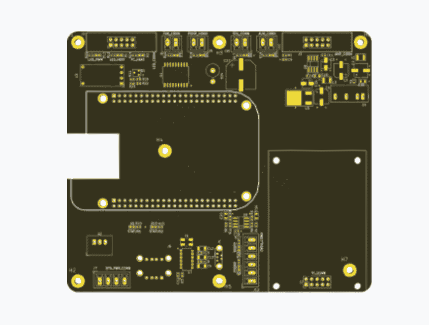

# YC 展示日 S18  第一天就吸引了我们眼球的 10 家初创公司

> 原文：<https://web.archive.org/web/https://techcrunch.com/2018/08/21/yc-summer-2018-demo-day-1-picks/>

从检测乳腺癌的新可穿戴设备到为肉类替代品行业创建工业供应链，Y Combinator 公司的最新一批产品展示了创业创新的广度，这些创新概括了 2018 年即将结束的日子。虽然整批 63 家公司令人印象深刻，但有几个特别引起了我们的注意。

所以，看看下面我们挑选的今年夏季上市的一些热门公司吧。

### 氧

将自由职业者从月复一月的繁荣与萧条的支付周期中解放出来， [【氧气】](https://web.archive.org/web/20230326160556/http://www.getoxygen.com/) 为那些可以几个月没有薪水的自由职业者提供流动资金贷款。该公司非常愿意与一群每年收入 1099 美元、被贷款拒之门外的借款人合作。Oxygen 提供统一收费的信贷和免费移动银行服务，同时使用机器学习来确定信用价值。事实上，全世界的自由职业者联合起来了！

**我们喜欢它的原因:**在借贷领域开辟一个新市场，对于做得好的公司来说是一个数十亿美元的机会。

### 希吉亚

通过监测乳房内部的热模式，初创公司 [Higia](https://web.archive.org/web/20230326160556/https://www.higia.tech/en/index) 希望它能为女性提供一种更好的非侵入性方法来检测乳腺癌。该公司的可穿戴设备名为 EVA，可以放在任何运动胸罩下，并提供了一种新的方法来填补当前筛查技术没有解决的空白——比如对乳腺密度高的女性进行早期乳腺癌检测。该公司已经在墨西哥预售了 5000 台，并将于 2018 年秋季开始发货。为了进行准确和即时的风险评估，Higia 将发布售价 299 美元的设备，首先专注于美国市场，然后在斯坦福大学进行临床试验。

[点击此处了解更多关于 Higia 的信息。](https://web.archive.org/web/20230326160556/https://techcrunch.com/2018/08/17/y-combinator-invests-in-non-invasive-breast-cancer-screening-bra-eva/)

**我们喜欢它的原因:**一种新的诊断工具，在与乳腺癌的斗争中，以合理的价格对消费者来说，可能是投资者和世界的巨大胜利。

### C16 生物科学公司

[C16 生物科学公司](https://web.archive.org/web/20230326160556/https://www.c16bio.com/)的目标是用他们实验室种植的棕榈油大大减少全球温室气体排放，这是一种在大量商品中发现的产品的替代品。该公司表示，C16 的替代品生长在生物反应器中，对客户来说便宜 20%，但“不会破坏地球”。

这家初创公司已经开始与一些美容和食品经销商建立早期合作伙伴关系，这些经销商每年在棕榈油上的总支出为 12 亿美元。

**我们喜欢它的原因:**虽然在这个风险投资周期中，一切都是新的，但作为第一轮“清洁技术”创新的一部分，备受吹捧的技术有机会在当前的市场上大展拳脚。

### 

### JITX

设计电路板作为一项服务赢得了最近一批 Y Combinator 公司的 [JITX](https://web.archive.org/web/20230326160556/https://www.jitx.com/) 席位。目前，每个电路板都是由技术熟练的工程师手工设计的，但使用 JITX 的机器学习软件，电路板可以自动创建，这可以为硬件公司节省时间和金钱。JITX 已经在销售完全由计算机生成的 电路板设计，惠普也在其中，还有至少一家他们还不知道名字的大公司。伯克利的团队瞄准了 92 亿美元的市场，收取人工设计成本的 20%。

**我们喜欢它的原因:**这家初创公司已经在投资者中引起了很大的反响，虽然它的本轮融资预计将达到 80 万美元，但我们听说它已经被超额认购了三倍。平局？简而言之，该公司正在推销一种更好的方法来制造所有技术硬件的组成部分之一。

### 甜蜜的爱

[HoneyLove](https://web.archive.org/web/20230326160556/https://www.honeylove.co/) 的目标是通过生产一种实惠、高质量、实用的产品来颠覆传统塑身服装市场。

这款售价 89 美元的产品在衣服的接缝处使用了支撑结构，类似于老式紧身胸衣中使用的弹性骨，并将这些结构包裹在柔软的保护性织物通道中。这种简单的改进可以确保衣服不会在裤腿或裤腰周围聚拢。该公司已经卖出了 50 万美元的产品

[点击](https://web.archive.org/web/20230326160556/https://techcrunch.com/2018/07/23/honeylove-looks-to-reinvent-shapewear/)了解更多关于 HoneyLove 的信息。

**我们喜欢它的原因:**市场巨大，我们听说该公司的早期数据非常非常有前途。

### 卡默洛特

[Camelot](https://web.archive.org/web/20230326160556/https://camelot.ai/) 是一款用于电子竞技博彩的移动应用程序……也是首批在电子游戏和体育博彩的交叉业务中开辟道路的公司之一。该公司为粉丝提供实时更新和统计数据，以及与朋友打赌的界面。在最高法院最近的裁决之后，任何运动中的博彩都可以赚到数十亿美元——包括电子竞技。卡梅洛特正在掷骰子，赌它能在这个新兴市场中获得正确的数字。

**我们喜欢它的原因:**体育博彩已经是(至少)十亿美元的产业。预计电子竞技将遵循同样的轨迹。

## 井上

[Inokyo](https://web.archive.org/web/20230326160556/https://www.inokyo.com/) 希望成为独立的亚马逊 Go，拥有无收银员的自主零售店。相机会跟踪你从货架上拿走的东西，在你进出商店的路上，只需对应用程序进行一次二维码扫描，你就可以为你拿走的东西付费。

第一家商店现在开在山景城的卡斯特罗街，出售一系列康普茶、小吃、蛋白粉和沐浴产品。

点击阅读更多关于 Inokyo 的信息。

**我们喜欢它的原因:**对任何初创公司来说，给亚马逊和阿里巴巴花费数百万美元完善的技术贴上标签，以获得更低的价格，并快速部署到零售商手中，是一种有说服力的宣传。

## **Hepatx**

Hepatx 正在为严重受损的肝脏创造治疗方法。慢性肝病影响着 390 万美国人，是超过 40，000 人死亡的原因。Hepatx 的创始人正在开发一种再生解决方案，使肝细胞生产能够用于治疗目的。这意味着再生肝细胞，以避免整个器官移植的成本和发病率。美国有 20 多万人需要肝移植，但只有几千人得到了移植。Hepatx 的目标是通过提取脂肪组织，将其转化为肝细胞，并将其引入患者体内以再生肝脏，从而修复肝脏。

**我们喜欢它的原因:**再生或创造新的肝脏组织是解决一个生死攸关问题的重大举措。凭借坚实的创始团队和积极的早期试验，Hepatx 似乎可以成为一个全垒打。

## **剑桥糖科学**

想用糖替代品烘烤出完美的点心，不仅能模仿甜味，还能模仿通常只来自真糖的黏糊糊的焦糖化和粘性？嗯，YC 公司[剑桥糖科学](https://web.archive.org/web/20230326160556/https://www.camglyco.com/)为你准备了甜味剂。该公司希望以一定的成本生产糖替代品，使低糖和无糖食品更容易被主流消费者接受。所以扔掉玉米糖浆，准备好迎接新的口味革命吧。

他们的制造工艺将让他们大规模生产糖替代品，他们有一个专利组合来保护他们的创新。值得注意的是，他们已经与包括 Haribo 在内的五家公司签署了意向书。

**我们喜欢它的原因:**根据《财富》杂志的一篇文章引用《柳叶刀》的一项研究，美国大约 74%的包装食品和饮料是由某种形式的甜味剂制成的，这将使市场规模约为 1000 亿美元。如果剑桥糖科学公司能够大规模生产替代品，这是一个很好的机会。

## **西雅图食品科技**

摄影:詹姆斯·a·吉利亚姆/出租车/盖蒂图片社

在这一点上，更美味、更好的植物性肉类替代品不再是幻想。投资者投入了数百万美元来实现这一目标。西雅图食品科技公司(T2)正在大规模生产更美味、更好、更便宜的植物性肉类替代品。他们正在使用新型高效的食品加工设备和设施，这些设备和设施可以实现大规模、低成本的生产，从而改变向全国各地的办公室和大学食堂供应美味食品的机构食品服务公司向饥饿的早餐、午餐和晚餐食客提供美味食品的方式。

“我们正在利用航空航天工程制造植物鸡块，”首席执行官克里斯蒂·拉加利说，他曾是波音公司的工程师和技术项目经理。

**我们喜欢它的原因:**虽然该公司在舞台上的宣传强调的是那些[美味的 nuggs](https://web.archive.org/web/20230326160556/https://people.com/food/wendys-free-chicken-nuggets-carter-wilkerson/) ，但西雅图食品科技公司引人注目的是它为肉类替代品市场创造工业供应链的潜力。