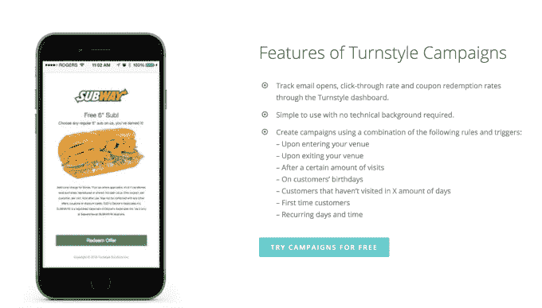
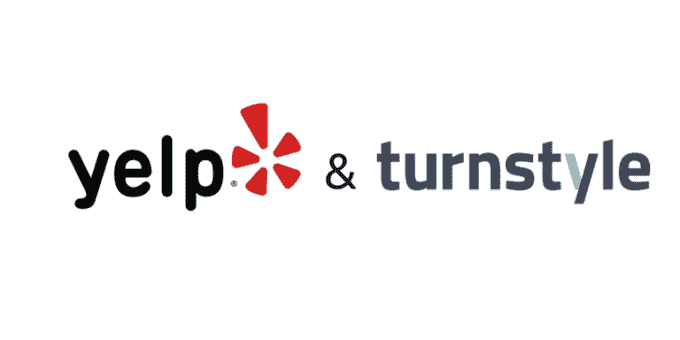

# Yelp 以 2000 万美元收购 Wi-Fi 营销公司 turn style Analytics 

> 原文：<https://web.archive.org/web/https://techcrunch.com/2017/04/04/yelp-acquires-wi-fi-marketing-company-turnstyle-analytics-for-20-million/>

Yelp 今天早上[宣布](https://web.archive.org/web/20230326023830/http://www.businesswire.com/news/home/20170404005620/en/)已支付 2000 万美元现金收购 Wi-fi 营销公司 [Turnstyle Analytics](https://web.archive.org/web/20230326023830/https://getturnstyle.com/) ，该公司提供一项服务，允许企业通过免费提供的 Wi-Fi 网络与客户联系。Yelp 解释说，此举旨在扩大 Yelp 已经提供的商业营销服务的类型，超越那些专注于客户获取的服务，还包括那些帮助企业留住客户和提高忠诚度的服务。

总部位于多伦多的 Turnstyle 成立于 2012 年，目前支持近 3，500 家企业，主要分布在美国和加拿大。根据其网站上的标识，这些客户包括后巷汉堡，汉堡王，野马滑块酒吧，赛百味，以及其他。

Turnstyle 是一项为其商业客户提供的付费服务，基于规模，通过免费的客人 Wi-Fi 登录，提供对客户行为、访问等的洞察。

同意使用免费 Wi-Fi 的客户提供他们的电子邮件地址，然后允许企业建立一个目标客户联系列表。企业还可以利用分析工具来提供对访问的额外洞察——跟踪频率等信息，以确定他们最忠诚的客户和持续时间等因素。

Yelp 解释说，如今的普通消费者每天花在网上的时间超过 5 个小时，但仍有大约 93%的购物是在网下进行的。通过 Turnstyle，Yelp 旨在为其中小型企业客户提供一种与离线客户联系的方式。

此外，它指出，免费 Wi-Fi 已被证明可以增加客流量和销售额。Yelp 指出，指出一项小型商业趋势调查[，62%的顾客在提供免费 Wi-Fi 的地方花费更多时间，其中 50%的顾客由于在商店花费的额外时间而在服务和产品上花费更多的钱。](https://web.archive.org/web/20230326023830/http://smallbiztrends.com/2014/06/benefits-of-offering-free-wifi.html)

使用 Turnstyle 的企业能够向客户发送电子邮件，并向他们提供其他激励和奖励，以鼓励他们再次光临。它还能让企业实现营销自动化，比如提前几天、几周或几个月安排信息发送，或者在电子邮件或短信活动中发送电子优惠券。

可以通过改变激励机制来定制这些活动，以满足各种指标。例如，它可以在客户进入或离开场地时触发优惠，在他们访问了一定次数后，或者它可以联系到在一定时间内没有访问过的人，向首次客户提供激励，发送生日奖励，等等。

该产品目前被许多客户使用，包括餐馆、咖啡馆、零售店、汽车经销商、水疗中心、沙龙等——基本上，消费者可能花费时间和逗留的任何地方，都希望有免费的 Wi-Fi。

Turnstyle 的客户将继续得到支持，并且随着该公司开始与 Yelp 整合，他们的服务或价格不会有任何变化。

与此同时，位于多伦多 Turnstyle 总部的 30 名员工也将加入 Yelp。Yelp 称，预计不会裁员。品牌名称“Turnstyle”将暂时保留，但随着时间的推移可能会改变。

Yelp 表示，尽管 Turnstyle 在美国和加拿大之外也受支持，但其产品的重点将是北美市场。

“我们很高兴通过此次收购扩大我们为当地企业提供的产品。Yelp 联合创始人兼首席执行官杰里米·斯托佩尔曼(Jeremy Stoppelman)在关于此次收购的一份声明中表示:“Turnstyle 有助于通过免费的公共 Wi-Fi 将企业与消费者联系起来，是一个有效的保留和忠诚度计划，有助于企业取得更大的成功。”。

该公司将在 Q2 收益电话会议上分享更多关于 Turnstyle 收入模式的信息，但今天拒绝谈论其财务信息，如收入和增长率。然而，它说它并没有因为收购而调整指导方针。