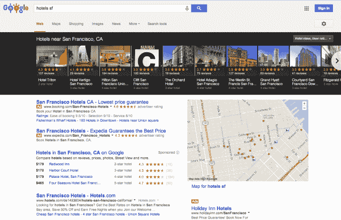
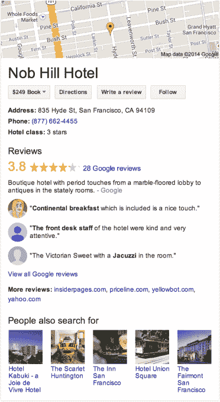
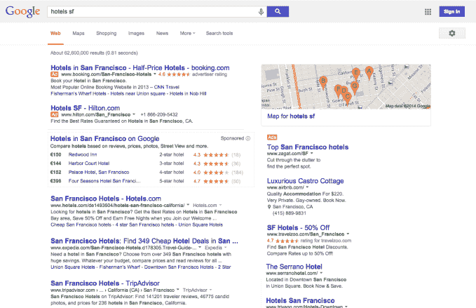
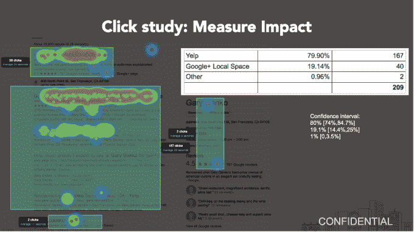
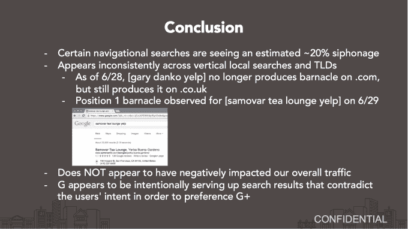

# 泄露的文件显示 Yelp 认为自己被 Google TechCrunch 耍了

> 原文：<https://web.archive.org/web/https://techcrunch.com/2014/07/09/yelp-google-anti-trust/>

从 Yelp 内部泄露给 TechCrunch 的文件声称，谷歌正在操纵其搜索结果，偏向于 T2 的 Google+(T3)内容，而不是 Yelp 内容。这些材料指控[谷歌](https://web.archive.org/web/20230212135338/http://www.crunchbase.com/organization/google)在美国而非欧洲的搜索中公然突出自己的产品，以避免激怒正在审查谷歌反垄断投诉的欧盟监管机构。

消息人士告诉我，这些截图和研究是 Yelp 内部流传的，以证明谷歌的策略是不公平的。据《纽约时报》今天报道，Yelp 最近加入了对欧盟与谷歌达成的反垄断协议宽大处理的正式投诉，我的消息来源称，这些文件有助于激发这一行动。

欧盟竞争事务专员华金·阿尔穆尼亚

2013 年初，谷歌在美国就类似的反垄断问题赢得了与美国联邦贸易委员会的轻松和解，这让批评者感到失望，因为它将流量导向自己的服务如 Google+的做法被认为是合法的。Yelp 和其他投诉者不希望谷歌在欧洲这么容易脱身。

当前的欧盟反垄断和解提案是由欧盟竞争专员华金·阿尔穆尼亚(Joaquín Almunia)推动的。如果谷歌利用其搜索引擎在本地企业名录和比较购物中阻碍竞争对手，它无需认罪或接受罚款，罚款可能会飙升至数十亿美元。我正在等待谷歌和 Yelp 对以下文件含义的回应。

但谷歌如何在谷歌搜索结果中降格竞争对手尚不完全清楚。

这些文件试图让它变得显而易见。

从美国搜索 Google.com 的“旧金山酒店”搜索结果

TechCrunch 的截屏显示了当你点击旋转木马时，搜索结果右上角的谷歌卡片中的内容。

第一张是两张相同的[搜索截图，分别来自 Google.com](https://web.archive.org/web/20230212135338/https://www.google.com/search?q=hotels+sf)上的美国 IP 地址和谷歌上的[比利时 IP 地址，谷歌是欧盟反垄断监管机构的所在地。在上面的美国 Google.com 搜索结果中，你会注意到屏幕顶部有一个突出的黑色大转盘，上面有 Google+评论。](https://web.archive.org/web/20230212135338/https://www.google.be/search?q=hotels+sf)

第一个是同一个 Google.com 搜索的两个截图(搜索“hotels sf”)。一个来自 Google.be 的美国 IP 地址,另一个来自欧洲的 IP 地址[,比如 Google.be](https://web.archive.org/web/20230212135338/https://www.google.be/search?q=hotels+sf) 上的比利时，那里是欧盟反垄断监管机构的所在地。在上面的美国 Google.com 搜索结果中，你会注意到屏幕顶部有一个突出的黑色转盘，上面有 Google+评论。

点击链接会在地图的右下角填充一个大的 Google 内容卡片。它占据了大约一半的屏幕宽度，链接可以通过谷歌预订酒店房间，在谷歌地图上获得方向，通过 Google+跟踪业务或撰写评论，以及探索相关的谷歌搜索查询。在轮播、谷歌内容窗口和谷歌关键词广告之间，根据你的屏幕大小，在折叠上方几乎没有有机的搜索结果。这些[旋转木马在谷歌赢得联邦贸易委员会的和解后仅仅六个月就在美国推出。](https://web.archive.org/web/20230212135338/http://blumenthals.com/blog/2013/06/18/google-rolls-out-local-carousel-display-for-in-us-dining-nightlife-hotels-and-other-attractions/)

但如果你在 Google.bg 上进行同样的搜索，你不会看到旋转木马或大的谷歌内容卡，而只会看到上面有一些大头针的谷歌地图，有机结果较少。

google.be(比利时网站)在 google.be 搜索美国或欧洲的结果是“hotels sf”。

美国人可以自己比较结果，点击[https://www.google.com/search?q=hotels+sf](https://web.archive.org/web/20230212135338/https://www.google.com/search?q=hotels+sf)查看美国结果，点击[https://www.google.co.uk/search?q=hotels+sf](https://web.archive.org/web/20230212135338/https://www.google.co.uk/search?q=hotels+sf)查看欧洲结果。

我的消息来源称，Yelp 认为这是因为谷歌希望在欧盟监管机构面前淡化其如何操纵结果，直到一项宽大的解决方案获得通过。该消息人士称，在某些情况下，甚至从欧洲 IP 地址在 Google.com 上搜索也会显示出谷歌自己的服务(如 Google+)的营销不那么积极，这表明谷歌正在积极地试图向欧洲人隐藏这些结果格式。

第二份文件是一个标签为“机密”的文件，报告了 Yelp 进行的关于用户点击谷歌搜索结果页面的用户行为研究的结果。

[scribd id = 233260174 key = key-6 xfevpy 08 eezpiewddhw mode = scroll]

它表明，在某些情况下，当有人搜索一家餐馆的名字和“yelp”这个词，希望找到评论时，谷歌返回的第一个结果是这家餐馆的网页，附有谷歌内容，如谷歌位置评论，一个“写评论”按钮，一个指向其 Google+页面的链接，以及一个谷歌地图链接。用户可能正在搜索的那家餐馆的 Yelp 页面显示在第二位。

Yelp 的研究结果

这项研究发现，在搜索“Gary Danko Yelp”寻找旧金山餐厅的人中，约有 20%会进入该餐厅网站的 Google+搜索结果，Yelp 认为它应该得到这个结果。

当然，在这项小规模(因此可信度较低)研究的 40 次点击中，有些人可能会决定，不管结果是第一还是第二，他们宁愿去加里·丹科的网站，也不愿被欺骗。你可以通过搜索“茶屋 Yelp”来了解谷歌是如何将其 Google+注入的网站链接放在 Yelp 之前的

Yelp 基于该研究得出的结论和指控

谷歌的辩护通常是，它向用户提供答案而不是链接，以便让他们更快地获得他们想要的信息。欧盟监管机构面临的问题将是，谷歌将自身属性的速度置于竞争对手的有机结果之上，这是对用户的良性服务，还是违反了反垄断法。