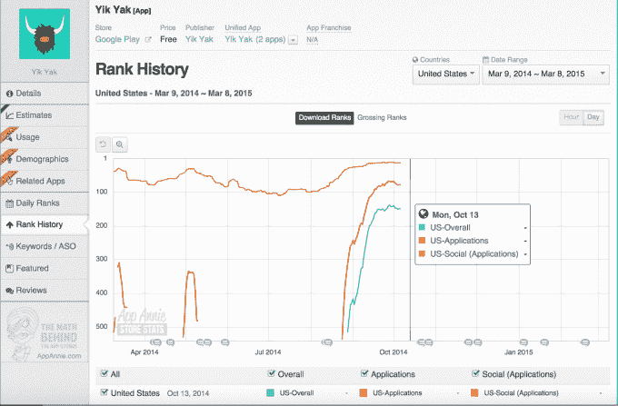
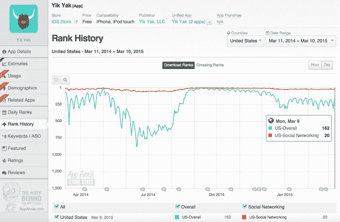
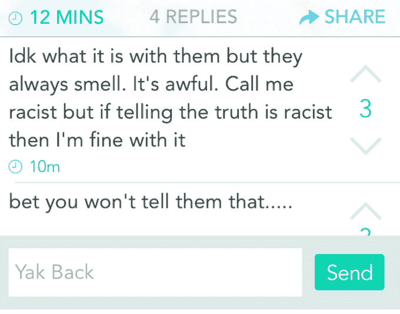
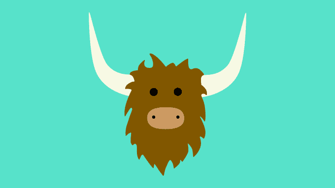

# Yik Yak 在 10 月份悄悄从 Google Play 排行榜上消失

> 原文：<https://web.archive.org/web/https://techcrunch.com/2015/03/10/yik-yak-has-been-delisted-on-google-play-since-october/>

如果匿名应用的兴起证明了什么的话，那就是当抑制我们卑劣本性的社会压力消除时，人类可能是丑陋的生物，我们被允许分享我们黑暗的情绪和想法——有时，只不过是因为知道他们引起了他人的愤怒而产生的廉价兴奋。一个典型的例子: [Yik Yak](https://web.archive.org/web/20230323231824/http://www.yikyakapp.com/) ，这是最新的一款利用匿名帖子的强大吸引力作为快速增长手段的应用程序——但其“狂野西部”的氛围导致该应用程序最近几个月在美国几所大学校园被禁。

然而，似乎并不是只有大学对 Yik Yak 有意见。事实证明，自 2014 年 10 月以来，该应用程序已在 Google Play 上退市。这意味着安卓用户只能通过搜索来展示这款应用，而不能在商店的[排行榜](https://web.archive.org/web/20230323231824/http://www.appannie.com/apps/google-play/top/united-states/application/social/)中找到它。

在被谷歌 Play 除名之前，Yik Yak 在谷歌 Android 应用商店的“社交”类别中排名第 13 位，总体排名第 149 位。

第二天，这款应用就完全从排行榜上消失了。它被解开了。(见下文)

App Annie 的图表显示了这一事件，我们已经向该公司确认了数据的准确性。一款应用要想从 App Annie 的排名中消失，它的排名必须低于# 1500。像 Yik Yak 这样受欢迎的社交应用程序在没有任何干预的情况下，从应用程序商店的榜首变成这样，这是闻所未闻的。

## 谷歌涉 Yik Yak 退市

虽然移动开发者可以删除他们自己的应用程序，但这也将使该应用程序无法通过搜索获得。Yik Yak 能够像现在这样被搜索到，这意味着谷歌不得不参与它的退市。

可能，谷歌采取这一行动是因为 Yik Yak 违反了谷歌在其开发者指南中的“仇恨言论”条款。根据谷歌的“[开发者计划政策](We%20don't%20allow%20content%20advocating%20against%20groups%20of%20people%20based%20on%20their%20race%20or%20ethnic%20origin,%20religion,%20disability,%20gender,%20age,%20veteran%20status,%20or%20sexual%20orientation/gender%20identity.)”，该公司不允许内容*“鼓吹反对基于种族或民族血统、宗教、残疾、性别、年龄、退伍军人身份或性取向/性别认同的人群。”*

那么，考虑到这一规则，为什么这个应用程序是实时的呢？也许是因为谷歌不想走得太远，以至于从其商店中删除这款受欢迎的应用程序——特别是因为苹果公司没有这样做，尽管往往有更严格的政策。(谷歌和 Yik Yak 都不愿置评。).

我们应该注意到，Yik Yak 在 iOS 上的排名有所下降——自去年秋天以来，它的整体排名大幅下降，在去年秋天，它一直保持着前 10 名或前 20 名，有时甚至前 30 名的稳定地位。 [GigaOm 此前也指出，这一下降发生在融资后不久](https://web.archive.org/web/20230323231824/https://gigaom.com/2015/02/13/yik-yaks-growth-flatlined-after-funding-but-why/)。

但截至昨日，Yik Yak 在社交网站上仍排名第 20，整体排名第 162。这意味着苹果还没有将该应用从其商店中下架，这可能是谷歌犹豫是否彻底禁止 Yik Yak 的部分原因。或者谷歌可以等着看 Yik Yak 的新工具是否能在某个时候开始工作。

## 高校禁令导致 Yik Yak 没落？

Yik Yak 的故事和围绕其内容的争议并不新鲜。

这款应用程序[就像之前的 ask . FM](https://web.archive.org/web/20230323231824/https://techcrunch.com/2013/08/12/in-wake-of-teen-suicides-ask-fm-faces-a-myspace-problem/)，以及早期的[网站](https://web.archive.org/web/20230323231824/http://thoughtlexicon.wordpress.com/2008/07/23/ms-suicide/)、 [MySpace](https://web.archive.org/web/20230323231824/http://www.smh.com.au/articles/2007/04/23/1177180569460.html) ，都被认为是网络欺凌和骚扰的来源。这种欺凌的结果可能会对年轻用户产生毁灭性的后果，Ask.fm 发现，当其主要是初中到高中的观众受到相当数量的青少年自杀的困扰时。

值得称赞的是，Yik Yak 试图阻止这一年轻群体使用其应用，甚至在去年春天主动实施了地理围栏，在美国各地的校园里屏蔽该应用。其推理？Yik Yak 是为成年人设计的，儿童的滥用玷污了它在家长、教师和其他官员中的声誉，导致学校在全国各地的[一些](https://web.archive.org/web/20230323231824/http://nakedsecurity.sophos.com/2014/03/11/yik-yak-banned-as-schools-grapple-with-toxic-anonymous-social-chat)地方禁止了这款应用。

不幸的是，事实证明“成年人”在保持文明的同时躲在匿名账户后面并没有好到哪里去。

该应用最近在越来越多的大学校园被禁止，包括东密歇根大学、纽约州尤蒂卡学院、佛蒙特州诺里奇大学等。在其他地方，大学正在处理学生中禁止该应用程序的呼吁，现在正在选择如何回应。

在某些情况下，Yik Yak 被用来发出大规模暴力的威胁，比如在[北卡罗来纳大学](https://web.archive.org/web/20230323231824/http://www.wral.com/universities-consider-blocking-controversial-app/14426363/)，密西根州立大学，佐治亚大学，陶森大学和宾夕法尼亚州立大学。

更多的学校正在处理与仇恨言论和其他攻击性“牦牛”相关的争议，包括一张威胁轮奸的海报。[包括](https://web.archive.org/web/20230323231824/http://www.huffingtonpost.com/larry-magid/banning-yik-yak-from-coll_b_6779168.html?utm_hp_ref=college&ir=College) [【克莱姆森】](https://web.archive.org/web/20230323231824/http://www.thedp.com/article/2015/03/colleges-consider-banning-yik-yak)【埃默里】[高露洁](https://web.archive.org/web/20230323231824/http://www.huffingtonpost.com/2014/09/24/colgate-university-protest-racist-yik-yak_n_5875106.html)【德克萨斯大学】[凯尼恩学院](https://web.archive.org/web/20230323231824/http://www.huffingtonpost.com/ryan-chapin-mach/why-your-college-campus-should-ban-yik-yak_b_5924352.html)[迈阿密大学](https://web.archive.org/web/20230323231824/http://college.usatoday.com/2014/05/14/viewpoint-racist-commentary-at-miami-university-prevalent-on-anonymous-app-yik-yak/)在内的学校已经被学生要求禁止 Yik Yak，尽管在很多情况下，这些大学并没有对这些要求采取行动。

在其他情况下，学校知道发生了虐待，但选择不采取行动。例如，杜克大学已经表示不会禁止 Yik Yak，因为它“不支持任何形式的审查”。

在杜克大学学生管理的出版物《编年史》中，学生事务主任 Sue Wasiolek 解释说，学校确实无法阻止有害内容在 Yik Yak 这样的论坛上传播，因为只要一个论坛被关闭，另一个就会在它的位置上出现。

这所大学过去曾处理过这个问题，当时一名杜克大学的学生创建了在线八卦论坛 [JuicyCampus](https://web.archive.org/web/20230323231824/https://www.crunchbase.com/organization/juicycampus) 。该报指出，另一个论坛 CollegiateACB 后来在 JuicyCampus 因网络欺凌被关闭后取代了它的位置，然后它也在 2014 年因负面媒体关注而被关闭。(JuicyCampus 创始人 Matt Ivester [最近告诉 NYT](https://web.archive.org/web/20230323231824/http://www.nytimes.com/2015/03/09/technology/popular-yik-yak-app-confers-anonymity-and-delivers-abuse.html) ，当 JuicyCampus 蓬勃发展时，世界并不知道“网络欺凌”这个词，但 Yik Yak 的家伙们现在“应该更清楚了”。)

除了校园争议之外，网上还有[请愿](https://web.archive.org/web/20230323231824/https://www.change.org/p/google-and-apple-and-apple-end-the-availability-of-the-yik-yak-application-on-google-play-and-the-itunes-app-store?recruiter=21050329&utm_campaign=twitter_link_action_box&utm_medium=twitter&utm_source=share_petition)活动，要求谷歌和苹果从各自的应用商店中移除该应用，称该应用是“一个允许人们彼此残忍对待的门户”。

虽然有人可能会认为禁止这款应用是对言论自由的冒犯，但事情没那么简单。应用程序上的一些内容是有害的，不受第一修正案的保护，但其他内容只是愚蠢的，有趣的，甚至是有用的。因此，对整个应用进行审查的全面禁令有些矫枉过正。

在 Yik Yak，[公司报告说](https://web.archive.org/web/20230323231824/http://www.huffingtonpost.com/larry-magid/banning-yik-yak-from-coll_b_6779168.html?utm_hp_ref=college&ir=College)已经建立了过滤机制，并有一个 24 小时审查帖子的版主团队，所以他们并不是没有意识到应用程序面临的问题。也许，这些系统还不够好，不够快，无法审核该应用数百万用户的帖子。

鉴于 Yik Yak 已经在 Google Play 上被取消排名多久，尚不清楚它是否或何时会重返 app store 的排行榜。还不清楚这将在多大程度上影响该应用的长期增长——毕竟，该应用主要是通过口碑推荐增长的，这意味着大学生和其他人正在寻找它，而不仅仅是偶然发现它。