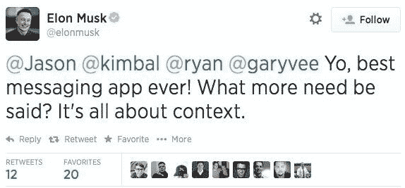

# Yo App 被大学生黑客攻击 

> 原文：<https://web.archive.org/web/https://techcrunch.com/2014/06/20/yo-app-allegedly-hacked-by-college-students/>

一名佐治亚理工学院的学生和他的两名室友声称在过去的 48 小时内黑掉了[的类似扑克的应用程序](https://web.archive.org/web/20230216155002/https://techcrunch.com/2014/06/18/hands-on-with-yo-the-absurdly-simple-messaging-app/)，该应用程序[在硅谷点燃了一些(虽然不是](https://web.archive.org/web/20230216155002/https://techcrunch.com/2014/06/18/yo-yo/) [全部](https://web.archive.org/web/20230216155002/https://techcrunch.com/2014/06/19/meh/) [)火](https://web.archive.org/web/20230216155002/https://techcrunch.com/2014/06/18/yo-yo/)。【见下面更新:Yo 已确认被黑】。

这名学生给 TechCrunch 发了电子邮件，详细描述了他所声称的黑客攻击的结果:“我们可以获得任何 Yo 用户的电话号码(实际上我给创始人发了短信，他给我回了电话。)我们可以欺骗任何用户的 Yos，我们可以向任何用户发送任意数量的 Yos。我们也可以给任何用户发送一个推送通知，里面包含我们想要的任何文本(尽管我们决定不这么做。)"

与此同时，一个来自用户 Hako 的 Vine 视频出现了，视频中的 Yo 发出了里克·阿斯特利的“永远不会放弃你”的片段，而不是正常的“Yo！”声音。换句话说，这看起来是另一次黑客攻击，尽管这还没有得到证实。

其他所谓的黑客证据已经出现，比如这张运行 Yo 的 iPhone 的 Instagram。

我们联系了 Yo 了解这个发展中的故事。

同时，你还有其他的问题。舒布汉姆·达塔的这篇文章详细描述了他是如何抢到埃隆·马斯克的用户名，并试图欺骗其他用户，让他们认为他是真正的埃隆·马斯克。

不知何故，埃隆·马斯克自己也相信媒体人物杰森·卡拉卡尼斯欺骗了他。

达塔现在说，他用 Yo 上的 ElonMusk 用户名换取了一辆特斯拉 Model S…

是的，很混乱。

**更新:**

创始人或 Arbel 现已证实 Yo“存在安全问题”

他告诉 TechCrunch:“有些东西已经修复，有些我们仍在努力。我们对此非常重视。”

他说他不能透露哪些黑客还活着。他说，该公司已经引入了一个专业的安全团队来处理这些问题，并希望这些安全问题将在“未来几个小时内”得到解决。

https://vine.co/v/MTMHawX3Zq6