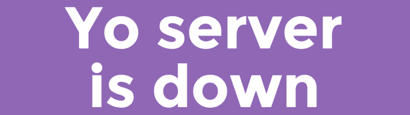

# 哟！黑客马拉松试图展示 Yo 如何发展 

> 原文：<https://web.archive.org/web/https://techcrunch.com/2014/06/28/yo-hackathon-attempts-to-show-how-yo-can-grow/>

时下流行的类似现象的应用程序 [Yo](https://web.archive.org/web/20230120212735/http://www.justyo.co/) 今天在旧金山举办了一场黑客马拉松，试图证明 Yo 不仅仅是 Yo，Yo。

一个已经登上[产品搜索](https://web.archive.org/web/20230120212735/http://www.producthunt.com/)排行榜榜首的黑客是 YoServerIsDown——由程序员 [Jarryd Lee](https://web.archive.org/web/20230120212735/https://twitter.com/LeeJarryd) 和 [Hayden Lee](https://web.archive.org/web/20230120212735/https://twitter.com/haydenjameslee) 创建。

该应用程序将在服务器宕机时发送 yo 通知用户(因此有了一个聪明的名字)，是试图将 Yo 从愚蠢的消息转移到更重要的东西的几个模块之一。

Cowboy Ventures 的合伙人诺亚·利希滕斯坦(Noah Lichtenstein)也参加了这次活动，他在 Product Hunt 上发布了一些他最喜欢的黑客技术，包括“YOaster”，当面包在被黑掉的烤面包机中烘烤完毕时，它会发送一个 yo，还有 Yo 收音机，它会将收音机上播放的歌曲标记为书签，这样用户可以稍后从计算机上访问关于这首歌的信息(我想最后一个叫做 [Shazam](https://web.archive.org/web/20230120212735/http://www.shazam.com/) )。

[更新:Yo Radio 的联合创始人 Santhosh Kumar Bala Krishnan 给我们写了一些关于他的黑客(赢得了黑客马拉松)的更多细节。

> 与等待像“Shazam”这样的应用程序来收听和识别收音机中当前播放的歌曲不同，当你从 YO 应用程序中 YO 说出“WHAT1015”时，“YO Radio”会将 101.5 FM 上当前播放的歌曲标记为书签，并将其与你的用户名相关联。您可以随时从“YO Radio”应用程序中查看书签歌曲和歌曲的 youtube 链接。
> 
> 我们使用 YO 作为一种媒介，向我们的应用程序发送一些上下文通知(此处为“101.5 FM”)，以便我们可以将该电台的歌曲加入书签。

所以就当我纠正了。]

批评家嘲笑 Yo 为技术创新已经退化为程序员和开发人员的内部笑话的最新证据——他们可以为一个只需要屎和笑声就能开发的应用筹集真金白银。

与此同时， [Yo 的支持者们已经花了几百个字](https://web.archive.org/web/20230120212735/https://techcrunch.com/2014/06/18/yo-yo/)(也许太多了)在本体探索上，以触及 Yo 的核心。

风险投资人(也是世界上[穿着最好的亿万富翁之一](https://web.archive.org/web/20230120212735/http://www.vanityfair.com/style/2014/06/best-dressed-billionaires)的丈夫)马克·安德森称 yo 为[一位沟通](https://web.archive.org/web/20230120212735/http://www.businessinsider.com/marc-andreessen-defends-yo-app-2014-6)的一个例子——一个只作为自身存在的信息。没有意义——事实上，媒介就是信息。

令人耳目一新的是，看到 Yo 至少试图通过推广可以增加附加值的应用程序，超越其批评者和支持者正在进行的对话。

正如任何一家初创公司都会告诉你的那样，成功从来都不仅仅与应用程序有关，而是与人们最终如何使用它有关。