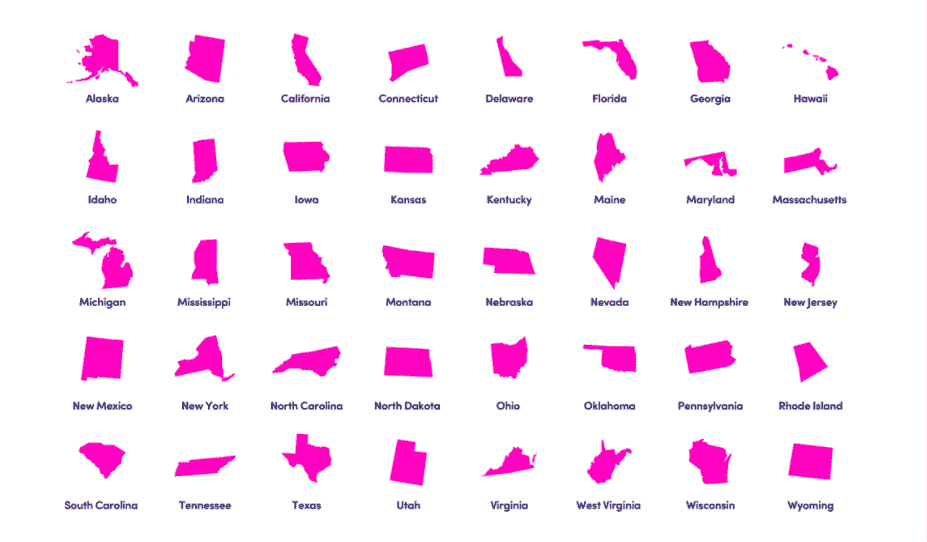

# 现在，你甚至可以在美国 40 个州的农村地区搭乘 Lyft

> 原文：<https://web.archive.org/web/https://techcrunch.com/2017/08/31/you-can-now-catch-a-lyft-even-in-rural-areas-in-40-u-s-states/>

# 现在你甚至可以在美国 40 个州的农村地区搭乘 Lyft

Lyft 在去年迅速扩大了在美国的覆盖范围，并刚刚宣布将服务扩展到 32 个州的每个角落，使其在 40 个州的每个道路区域都可用。

所有 50 个州都提供某种形式的 Lyft 服务，但现在甚至大多数州的农村地区也可以享受 Lyft。根据今天发布的一份公司声明，Lyft 现在可以在全国 94%的地方招揽顾客，达到 2.87 亿人。

此次大规模扩张是为了在竞争对手优步面前获得立足点，后者目前控制着美国约 75%的叫车服务市场，并声称覆盖 13 个州。

毫无疑问，Lyft 也希望从优步最近的损失中获利。由于几起丑闻，包括#DeleteUber 运动和指控该公司在性骚扰和厌恶女性的文化中溃烂，优步对市场的控制一度达到 90%，在过去几年中有所下滑。

优步现在正努力摆脱困境。该公司正式宣布，Expedia 前首席执行官达拉·科斯罗萨西(Dara Khosrowshahi)将接替前首席执行官特拉维斯·卡兰尼克担任优步首席执行官。卡兰尼克在 6 月份辞去了这个角色。

与此同时，Lyft 继续在骑手和司机两方面取得巨大收益，从 2016 年的 1.625 亿人次增加到今年前六个月的两倍，并增加了新的司机，其中许多人在农村社区，计划在那里推出扩大的乘车覆盖面。目前还不清楚增加了多少司机，但 Lyft 表示，目前全国约有 70 万名司机。

当然，搭乘顺风车的能力以及搭乘同一顺风车所需的时间取决于有多少司机以及农村地区的人离司机有多远。在需求较低的地区也很难搭车。

那些在农村地区需要在特定时间去机场或开会的人可能需要提前安排行程，以确保他们在需要的时候到达。

好的一面是，住在该国更偏远地区的老年人和有某些残疾的人现在可以选择使用 Lyft 出行。此外，随着这些地区需求的增长，司机数量也会增加，乘车等待时间也会缩短。