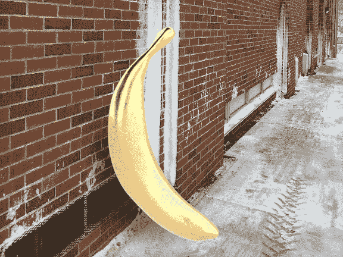

# 您现在可以下载 Adobe 的新项目 Felix 3D 合成工具 

> 原文：<https://web.archive.org/web/https://techcrunch.com/2016/12/13/you-can-now-download-adobes-new-project-felix-3d-compositing-tool/>

# 你现在可以下载 Adobe 的新项目 Felix 3D 合成工具

几周前，Adobe [在圣地亚哥的 MAX 大会上宣布了其项目 Felix 2D/3D 合成工具。该声明是此次活动的亮点之一，但遗憾的是，该应用程序实际上还没有推出。随着今天](https://web.archive.org/web/20221206220605/https://beta.techcrunch.com/2016/11/02/adobes-project-felix-makes-combining-2d-and-3d-assets-easy/)[项目 Felix](https://web.archive.org/web/20221206220605/http://www.adobe.com/products/project-felix.html) 的正式启动，这种情况正在改变。遗憾的是，你需要付费的创意云会员资格才能访问这些信息——免费的创意云会员资格是没有资格的。如果你有付费会员，你现在可以在这里下载新工具。

Felix 项目背后的基本想法是，设计师现在经常被要求创建结合品牌 3D 资产的照片级逼真图像(想想标志、产品等的模型)。)和一张背景照片。Project Felix 让您可以轻松地将这些 2D 和 3D 资产结合成一个单一的、逼真的图像。它将相当多的 Adobe 人工智能与其现有的图像处理技术结合在一起。例如，Felix 分析 2D 场景以确保 3D 资产显示正确的反射。

[https://web.archive.org/web/20221206220605if_/https://www.youtube.com/embed/yaMjHn-RJYA?feature=oembed](https://web.archive.org/web/20221206220605if_/https://www.youtube.com/embed/yaMjHn-RJYA?feature=oembed)

视频

值得注意的是，Project Felix 确实有相对较高的最低系统要求。在 Windows 10 上，你需要至少 8 GB 的内存和 Geforce GTX 770 或更好的显卡。在 macOS 上，最低也是 8 GB 的内存和英特尔 Iris Graphics 540 或 GeForce GT 750M 卡，尽管在这里，Adobe 也建议 16 GB 或更多的内存。根据我的经验，Adobe 不是在开玩笑。我试图在一台不符合推荐规格的机器上使用 Felix，虽然它可以工作，但我无法想象自己使用它超过几分钟。不过，在一个很容易达到推荐规格的类似系统上，它工作得很好。

