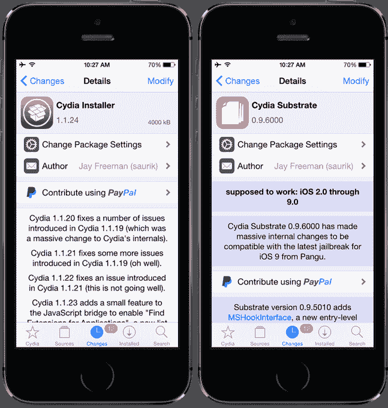

# 你现在可以越狱你的 iOS 9 设备了(但你可能不应该这么做)

> 原文：<https://web.archive.org/web/https://techcrunch.com/2015/10/14/you-can-now-jailbreak-your-ios-9-devices-but-you-probably-shouldnt/>

多年来，苹果为其移动操作系统 iOS 引入了一些功能，这些功能使得通过越狱来定制和调整手机或平板电脑变得不那么吸引人了。用户现在可以做一些事情，如添加小工具，安装动态(移动)壁纸，发送音频消息，快速访问常用控件，并且由于 3D Touch，可以调用已安装应用程序的快捷方式。

但 iOS 越狱者的核心社区仍然存在，现在他们有办法破解他们的 iOS 9 设备，这要感谢今天发布的一个名为[盘古](https://web.archive.org/web/20230404231525/http://en.pangu.io/)的中国黑客团队的黑客攻击。

[越狱](https://web.archive.org/web/20230404231525/http://en.pangu.io/)由一个 Windows 软件包组成，允许“不受限制”的越狱——这意味着，你的设备不必插入你的计算机就能运行。据报道，越狱可以在运行 iOS 9 到 9.0.2 的 iPhones、ipad 和 iPod touch 设备上运行。

这是首次为 iOS 9 发布的公开越狱，据称 iOS 9 运行一个名为“无根”的安全系统，旨在防止恶意软件。该系统[被认为是对越狱社区](https://web.archive.org/web/20230404231525/http://9to5mac.com/2015/05/22/ios-9-os-x-10-11-to-bring-quality-focus-smaller-apps-rootless-security-legacy-iphoneipad-support/)的一大打击。([早前的一次越狱](https://web.archive.org/web/20230404231525/http://www.geek.com/apple/an-untethered-jailbreak-for-ios9-already-exists-1633701/)没有向公众公布。)

具体来说，盘古的越狱涵盖了 iPhone 4s、5/5c/5s、6/6 Plus 和 6s/6s Plus 以及 iPad 2、3 和 4、iPad Air/Air 2、iPad mini、iPad mini 2/3/4 和第 5 代和第 6 代 iPod touch。换句话说，当前和旧设备的广泛列表。

越狱后，用户可以安装 Cydia，这是一个框架，允许你下载和安装非官方的软件包到你的设备上，允许你运行应用程序或进行 iOS 操作系统否则会阻止的更改。

然而，modder 爱好者网站[ModMyi.com](https://web.archive.org/web/20230404231525/http://modmyi.com/content/20744-saurik-updates-cydia-substrate-cydia-installer-pangus-new-ios-9-jailbreak.html)指出，尽管设备可以越狱，Cydia 可以安装，但许多应用程序和调整尚未就绪，该网站还表示，一些开发者，如界面调整桶[的制造商](https://web.archive.org/web/20230404231525/https://twitter.com/aaronash/status/654308251450908672)，已经开始寻找测试人员。

## 建议小心

那么你应该运行越狱吗？嗯，可能不会。除非你*真的*知道你在做什么，并愿意让你的设备和数据冒风险。

但是如果你下定决心，并且需要一些建议，Reddit 用户会给[提供指导和帮助](https://web.archive.org/web/20230404231525/https://www.reddit.com/r/jailbreak/wiki/ios9jailbreakhelp)。

越狱不仅违反了你的最终用户许可协议(这将使你的保修失效，并意味着当出现问题时，你将无法从苹果公司获得帮助)，还会使你的手机暴露于安全漏洞，并使你的个人数据面临风险。

事实上，最近的一些攻击涉及到 iOS 恶意软件——是的，它确实存在！–专门针对使用越狱设备的用户。

例如，KeyRaider 恶意软件,[可能是当时](https://web.archive.org/web/20230404231525/https://techcrunch.com/2015/08/31/keyraider-malware-responsible-for-possibly-largest-known-apple-account-theft-to-date-affecting-225000-users/#.s2agxy:PkiK)已知的最大的苹果账户盗窃案——影响了 225，000 名用户——针对的是越狱了手机的客户。该恶意软件试图窃取帐户名称，密码，设备 id 和更多。

最近的 [YiSpector 恶意软件](https://web.archive.org/web/20230404231525/http://researchcenter.paloaltonetworks.com/2015/10/yispecter-first-ios-malware-attacks-non-jailbroken-ios-devices-by-abusing-private-apis/)针对越狱和未越狱的 iOS 设备。然而,[苹果证实,](https://web.archive.org/web/20230404231525/https://techcrunch.com/2015/10/05/new-malware-called-yispecter-is-attacking-ios-devices-in-china-and-taiwan/)只有那些从应用商店以外下载应用程序的人受到影响，越狱者往往会这样做。

此外，许多恶意软件变种主要针对中国的 iOS 用户，在中国，iOS 设备所有者更容易找到直接从 App Store 购买软件的变通办法。利用非官方资源的趋势——部分是由于防火长城及其减缓或阻止合法网站下载的方式——也助长了恶意软件在该地区的传播。

甚至该地区的一些顶级应用程序开发商最近也在 App Store 上发布了他们应用程序的官方版本，[在下载了 Xcode 的受损版本后，其中包含了恶意软件。](https://web.archive.org/web/20230404231525/https://techcrunch.com/2015/09/21/apple-confirms-malware-infected-apps-found-and-removed-from-its-chinese-app-store/) [被称为 XcodeGhost 的恶意软件](https://web.archive.org/web/20230404231525/http://www.apple.com/cn/xcodeghost/)感染了滴滴出行打车、百度音乐、微信等应用。

换句话说，随着一系列新越狱的 iOS 设备上线，可以肯定的是，恶意软件作者将加紧努力寻找进入这些设备的方法。

应该指出的是，盘古黑客团队将他们的越狱发布到了野外，而不是将他们的发现提交给漏洞利用收购平台制造商 [Zerodium](https://web.archive.org/web/20230404231525/https://zerodium.com/program.html) ，[，该公司早些时候承诺为 iOS 9 越狱](https://web.archive.org/web/20230404231525/http://www.ign.com/articles/2015/09/22/security-firm-zerodium-offers-1-million-bounty-for-ios-9-jailbreaks)提供 100 万美元的报酬。Zerodium 创始人 Chaouki Bekrar [今天在 Twitter 上说](https://web.archive.org/web/20230404231525/https://twitter.com/cBekrar/status/654313685259677696)这很可能是因为盘古越狱没有资格获得奖励，因为它并不遥远，而且是公开的。

如果你敢的话，越狱可以在这里找到。目前还没有 OS X 支持的消息。

*(图片鸣谢:[盘古](https://web.archive.org/web/20230404231525/http://en.pangu.io/)；[@ aaronash](https://web.archive.org/web/20230404231525/https://twitter.com/aaronash/status/654308251450908672)； [Modmyi](https://web.archive.org/web/20230404231525/http://modmyi.com/content/20744-saurik-updates-cydia-substrate-cydia-installer-pangus-new-ios-9-jailbreak.html) )*