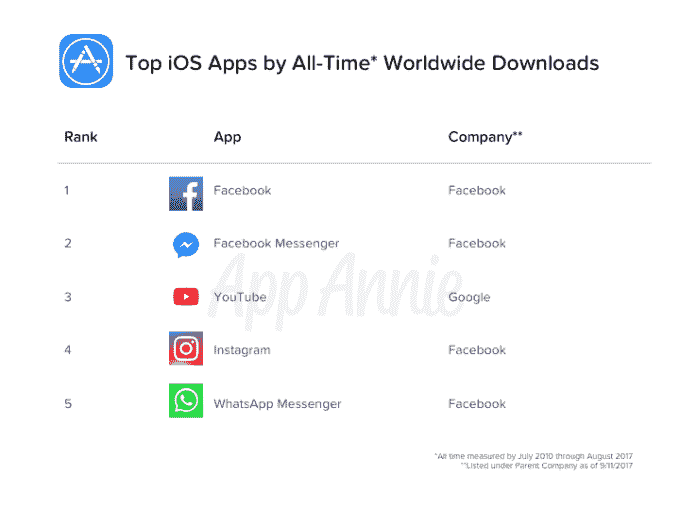

# 你现在可以直接从脸书 启动 Instagram 应用了

> 原文：<https://web.archive.org/web/https://techcrunch.com/2017/09/20/you-can-now-launch-the-instagram-app-directly-from-facebook/>

脸书让用户更容易直接从脸书应用程序中访问他们的 Instagram 个人资料。该公司证实，它将在手机上推出一个新的主导航菜单，其中包括一个指向你的 Instagram 账户的链接。此选项显示在脸书应用程序中您的个人资料链接的下方，您可以管理的任何脸书页面链接的上方。

如果你点击这个链接，手机上的 Instagram 应用程序就会启动，把你带到 Instagram 的主页面，就像你从主屏幕上启动应用程序一样。

这一变化虽然很小，但却很显著，因为它让脸书可以通过自己的移动平台循环使用用户，而不会让他们流失到其他移动应用，比如 Twitter 或 Snapchat。(当然，如果 Instagram 反过来也能添加一个返回脸书的链接，效果会更好。但在这一点上，我们没有看到类似的选项出现在 Instagram 中。)

“我们正在寻找帮助人们在脸书和 Instagram 上与朋友保持联系的方法，”脸书发言人在确认新功能时告诉 TechCrunch。“脸书上的人可以看到他们有多少朋友在 Instagram 上，”他们补充道。

这不是脸书第一次尝试合并房产。今年 5 月，该公司被发现测试了一项功能，该功能可以显示其他应用程序的通知计数器，并允许你在它们之间即时切换。当一些用户点击脸书、Messenger 或 Instagram 右上角的个人资料图标时，这些弹出的跨应用切换程序就会出现。

脸书[也短暂地](https://web.archive.org/web/20230325052806/https://thenextweb.com/facebook/2017/02/17/facebook-tests-shortcut-buttons-rivals-like-snapchat-twitter/#.tnw_sC9BsnNj)尝试过链接到其他社交网络。

相比之下，在用户档案中添加 Instagram 链接的新功能是一个更加保守的变化。

然而，就应用安装和使用而言，此举可能会进一步巩固脸书作为顶级移动应用制造商之一的地位。

App Annie 的全球数据显示，脸书如今占据主导地位。其应用程序是有史以来下载量最高的应用程序，Instagram 排名第四。2017 年 1 月至 8 月，脸书和 Instagram 也分别是全球下载量排名第三和第四的应用程序。

此外，根据 comScore 在 8 月份发布的数据，脸书和 Instagram 都位列美国移动渗透率前十的应用程序，脸书本身也是月访问量排名第一的应用程序。

但当你开始按人口统计群体细分时，发现 Snapchat 在 18 岁至 24 岁的访问者中的排名高于 Instagram。这支持了 eMarketer 最近的另一项研究，该研究也发现青少年更喜欢 Snapchat 而不是 Instagram 和脸书。

鉴于 Instagram 与 Snapchat 的激烈竞争(就总使用量而言，[正在赢得](https://web.archive.org/web/20230325052806/https://techcrunch.com/2017/08/02/instagram-stories-anniversary/))，该公司现在试图利用脸书，希望通过这种变化增加 Instagram 的访客数量，特别是来自年轻群体的访客数量，这是有道理的。

[gallery ids="1544240，1544239，1544238"]

目前尚不清楚这项新功能是否已经向所有脸书用户推出，但我们发现，如果你不是 Instagram 用户，那么你的个人资料不会发生任何变化。