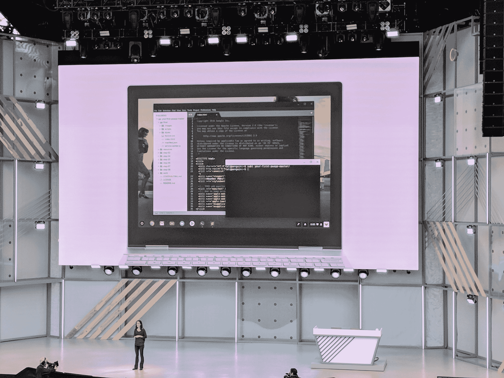

# 你现在可以在 Chrome OS  上运行 Linux 应用了

> 原文：<https://web.archive.org/web/https://techcrunch.com/2018/05/08/you-can-now-run-linux-apps-on-chrome-os/>

# 你现在可以在 Chrome 操作系统上运行 Linux 应用了

很长一段时间以来，开发人员一直使用 Chrome OS 机器并运行像 [Crouton](https://web.archive.org/web/20230407013326/https://github.com/dnschneid/crouton) 这样的工具，将它们变成基于 Linux 的开发人员机器。这有点麻烦，但是很有效。但是事情越来越简单了。很快，如果你想在 Chrome OS 上运行 Linux 应用程序，你只需在设置菜单中切换一个开关。这是因为谷歌将开始为 Chrome OS 配备一个定制的虚拟机，该虚拟机运行 Debian Stretch，这是该操作系统当前的稳定版本。

值得强调的是，我们这里不只是在谈论一个外壳，而是对图形应用程序的完全支持。这意味着你现在可以在 Chrome 操作系统上运行微软的 Linux 版本的 Visual Studio 代码。或者在 Android Studio 中构建您的 Android 应用程序，并在您的笔记本电脑上进行测试，这要归功于去年 Chrome OS 对 Android 应用程序的内置支持。

Chrome OS 上的第一个 Linux 预览版现在可以在 Pixelbook 上使用，对更多设备的支持将很快推出。

谷歌 Chrome OS 刘戡项目经理告诉我，公司显然意识到人们以前用油炸面包丁来做这件事。但是这样做也意味着放弃所有的安全特性