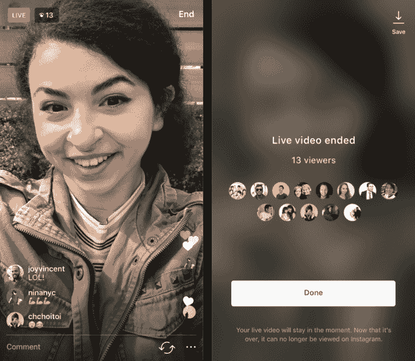

# 现在，您可以将 Instagram 直播流保存到相机胶卷 

> 原文：<https://web.archive.org/web/https://techcrunch.com/2017/03/20/you-can-now-save-your-instagram-live-streams-to-your-camera-roll/>

# 现在，您可以将 Instagram 实时流保存到相机胶卷中

Instagram Live 的一个独特之处是视频总是会消失。直播结束后，内容会被永久删除——不像脸书直播或潜望镜会保存你的视频，以便观众在事后观看。

直到现在。

公司[刚刚宣布](https://web.archive.org/web/20230129120355/https://instagram-press.com/blog/2017/03/20/new-save-your-live-video-to-your-phone/)广播公司将可以选择在完成流媒体后将直播视频保存到他们的手机上。这非常简单——当你的视频流结束时，你会在右上角看到一个保存按钮——你点击它，视频就会保存到你的相机胶卷中。

值得注意的是，这些直播视频仍然不会保存在 Instagram 上，所以观众仍然应该感到迫切需要观看，因为这将是他们观看流媒体的唯一机会。

也就是说，广播公司可以选择保留他们的流媒体，这一事实应该会增加人们决定直播的机会。以前，用户可能会犹豫是否在重要时刻直播(而是用他们的相机应用程序或 Snapchat 记录)——因为他们知道他们会永远失去那些镜头。现在，用户可以两全其美——他们可以与观众分享有趣的直播内容，同时如果是一个特殊的时刻，还可以选择永远保存它。

该更新将于今天在 iOS 和 Android 手机上推出。

