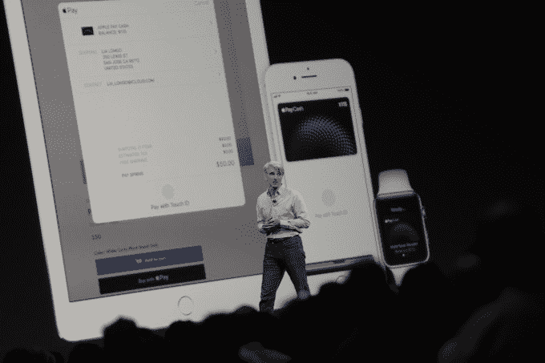

# 您现在可以通过 iMessage TechCrunch 向您的朋友汇款

> 原文：<https://web.archive.org/web/https://techcrunch.com/2017/06/05/you-can-now-send-your-friends-money-inside-imessage/>

# 您现在可以在 iMessage 内向您的朋友汇款了

作为 iOS 11 的一部分，苹果宣布用户现在可以通过 iMessage 给朋友汇款，并通过虚拟的 Apple Pay 卡消费余额。

该功能将作为一款应用程序内置于 iMessage 中，本质上让你只需轻轻一点，就可以与你的联系人一起发送和请求资金。该集成还将能够做一些事情，如识别何时有人说“你欠我 10 美元”，并自动提示你给他们付款。

当然，通过 iMessage 汇款并不新鲜——像 Square 和 Venmo 这样的公司已经有了 iMessage 应用程序，可以让你通过他们的平台付款。但拥有整个生态系统总是让苹果占据上风，这一次也不例外。

苹果正在将这种点对点支付服务与 Apple Pay 集成，这将使其成为一个杀手级功能，并最终超过 Venmo 和 Square 现金支付。有人给你汇钱后，余额会存在你钱包应用程序中的 Apple Pay 虚拟卡上。虽然你当然可以将这笔钱兑现到你的银行账户上，但你也可以使用虚拟卡在任何接受 Apple Pay 的地方支付，无论是在商店还是在线，而不用等一天就能转移到你的银行账户上。

从本质上说，苹果给每个 iOS 用户发了一张虚拟卡，卡里有余额，他们可以在任何想去的地方消费。这对苹果来说是一个明智的举动，因为当用户持有并消费余额而不是立即将其兑现到他们的银行账户时，他们(和任何支付公司)都会赚得更多。

