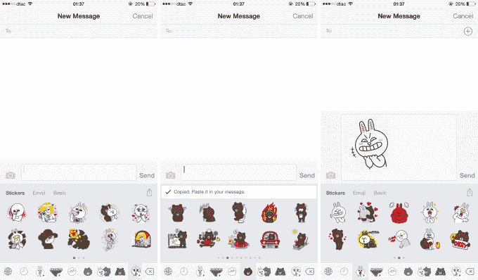
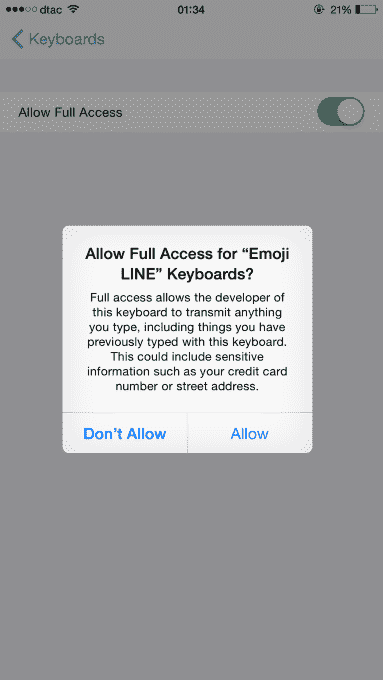

# Line 以 iOS  的表情键盘应用瞄准美国市场

> 原文：<https://web.archive.org/web/https://techcrunch.com/2015/06/17/you-wont-use-our-messaging-app-so-heres-a-funky-keyboard/>

日本移动通讯应用 Line 已经转向键盘应用，希望在美国和亚洲以外的世界其他地区扩大业务。

该公司拥有 2.05 亿月活跃用户，今天[推出了表情键盘](https://web.archive.org/web/20230405114710/http://www.prnewswire.com/news-releases/line-the-pioneer-of-stickers-officially-launches-keyboard-app-emoji-line-300100485.html)，[一款 iOS 应用](https://web.archive.org/web/20230405114710/https://itunes.apple.com/app/id990903485)，它可以将 3000 多种不同的贴纸和表情符号直接放入你的键盘。目前还不知道它什么时候会出现在 Android 上。有趣的是——这说明了 Line 的战略——该应用程序在全球范围内可用，只有三个国家除外:日本、台湾和泰国——这三个市场占了 Line 活跃用户群的一半以上。

因此，目标非常明确，提供一种服务，能够将新用户带入 Line 的消息和应用生态系统——包括照片应用、实用应用、游戏等——独立于其聊天服务。

这并不是该公司的新战略——本月早些时候，它推出了一款群呼应用程序[，可以让多达 200 名用户同时聊天](https://web.archive.org/web/20230405114710/https://techcrunch.com/2015/06/04/line-moves-into-group-calling-with-popcorn-buzz-lets-you-talk-with-up-to-200-people-for-free/)——但贴纸和表情键盘在吸引美国和欧洲等市场的观众方面有了不错的变化，Line 的消息服务在这些市场未能取得进展。

我们已经看到了一些基于贴纸的应用和服务的兴起——就在上个月 [Fleksy 将 Imoji 的贴纸集整合到其流行的 iOS 和 Android 键盘应用中](https://web.archive.org/web/20230405114710/https://techcrunch.com/2015/05/27/the-sticker-invasion-is-coming/)——这正在成为一个有趣的领域，特别是在美国..这是因为在美国，许多不同的消息应用程序已经胜出——例如 Snapchat、Facebook Messenger 和 Kik——而苹果的巨大市场份额(约为 50%，相比之下，亚洲的少数族裔份额)意味着 iMessage 仍然是一种受欢迎的沟通方式。

美国短信市场的碎片化使得局外人很难为一个新的应用程序开发大量的受众，特别是考虑到大多数美国居民仍然使用短信。另一方面，键盘应用程序存在于所有的消息应用程序和服务中。这使得它成为一种有趣的媒体，可以在用户的设备和日常活动中获得突出地位(并占据宝贵的空间)。

Line 的键盘应用最初只包括免费的贴纸，但用户可以添加付费的贴纸，如果他们下载主线应用并从商店购买的话。( [Line 在 2013 年](https://web.archive.org/web/20230405114710/http://thenextweb.com/asia/2013/08/21/japanese-messaging-company-line-makes-over-10-million-per-month-from-selling-stickers/)时每月从贴纸上赚 1000 万美元，所以你可以打赌这个数字已经增加了，但这仍然只是它从游戏和其他项目中获得的收入的一小部分。)

至于 app 本身。它就像 Imoji 和其他贴纸竞争对手一样工作。你手机里的大多数服务，比如 iMessage，会要求你把每个贴纸复制粘贴到一个信息泡泡里。所以它不如 Line 自己的应用程序方便——它包括一个在你打字时选择贴纸的惊人功能——但是，如果你不在 Line 的国家，那么你更有可能下载一个可爱的键盘应用程序，而不是一个你的朋友都不使用的聊天应用程序。

如果这个应用程序和其他第三方键盘有一个问题，那就是一旦你授予对键盘的完全访问权限，就会弹出一条相当令人担忧的消息。如果你想要一个别致的键盘，这是一个必要的过程，但在这个时代，我想知道人们会如何谨慎地信任第三方，用他们的数据来换取一些华而不实的笑脸？

