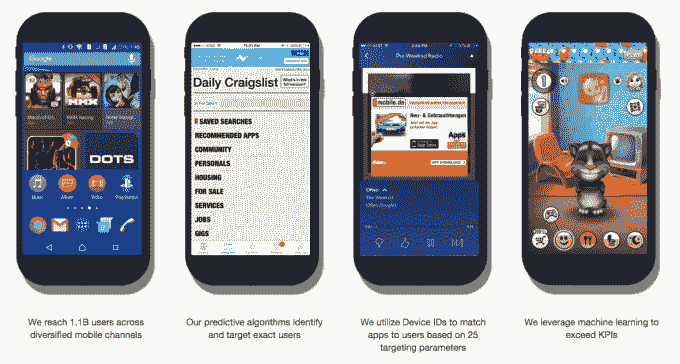

# YouAppi 完成 1310 万美元的 B 轮融资，以拓展其在亚洲的移动用户获取服务 

> 原文：<https://web.archive.org/web/https://techcrunch.com/2016/02/17/youappi-closes-13-1m-series-b/>

# YouAppi 完成 1310 万美元的 B 轮融资，以拓展其在亚洲的移动用户获取服务

帮助公司通过移动广告和分析获取用户的美国-以色列初创公司 YouAppi 已经完成了 1310 万美元的 B 轮融资，以开发其技术并扩展其亚洲业务。

该公司成立于 2011 年，旨在为希望吸引和留住移动新用户的公司提供单一平台。它结合了一个与 3，500 多个移动应用程序和网站同步的移动广告平台，以及由机器学习支持的分析(测量用户的 25 个数据点)和预测算法。利用这些数据，YouAppi 还与现有的移动广告公司(如猎豹移动)合作，以更好地了解他们的受众并优化他们的广告库存。

“我们帮助主要品牌应用获得高价值的客户，”首席执行官兼联合创始人 Moshe Vaknin 在接受 TechCrunch 采访时表示。“我们看到每个用户的每次点击都会发生什么。许多公司收集数据，但很少有人知道如何使用数据。”

迄今为止，YouAppi 已经从投资者那里筹集了 500 万美元，它在美国的旧金山和纽约，以及中国、印度、以色列、新加坡、德国和英国都有团队。瓦克宁说，截至目前，北美占总收入的 60%，亚洲占 30%。该轮投资包括亚洲投资者 Hawk Ventures(中国)和 Global Brain(日本)，目的是增加对潜在增长市场的关注。仅在中国，YouAppi 就与百度、阿里巴巴、Sungy Mobile 和 APUS 合作——它预计今年来自中国的收入将翻一番，从其全球收入的 10%增加到 20%。

除了在亚洲发展公司之外——YouAppi 计划很快在印度和印度尼西亚开设办事处——这轮融资的其余三分之二将被留出，用于将美国团队从目前的 20 人扩大到 28 人，并开发 YouAppi 的技术。

根据 Vaknin 的说法，2016 年对 YouAppi 来说将是重要的一年。他预计该公司将在 8 月份实现盈利，同时计划在今年最后一个季度进行 C 轮融资，“以帮助进一步扩大规模”。