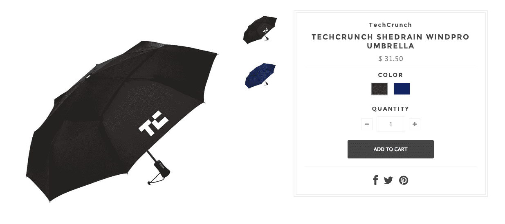

# 你对 TechCrunch 品牌纸杯的漫长等待结束了

> 原文：<https://web.archive.org/web/https://techcrunch.com/2014/07/25/your-long-wait-for-techcrunch-branded-paper-cups-is-over/>

母公司和真正的母公司没什么不同。他们给你吃的，给你钱。他们给你建议(有时比别人更严格)。是的，他们让你尴尬。

说到这里，今天我们引以为豪的母公司 [Aol](https://web.archive.org/web/20230129092304/http://www.crunchbase.com/organization/aol) ，凭借在~~零售、~~ ~~网上零售、~~网上商务方面的丰富经验，推出了旗下品牌的网上店面，包括 TechCrunch。亲爱的读者，欢迎来到美国在线商店的[盛大开业典礼，在这里你可以“飘扬你的美国在线旗帜”。(说真的，这是我们收到的关于此事的内部邮件的主题。不开玩笑！).](https://web.archive.org/web/20230129092304/http://store.aol.com/)

商店的[关于第](https://web.archive.org/web/20230129092304/http://store.aol.com/pages/about-this-store)页也是一块宝石:

> 美国在线商店为你、你的家人、你的朋友、你的客户、你假日购物清单上的那些困难的人以及你能想象到的几乎任何人提供最受欢迎、最受欢迎和最有用的产品。
> 
> 我们根据质量、品牌、环境影响以及我们完全科学的 Hipness Factor 来选择产品。这些物品不仅稀有，而且被那些无法像你一样接触到我们私人库存的人所觊觎。所以继续吧。飘扬你的美国在线旗帜。你可以回头看看。

时尚因素？

商场的一些亮点:

我不知道什么是不太相关的:是《华尔街日报》还是 MapQuest？

[Adap.tv](https://web.archive.org/web/20230129092304/http://www.crunchbase.com/organization/adap-tv) 有很多婴儿。所以这是有道理的。

直到你向下滚动，意识到你需要购买 *36 单位*的温泉。一夫多妻的邪教领袖会神魂颠倒！

[TechCrunch](https://web.archive.org/web/20230129092304/http://www.crunchbase.com/organization/techcrunch) ，扰乱 2014 年以来的降雨

谈谈环保吧，阿米利特？

Aol 为其客户提供了如此多的价值，以至于它甚至无法将所有的价值都装进包装中。

因为这以一种意想不到的方式点亮了我们的周五，我们直接从 TechCrunch 内部留言板分享了这次对话。尽情享受吧！

**安德鲁:**谁想要 TechCrunch 威士忌酒杯和婴儿连体衣？

安东尼:哦，我们能在纽约买到吗？

“美国在线商店为你、你的家人、你的朋友、你的客户、你假日购物清单上的那些难缠的人以及你能想象到的任何人提供最受欢迎、最受欢迎和最有用的产品。

我们根据质量、品牌、环境影响以及我们完全科学的 Hipness Factor 来选择产品。这些物品不仅稀有，而且被那些无法像你一样接触到我们私人库存的人所觊觎。所以继续吧。飘扬你的美国在线旗帜。你可以回头看看。
**瑞恩:**请某人 BLAWG 这个

格雷格:我们整个商店就应该是那个威士忌酒杯。

**Matthew:**http://store . AOL . com/collections/TechCrunch/products/TechCrunch-EOS-smooth-sphere-lip-balm<我女儿会很高兴吃这个

**Greg:**http://store . AOL . com/collections/TechCrunch/products/TechCrunch-paper-cups-1 最后

马特:@格雷格，每个 0.93 美元

Matthew: 其实我喜欢这些绿色的帽衫，这些应该是我们队的帽衫。http://store . AOL . com/collections/TechCrunch/products/TechCrunch-zip-hoodie

马修:这东西用 PS 处理的方式真好。http://store . AOL . com/collections/TechCrunch/products/TechCrunch-title ist-dt-solo-golf-golf-balls

请给我来一个。这些东西我们能打折吗？

瑞恩:花掉它

完成了

**马修:**突破:你对 TechCrunch 品牌纸杯的漫长等待结束了:商店:电影 cc @Alexia

就像 Jay-Z 在俱乐部点他自己的伏特加一样

格雷格:所有这些东西的最低订单是 36 件。谁订购了 36 件 techcrunch 夹克

**Matt:** 这是最好的 http://store . AOL . com/collections/TechCrunch/products/TechCrunch-appliant-hoodie

莎拉:我们开店多久了？

达雷尔:我会签这些东西，每份收取 5 美元的回扣。达雷尔:这是“好孩子”的个性化问候，额外 10 美元

Matthew: 我们的帽衫会让你脊柱侧弯 http://store . AOL . com/collections/TechCrunch/products/TechCrunch-zip-hoodie

**Matt:** 请购买 72 个水瓶 http://store . AOL . com/collections/TechCrunch/products/copy-of-style list-75l-camel bak-eddy-water-bottle

**马特:**全零售

**瑞恩:**好吧，那么是谁写的呢？插播:你对 TechCrunch 品牌纸杯的漫长等待结束了

Matthew: @Greg 事实上，它们是 36 个的最小订单，这告诉我这些应该是卖给 AOL 的内部品牌，而不是外部。

还在等巴尔托去年答应给我的 XS TC 夹克。开始认为这是过时的

弗雷德里克:http://store.aol.com/pages/about-this-store

**Ryan:**‘我们选择储备各种 AOL 品牌的产品，可以在短时间内订购任意数量。对于所有其他品牌，订单都是定制的，并且有最低数量限制。我们尽最大努力选择最低订单量低、交货时间短的产品。

2013 年:魔鬼计划。2014 年:Drinkstirrer 项目

Sarah: 这个 convo 线程可能是整个帖子。

**Ryan:** 伙计们:“我们完全科学的时尚因素”

崔维斯:所以……这家商店对所有 AOL 员工开放。这意味着 MapQuest 和 Cambio 可以获得 TechCrunch 的赠品。

莎拉:实际上没有收入:“美国在线没有从商店出售的商品中获利。”

Matthew: 那他们就大错特错了
**Matthew:** 我岳父做丝网印刷和刺绣(基本上就是所有这些东西)，这些价格高得离谱。

这是本世纪最伟大的发现

Matthew: 像这样一件连帽衫的价格大约是 6 美元

**莎拉:**@马修写这个博客的人有多火？严肃的问题。

乔丹:我会这么做的……我觉得这样做很好。

**马修:**@莎拉没有被解雇

所以，如果你和你的 35 个最亲密的朋友想聚在一起买一大堆帽衫，那就买 TC 的吧。代表。