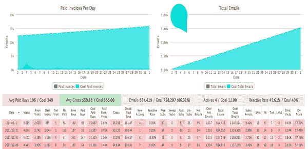
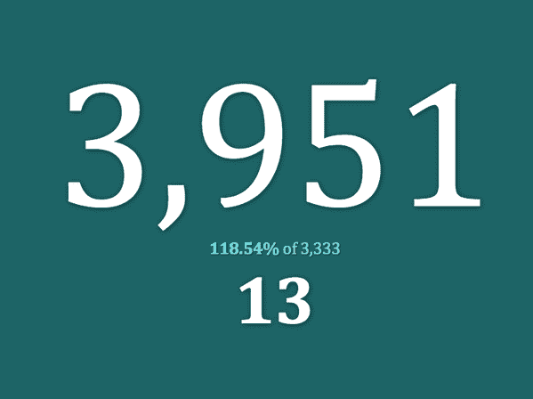

# 您对增长的建模仍然不正确 

> 原文：<https://web.archive.org/web/https://techcrunch.com/2015/08/12/youre-still-modeling-growth-wrong/>

当我第一次在 Mint 得到营销工作时，创始人兼首席执行官 Aaron Patzer 告诉我，我们必须在推出的六个月内让 Mint 拥有 10 万用户。

这个数字本身并没有吓倒我:在 Mint 之前，我是脸书的第 30 号员工。我亲眼目睹了疯狂的指数级用户增长。不同的是，在 Mint，我们是预生产，当然也是预可重复的- 增长-引擎。这意味着我们必须从头开始发明一些东西。

我不会撒谎，我很紧张。我首先起草了一份营销计划。

结果:12 个月后，Mint 的用户超过了 100 万。我们在目标上方多加了一个逗号。

在创业的世界里，增长就像氧气一样对生命至关重要，达不到你的增长目标就意味着你的公司会倒闭。

鉴于实现增长的生死攸关的重要性，具有讽刺意味的是增长团队、营销人员和创始人往往将其视为信仰问题。他们的执行计划相当于非常努力地工作，然后跪下向增长之神祈祷一切都会奇迹般地运转。

你犯的错误是一个简单而深刻的修正，它将从根本上改变你和 T21 对待增长的方式。

## 模拟增长:你做错了

增长不是通过假设增长来建模和实现的。这听起来是显而易见的，但是假设 99%的企业家今天仍然在增长。

我的朋友陈楚翔在他的精彩文章“预测新产品的增长时最常见的错误是什么”中说，他认为增长预测的头号错误是这样的:

在第*个月*、个月有 U_0 x (1 +月增长的)^n 用户。

这看起来眼熟吗？要诚实。

这就是通过定义指数来模拟曲棍球棒增长，曲棍球棒增长。然后游戏调整增长率，使数字看起来合理。你降低了增长率，这样你的预测就不会完全疯狂——疯狂到足以让你成为纸面上的百万富翁。

这种模型是一种虚荣心的练习，因为它让你觉得十亿美元的估值只不过是对你电子表格上的增长率单元格的一个微小调整。

> 推导增长率的过程就是创建一个你可以执行的实际计划的过程。

这就是问题所在。在生活中，我们无法选择我们的增长率(T21)。我们只能选择我们投入工作的内容，而增长率从另一端作为我们所做工作的产出出现。

用安德鲁的话说，当你’重新创造你的模型时，“与其假设增长率，不如把重点放在推导增长率上。”

推导增长率的过程就是创建你可以执行的实际计划的过程。我会告诉你怎么做。

## 从你最重要的数字开始

如果说我在脸书从马克·扎克伯格那里学到了什么，那就是你必须一次只专注于一件最重要的事情。有一次他特别教了我这一课，我永远不会忘记。

早在 2005 年，我会给马克带来各种新的想法和不同的产品特性。

很久以前，如果你还记得的话，人们认为脸书是一个很酷的应用程序，但是没有人认为它可以成为一项真正的业务。这让我很困扰，我总是担心我们没有赚到足够的钱，人们认为我们做不到。

这为我的天才想法铺平了道路:证明怀疑论者是错误的，在脸书赚钱，成为一个真正的企业，获得丰厚的利润。

马克听了我的想法，然后在白板上写下了单词“成长”他宣称，除非能帮助脸书增加用户总数，否则他不会考虑任何想法。

当我经营自己的公司 AppSumo 时，我才真正开始体会到这一点。这是我们公司的仪表板过去的样子:

它充满了干扰。我们不能对不同的想法说不，因为我们有太多的数字，我们试图改善，但最终我们什么也没有改善。

最糟糕的是，如果你在房间里走来走去，问 AppSumo 的员工我们公司的目标是什么，每个人都会说一些不同的话。让那件事过去一会儿。这是一个令人尴尬的想法。

第二年 1 月，我们设定今年的目标是为我们的新课程争取 3333 名客户，帮助 3333 人创建了自己的[、月收入 1000 美元的企业](https://web.archive.org/web/20221226020328/http://www.appsumo.com/how-to-make-your-first-dollar/?src=andrewchen_htmyfd)。我们创建了一个新的仪表板，如下所示:

这是我们想要完成的一件真诚的事情，整个团队清楚地知道我们今年想要去哪里。我们在 10 月份达到了目标，并吃掉了几个玉米卷以示庆祝。

这就是为什么要制定一个增长的计划，你的第一步是选择你最重要的一个指标，并逆向设计你需要做什么才能实现。

## 如何满足，然后超越你的目标

现在我们知道了我们的目标，我们将返回到我们需要的解决方案。

我们不会去做“社交媒体营销”,也不会在网络上随意发表博文，因为我们知道这不会让我们达到目标。

以下是我们的做法，以 Mint 为例:

如果你’re认为这是愚蠢的简单，它就是。这就是它如此强大的原因。

我们通过对系统输入的合理估计，得出了 100，000 个用户的总数。我们从我们的用户目标，到我们需要的转化率和点击率，到不同来源的预期流量。

现在我们知道我们需要做什么——这是我们要执行的计划。

有两列:总用户数和确认用户数。你必须提前确认营销:博客、推文、广告购买等。不要听天由命。只有*确认了*事项。

如上所述，在发布前设置您的指标，然后确认营销渠道。随着你的 T21 之行，让你的估计与实际发生的情况相一致。使用谷歌电子表格跟踪，了解哪些有效，哪些无效。这会告诉你需要如何调整你的计划。

如果你这样做了，你就会从希望和祈祷走向真正思考你需要做什么，并且有一个路线图可以指引你到你需要去的地方。