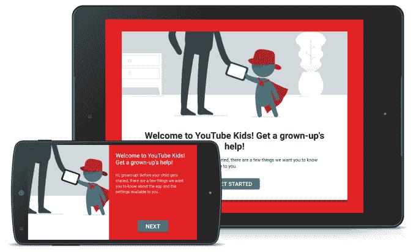
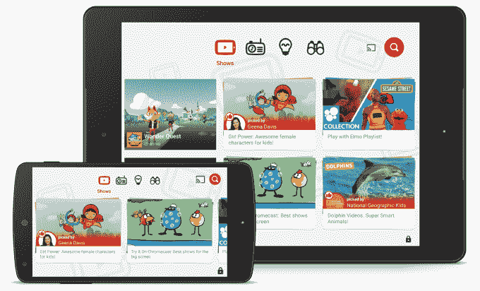

# YouTube 在更新的 YouTube 儿童应用 中解决了关于不适当内容的投诉

> 原文：<https://web.archive.org/web/https://techcrunch.com/2015/10/01/youtube-addresses-complaints-about-inappropriate-content-in-updated-youtube-kids-app/>

当 YouTube [今年早些时候首次推出其专用的“儿童”应用程序](https://web.archive.org/web/20230308071854/https://techcrunch.com/2015/02/23/hands-on-with-youtube-kids-googles-newly-launched-child-friendly-youtube-app/)时，由于新应用程序精选了适合儿童的视频，父母们欢迎能够让他们的孩子远离更大的 YouTube 网络上的更成人内容的机会。但是这款应用[很快就遭到了消费者监督组织](https://web.archive.org/web/20230308071854/https://techcrunch.com/2015/05/19/youtube-kids-app-reported-to-ftc-for-featuring-videos-with-adult-content/#.s2agxy:K8Ek)的抨击，他们声称 YouTube 在保护儿童免受不良内容方面做得不够，包括色情、毒品、酒精等内容。

现在，YouTube 开始通过更新来解决这个问题，这将帮助父母更好地限制孩子可以在 YouTube Kids 上访问的内容类型。

YouTube 表示，这一功能和更多功能，包括 Chromecast 和 Apple TV 支持以及嘉宾管理的播放列表，将在几周后的新版本应用中推出。

[YouTube Kids 想要解决的问题](https://web.archive.org/web/20230308071854/https://techcrunch.com/2015/02/23/hands-on-with-youtube-kids-googles-newly-launched-child-friendly-youtube-app/)意义重大。

今天的孩子们经常访问 YouTube，观看教育视频、卡通、音乐视频、网络系列等等。但由于该网站缺乏易于实施的家长控制，孩子们经常会通过 YouTube 在 via search 上的推荐偶然发现内容，这并不完全是“对孩子安全的”例如，一个无辜的搜索 Elmo 视频可以看到孩子们在一个视频上结束了 [Elmo](https://web.archive.org/web/20230308071854/https://www.youtube.com/watch?v=G_Yc7NY0ZCE) [诅咒](https://web.archive.org/web/20230308071854/https://www.youtube.com/watch?v=miBQ9jDeujk)。

相反，YouTube Kids 的想法是提供一个简化的用户界面，用于与 YouTube 互动，视频经过审查，并被归类为高层次的类别，如“节目”、“音乐”、“学习”和“探索”

YouTube 儿童应用程序是在与常识媒体、ConnectSafely.org、家庭在线安全研究所、互联网安全联盟(iKeepSafe)和 WiredSafety.org 协商后开发的，它包含了来自梦工厂电视、吉姆·汉森电视、鹅妈妈俱乐部、会说话的汤姆和朋友、国家地理儿童、阅读彩虹和托马斯坦克引擎等知名儿童娱乐品牌的内容，以及来自 Vlogbrothers 和 Stampylonghead 等 YouTube 的其他节目。

**处理不当内容**

但这款应用的问题是，YouTube Kids 提供了一个搜索功能，可以将孩子们引向那些没有被明确包含和组织到应用各个部分的视频，这也是[导致 FTC 投诉](https://web.archive.org/web/20230308071854/https://techcrunch.com/2015/05/19/youtube-kids-app-reported-to-ftc-for-featuring-videos-with-adult-content/#.s2agxy:K8Ek)的原因之一。虽然可以在家长控制中禁用该选项，但似乎很多人都不知道它的存在。

两个消费者团体——数字民主中心和无商业童年运动——合作展示了如何利用搜索功能将孩子们指向非常不合适的视频。

他们使用该应用程序来查找视频，其中包括性语言、不安全行为(如玩火柴或杂耍刀)、亵渎(如对电影《赌场》(Casino)的模仿，该电影由《芝麻街》(Sesame Street)中的伯特和厄尼主演)、关于家庭暴力、色情和虐待儿童的成人讨论、关于吸毒和恋童癖的笑话以及酒精广告。

[YouTube 今天表示](https://web.archive.org/web/20230308071854/http://youtube-global.blogspot.com/2015/10/more-for-your-family-in-youtube-kids-app.html)它将对 YouTube Kids 做出改变，现在将向父母解释如何选择视频以及如何标记视频，这将迫使父母决定他们希望他们的孩子有多少访问权限。简而言之，家长将被要求启用或禁用搜索功能。当禁用时，孩子们将被限制在应用程序中更有限的一组视频。

同样新的是父母可以设置密码而不是拼写出来的代码。

然而，正如 YouTube 在[的一篇博客文章](https://web.archive.org/web/20230308071854/http://youtube-global.blogspot.com/2015/10/more-for-your-family-in-youtube-kids-app.html)中提醒家长的，“没有一个系统是完美的”——同时指出，如果视频泄露，家长应该标记相关视频。这些被标记的视频会被全天候人工审查，任何不应该被包括在内的视频都会在几个小时内被删除。

眼下更大的问题是，YouTube 拥有大量内容，而且其目录以令人难以置信的速度增长，每分钟都有数百小时的视频上传到 T2。这意味着 YouTube 不能手动过滤儿童应用程序的所有内容，而是使用算法过滤、用户输入和人工审查的组合。如果没有 100%的人工监管，不良视频可能会溜走。

这意味着简单地在你的移动设备上安装“儿童”版本的 YouTube 永远不会取代真正的家长监督。这只是对 YouTube 主应用程序的改进。

**YouTube 儿童和广告**

虽然今天的帖子中没有提到，但 YouTube 正在对消费者在向 FTC 投诉中提出的另一个问题——广告表明立场。这些组织称，YouTube 以欺骗儿童的方式将内容和广告混在一起。特别是，这些团体关注的是付费代言，在这种情况下，视频明星和产品制造商之间的关系不会被披露。

YouTube 的立场是，付费广告在应用程序中是允许的，它们将被如此标记。但用户上传的任何视频都不被视为广告，也不受 YouTube 广告准则的约束。我们从熟悉情况的人那里了解到，这意味着用户视频可以包括“某些商业广告和其他宣传材料”

例如，在应用程序上搜索“cookie”可能会在用户的*频道*上显示 cookie 公司的电视广告——但 YouTube 不会将该视频视为付费广告，也不受 YouTube 广告政策的约束。

对用户视频的唯一要求是它们是儿童友好的。

也就是说，创作者被要求披露视频是否是付费代言，那些被排除在 YouTube Kids 应用程序之外的视频是政策问题(如果不是实践的话)。)创作者还会被指引到一个详细说明如何给这些视频贴标签的页面。

我们知道联邦贸易委员会对 YouTube 投诉的调查正在进行，但正在等待详细情况的反馈。

除了这些更严重的问题，YouTube 今天还在更新的应用程序中推广了一些其他功能，包括支持通过 Chromecast、Apple TV、游戏机和智能电视在电视上观看 YouTube Kids，以及来自国家地理 Kids、Kid President、演员吉娜·戴维斯的女孩力量主题播放列表、包括 Vsauce 和艾米·波勒的 Smart Girls 在内的创作者等新的访客创建的播放列表。

该公司表示，自 2 月份推出以来，该应用程序的下载量已超过 800 万次。