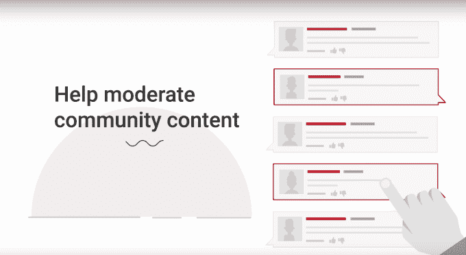

# YouTube 通过一个新的“YouTube 英雄”项目招募志愿者来管理它的网站

> 原文：<https://web.archive.org/web/https://techcrunch.com/2016/09/21/youtube-enlists-volunteers-to-moderate-its-site-via-a-new-youtube-heroes-program/>

本月早些时候，随着 YouTube 社区的首次亮相，YouTube [推出了自己的社交网络](https://web.archive.org/web/20230323173220/https://techcrunch.com/2016/09/13/youtube-gets-its-own-social-network-with-the-launch-of-youtube-community/);现在，它正在寻求观众的帮助，以帮助调节它，以及视频共享网站上的其他内容。该公司[宣布](https://web.archive.org/web/20230323173220/https://www.youtube.com/watch?v=Wh_1966vaIA)推出一个新的众包审核程序，名为“ [YouTube Heroes](https://web.archive.org/web/20230323173220/https://support.google.com/youtube/answer/7124236?hl=en&ref_topic=7124235) ”，要求志愿者执行诸如标记不当内容、添加字幕和字幕、回答 YouTube 帮助论坛上的问题等任务。

YouTube 表示，参与者将有资格获得额外津贴，例如，包括参加独家研讨会和预览产品发布会。

该公司没有正式宣布 YouTube 英雄，而是通过其 YouTube 帮助频道发布了新闻，在那里它首先被博客 [9to5Google](https://web.archive.org/web/20230323173220/https://9to5google.com/2016/09/20/youtube-wants-to-enlist-you-to-help-moderate-its-website/) 发现。

在[视频](https://web.archive.org/web/20230323173220/https://www.youtube.com/watch?v=Wh_1966vaIA)中，YouTube 进一步详细介绍了志愿者将从事的工作类型。在审核方面，他们将不仅仅标记单个视频，还可以使用大量标记工具，允许他们一次检查多个视频。他们还将负责管理网站上的新社交社区。

视频称，英雄们将拥有自己的在线仪表盘，可以随时参加“英雄聚会”。在更高的层面上，他们可以偷偷瞥一眼新产品，甚至亲自测试，也可以直接联系 YouTube 的工作人员。

https://youtu.be/Wh_1966vaIA

这个新项目遵循了 YouTube 成为一个社交平台的最新努力。

YouTube 社区[于 9 月中旬推出](https://web.archive.org/web/20230323173220/https://techcrunch.com/2016/09/13/youtube-gets-its-own-social-network-with-the-launch-of-youtube-community/),为视频创作者提供更多与观众互动的方式，而不仅仅是视频。在频道页面上一个名为“社区”的新标签上，创作者可以与他们的观众分享文本、gif、图像和其他内容。

这项服务目前在 YouTube 的一些知名用户中处于公开测试阶段，但尚未向所有人推广。在此之前准备好审核工具是 YouTube 明智的下一步。

谷歌依靠众包来努力改进其产品是很常见的。该公司已经[使用被称为“本地向导”](https://web.archive.org/web/20230323173220/https://techcrunch.com/2015/11/13/google-crowdsources-business-listing-corrections-map-edits-with-expanded-local-guides-program/)的贡献者来纠正企业列表信息和撰写评论，并且在[其新推出的应用程序 Google Trips](https://web.archive.org/web/20230323173220/https://techcrunch.com/2016/09/19/google-launches-a-personalized-travel-planner-google-trips/) 中利用众包旅游信息。

正如它的一些其他节目一样，YouTube 英雄因他们的工作而获得积分，这决定了他们的“英雄级别”

例如，通过标记不合适的视频，或为字幕写一句话，他们可以得到一分。在帮助论坛上回答一个被选为“最佳答案”的问题是 10 分。

YouTube 英雄计划[现已开放注册。](https://web.archive.org/web/20230323173220/https://support.google.com/youtube/answer/7124236?hl=en&ref_topic=7124235)任何个人(不是企业或品牌)都可以申请，只要他们拥有有效的 YouTube 频道，并且达到法定年龄。