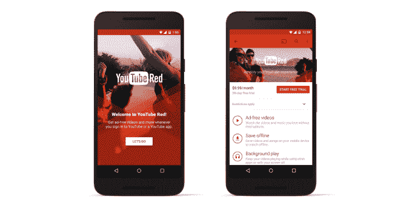
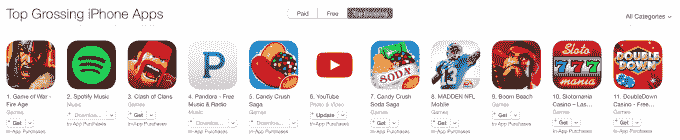
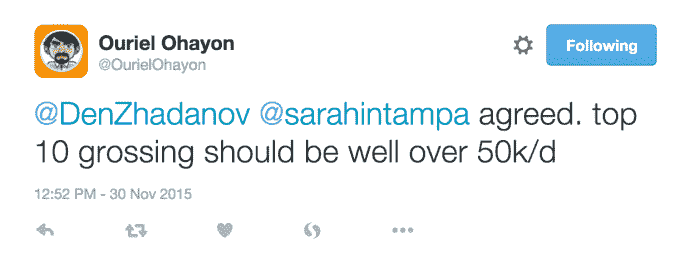
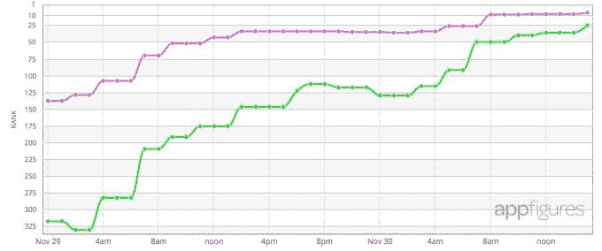

# 得益于 YouTube Red 订阅 TechCrunch，YouTube 进入了 App Store 的票房排行榜

> 原文：<https://web.archive.org/web/https://techcrunch.com/2015/11/30/youtube-enters-the-app-stores-top-grossing-charts-thanks-to-youtube-red-subscriptions/>

YouTube 计划将其部分用户群转化为基于订阅的无广告服务 YouTube Red，这一计划似乎正在获得支持。继 10 月下旬推出 YouTube Red 之后，该公司的 iOS 应用程序现已被评为苹果手机应用商店(App Store)收入最高的十大应用程序之一。这表明许多最初注册了一个月免费试用的用户在试用结束后已经转变为付费用户。然而，现在的问题是，这些用户中有多少人是无意中这么做的——也就是说，他们是不是在月租费生效之前忘记取消订阅了？还是他们有意付钱？

YouTube Red 是 YouTube 雄心勃勃的努力，旨在为网站本身及其创作者创造新的收入来源。YouTube Red 用户不再观看充斥着广告的视频，而是获得了无广告的视频，以及其他高级功能，如保存视频以便离线观看和在后台播放视频的能力。后一项使 YouTube 比竞争对手的流媒体音乐服务更具竞争力，因为用户可以在使用其他应用程序的同时通过 YouTube 听音乐。

YouTube Red 的好处还延伸到你登录 YouTube 的任何地方，包括该公司的独立应用程序、YouTube 游戏和新推出的 YouTube 音乐。此外，YouTube Red 订户可以访问 Google Play Music，这是谷歌的*其他*流媒体音乐服务和数字音乐锁。

YouTube 与创作者分享其红色订阅收入，向为其服务制作视频的人支付 55 %,与其分享的广告收入比例相同。然而，该公司实际上是通过要求创作者同意更新的条款或让他们的视频从 YouTube 上撤下来迫使他们同意参与 YouTube Red。这影响了一些更大的频道，比如 T2 的 ESPN T3，他们与其他一些频道签订了流媒体协议，阻止他们加入 YouTube Red。作为回应，它从 YouTube 上撤下了大部分视频。

随着早期用户的免费 YouTube Red 试用在 11 月底结束，YouTube 应用在 iOS 应用商店的排行榜上一直攀升。

11 月 28 日星期六，它首次出现在 iPhone 和 iPad 的票房排行榜上，分别排在第 214 位和第 389 位。到周日，它已经跃升至第 34 位和第 123 位，今天它又移动到第 8 位和第 36 位，适用于 iPhone 和 iPad。(我写完这篇文章后，app 又跳了，现在 iPhone 第 6，iPad 第 25。)

应用营销公司 Sensor Tower 指出，在这段时间内，美国的下载量估计为 340 万次，但没有办法知道这些用户中有多少人选择了免费的 YouTube Red 试用，也没有办法知道有多少当前用户看到了在应用中注册尝试 YouTube Red 的选项。

尽管订阅选项在 iOS 和 Android 上的设置中都有点埋没，但 YouTube 一直在显示一个闪屏，鼓励用户免费试用 YouTube Red。一些用户报告说，他们甚至可以选择延长免费试用期，这表明并非所有同意试用 YouTube Red 的人都还没有决定是否要付费。

在 iOS 系统上，YouTube 对 YouTube Red 的收费略高于其每月 9.99 美元的标准价格，以此作为苹果销售额的百分比。相反，iOS 用户每月支付 12.99 美元——这个价格点足够高了(比网飞还高！)YouTube 必须证明其新的付费服务有巨大的价值，才能让用户不会取消。

Sensor Tower 估计，YouTube 在周末期间每天从应用内购买中获得约 1.2 万美元的收入——唯一的应用内购买是订阅 YouTube Red 的选项。他们说，每天大约有 927 名新用户。然而，其他人报告说，在票房收入最高的部分意味着该应用程序的收入比这多得多——每天超过 5 万美元:

毕竟，[最卖座的 iPhone 游戏每天能赚到 6 位数](https://web.archive.org/web/20221207001825/https://thinkgaming.com/app-sales-data/)或者更多。

据 Readdle 的营销负责人丹尼斯·扎达诺夫(Denys Zhadanov)称，由于他在 Readdle 的工作，他对 App Store [和 Mac App Store](https://web.archive.org/web/20221207001825/https://medium.com/developers-writing/how-to-launch-a-mac-app-and-become-1-top-paid-app-globally-4434bbfb51ee#86d8.1ttrpwrkz) 的运营非常熟悉，更好的估计是每天 7 万至 9 万美元。他说，排在第六位，这意味着 YouTube 每天的收入超过 10 万美元。

在 Sensor Tower 运行该应用程序当前排名的数据后，他们发现 iPhone 每天可以赚 30 万美元，iPad 每天可以赚 5 万美元。这相当于每天 350，000 美元，或者大约 27，000 名用户每月支付 12.99 美元。

Sensor Tower 澄清说，它的估计是基于迄今为止报告的收入，但还需要几天的数据才能了解全貌。出于同样的原因，App Annie 拒绝提供数据，但同意 YouTube 应用程序排名如此之高的事实令人印象深刻。

与此同时，YouTube 的应用程序目前并不是 Google Play 上票房最高的应用程序，这表明要么是购买该服务的用户减少了，要么是 Android 上的大多数 YouTube Red 订户是通过已经是 Google Play 音乐的付费订户来加入 YouTube Red 的。(在 Red 发布后，Google Play 音乐用户可以免费使用它。)然而，根据 App Annie 的排名[数据](https://web.archive.org/web/20221207001825/https://www.appannie.com/apps/google-play/top/united-states/)，新的 YouTube 音乐应用在 Google Play 的免费排行榜上排名第 78 位。

关于这些早期数据的另一件有趣的事情是，就其总收入排名而言，iPhone 版的 YouTube 应用程序比 iPad 版起飞得更多——特别是因为 iPad 的排名更容易攀升。然而，YouTube 一直在 iPhone 应用程序中大量宣传红色，与 iPad 相比，iPhone 上消费的视频可能更多，这可以解释这一趋势。

*上图由 [appFigures](https://web.archive.org/web/20221207001825/http://appfigures.com/)* 提供

同样值得注意的是，鉴于 YouTube 的高下载量，即使少量的转换也会使该应用程序出现在 App Store 的排行榜上。事实上，这符合 YouTube Red 对创作者的承诺——由于 YouTube 的巨大规模，即使只有少数用户选择为无广告的 YouTube 付费，它仍然可以看到一个可观的新收入流。