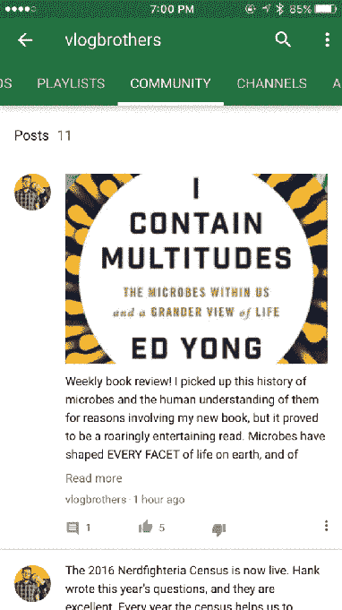

# 随着 YouTube 社区 的推出，YouTube 拥有了自己的社交网络

> 原文：<https://web.archive.org/web/https://techcrunch.com/2016/09/13/youtube-gets-its-own-social-network-with-the-launch-of-youtube-community/>

证实了早先的报道，YouTube 正计划为其服务引入更多的社交网络功能，[公司今天早上宣布推出 YouTube 社区，允许视频创作者使用文本、gif、图像等更好地吸引观众。新功能的目标是通过提供更多工具来联系观众，而不仅仅是视频本身，从而帮助创作者避免离开竞争平台。](https://web.archive.org/web/20230307214706/https://youtube-creators.googleblog.com/2016/09/youtube-community-goes-beyond-video.html)

过去几个月，YouTube 一直在与少数创作者一起测试这项新服务，以获得反馈。今天，它将与这批早期测试者一起推出这项服务，并将在“未来几个月”向更广泛的创作者群体提供这项服务。

创作者和他们的观众可以通过他们频道上的一个新的“社区”标签来访问这个扩展的功能集。

从这里，创作者可以分享文字帖子、图像、gif 和其他内容，观众可以像视频本身一样上下拇指，也可以发表评论。

YouTube 表示，观众将在 YouTube 移动应用程序的“订阅”源中看到这些帖子，还可以选择接收他们最喜欢的创建者关于这些帖子的推送通知。

YouTube 社区的早期采用者包括[约翰&汉克·格林](https://web.archive.org/web/20230307214706/https://www.youtube.com/user/vlogbrothers/community)、[阿萨科普](https://web.archive.org/web/20230307214706/https://www.youtube.com/user/AsapSCIENCE/community)、[游戏理论家](https://web.archive.org/web/20230307214706/https://www.youtube.com/user/MatthewPatrick13/community)、[唱游乐团](https://web.archive.org/web/20230307214706/https://www.youtube.com/user/karmincovers/community)、[牛逼之钥](https://web.archive.org/web/20230307214706/https://www.youtube.com/user/barelypolitical/community)、[克隆人](https://web.archive.org/web/20230307214706/https://www.youtube.com/user/thekloons/community)、[莉莉·辛格](https://web.archive.org/web/20230307214706/https://www.youtube.com/user/IISuperwomanII/community)、[彼得·霍伦斯](https://web.archive.org/web/20230307214706/https://www.youtube.com/user/peterhollens/community)、[罗西安娜·哈尔丝·罗哈斯](https://web.archive.org/web/20230307214706/https://www.youtube.com/user/missxrojas/community)、[山姆·徐克](https://web.archive.org/web/20230307214706/https://www.youtube.com/user/TheSamTsui/community)、

例如，在 vlogbrothers 的[频道](https://web.archive.org/web/20230307214706/https://www.youtube.com/user/vlogbrothers/community) (John & Hank Green)上，视频创作者表示，他们将使用社区页面通知他们的粉丝关于他们的频道、活动以及其他有趣的链接和他们收集的照片的更新。

实际上，这个社区页面允许创建者在他们的频道页面上运行一个小型社交网络。这对谷歌来说是一个重要的举措，谷歌在历史上一直难以获得社交权利，从其脸书竞争对手 Google+的失败就可以看出这一点。该公司曾试图将 Google+植入 YouTube，结果是灾难性的。(它终于在去年取消了整合。)

就让 YouTube 变得更像一个社交社区而言，社区标签比 Google+这样的目的地社交网络更有意义，因为它有效地让创作者能够直接与粉丝群对话，并推动公司渴望的社交参与。

YouTube 表示，其社区功能将暂时保持测试，因为它会听取反馈并推出新的功能和功能。一个更广泛的展示计划在未来几个月，但没有给出确切的 ETA。

[YouTube https://www.youtube.com/watch?v=K9V0p29u_UE]