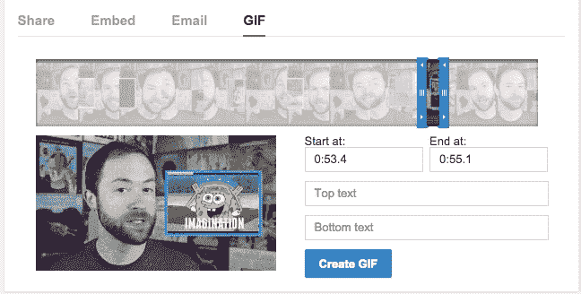

# YouTube 获得了一个内置的 GIF 创建器

> 原文：<https://web.archive.org/web/https://techcrunch.com/2014/12/11/youtube-gif-maker/>

# YouTube 有一个内置的 GIF 创建器

还记得去年 11 月我写道 YouTube 需要开发自己的工具来制作视频 gif 吗？有人说我疯了。然而，许多人完全同意。

似乎 YouTube 也同意了。YouTube 现在正悄悄推出自己的 GIF 制作工具。

它似乎还没有在所有的视频上启用，但它肯定会在一些视频上启用。举个例子，几乎所有来自 [PBS 创意频道](https://web.archive.org/web/20230404180453/https://www.youtube.com/channel/UC3LqW4ijMoENQ2Wv17ZrFJA)的视频(安迪·拜奥最先发现[)。点击](https://web.archive.org/web/20230404180453/https://twitter.com/waxpancake/status/543230698706857984)[他们的一个视频](https://web.archive.org/web/20230404180453/https://www.youtube.com/watch?v=z9WwVxGvDwI&list=PL69BD06CC757E1D61&index=1)，点击分享按钮，然后 GIF 离开。

通过该工具创建 GIF 非常简单:点击分享按钮，设置你的开始/结束点，设置任何你想要的标题，然后创建。这个工具速度非常快，YouTube 上也有 gif 图片。

该工具的最终外观与我在第一篇文章中所做的模型并没有太大的不同，这意味着我将对这个想法承担 100%的责任，尽管事实上它可能已经工作了几个月/几年。

现在需要制作一个 GIF*，但是 YouTube 的新工具还不能在你的可赠送视频上使用？[别忘了这个技巧](https://web.archive.org/web/20230404180453/https://techcrunch.com/2014/08/16/turn-any-youtube-video-into-a-gif-by-just-adding-gif-to-the-url/)，它可以将几乎所有的 YouTube 视频转换成 GIF 格式，只需快速调整网址。*