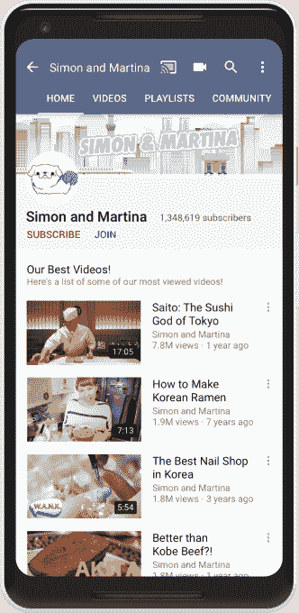
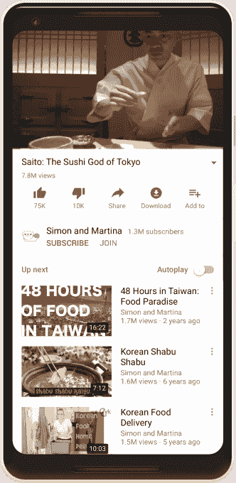
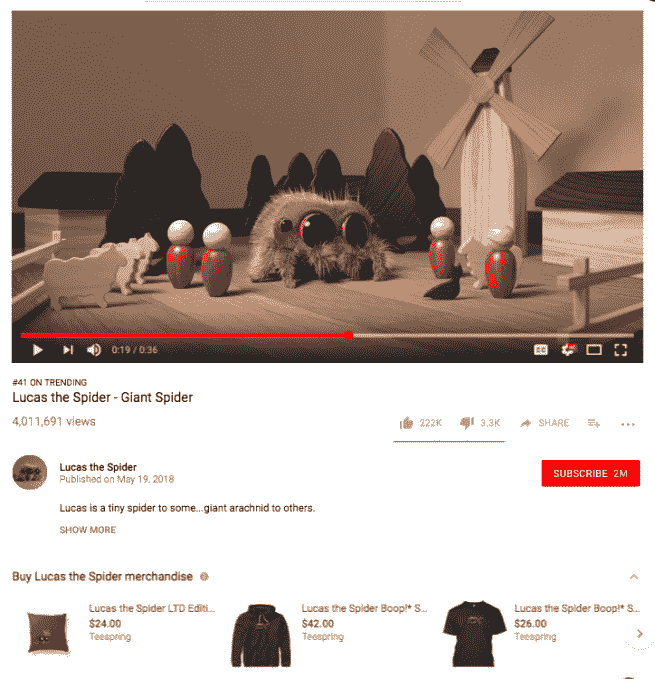
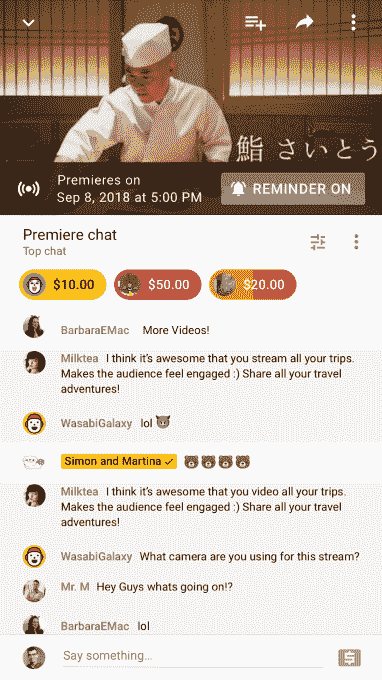

# YouTube 引入频道会员、商品和首播

> 原文：<https://web.archive.org/web/https://techcrunch.com/2018/06/21/youtube-introduces-channel-memberships-merchandise-and-premieres/>

据视频流媒体网站[今天在加利福尼亚州阿纳海姆举行的](https://web.archive.org/web/20230302224248/http://youtube.googleblog.com/2018/06/vidcon-2018-helping-creators-earn-more.html)[视频会议](https://web.archive.org/web/20230302224248/http://vidcon.com/)上宣布的消息，YouTube 创作者正在获得一些新工具，以从传统广告之外的视频中创收，以及那些将帮助他们更好地吸引粉丝的工具。这包括通过 FameBit 推出渠道会员资格、销售、营销合作伙伴关系，以及推出“首映”，这提供了一个介于预先录制、编辑的视频和直播之间的中间地带。

**会员资格**

在今天之前，YouTube 已经在 YouTube 游戏上提供了类似 Twitch 的“赞助”模式。这让粉丝们能够以每月 4.99 美元的价格赞助一个频道，这也让他们能够获得专属的数字商品，比如定制的徽章和表情符号。

YouTube 表示，去年秋天开始在其更大的视频网络中测试这一程序。这些测试导致了 YouTube 频道的会员资格。

与 YouTube 游戏不同，频道会员有额外的要求。

创作者需要有 100，000 或更多的订户，年龄在 18 岁以上，并且是 YouTube 合作伙伴计划的成员。

然而，支持创作者频道的价格点保持不变:每月 4.99 美元，包括定制徽章和专属表情符号。

它还允许订阅者在社区标签中访问仅限成员的帖子，创建者将不时分享定制的特权，如访问独家直播流、附加视频、呼喊、即将举行的活动的新闻、提前获得门票销售等。

YouTube 表示，它将手动审查这些额外津贴，以确保它们符合 YouTube 的指导方针，并且是创作者实际可以提供的东西。

“这套工具相当强大，所以我们想确保他们不会推出他们真的无法承诺的产品，”YouTube 替代货币化负责人、产品管理总监 Rohit Dhawan 解释道。

他说，在 YouTube 的指导原则范围内，额外津贴几乎可以是创作者想要提供的任何东西。

“这有点像一张空白的画布……我们给创作者提供工具，定制他们的会员服务，并提供他们认为对粉丝有价值的任何额外待遇，”他说。

这项功能于 1 月份推出，面向已经产生收入的精选创作者。对于所有有资格的人来说，它很快就会到来。

YouTube 表示，由于会员资格，omedy 创始人迈克·法尔宗的 YouTube 收入增加了两倍多。西班牙游戏频道[elrubiusmg](https://web.archive.org/web/20230302224248/https://www.youtube.com/user/elrubiusOMG/)现在的会员数量是 YouTube 游戏赞助商的六倍。Wintergatan 超过 50%的收入来自渠道会员。

YouTube 表示，总的来说，年收入五位数的创作者人数增加了 35%，年收入六位数的创作者人数增加了 40%。

与赞助类似，YouTube [在扣除当地销售税后保留](https://web.archive.org/web/20230302224248/https://support.google.com/youtube/answer/6304294?co=GENIE.Platform%3DDesktop&hl=en)30%的赞助收入，但涵盖所有交易成本，包括信用卡费用。

**商品**

除了会员资格，从今天开始，创作者还可以直接向粉丝销售。

在视频本身正下方的一个货架上，拥有超过 1 万名订户的创作者可以提供 t 恤、帽子、手机壳等商品，或者对他们的频道有意义的 20 多种不同商品中的任何一种。

例如， [Lucas the Spider](https://web.archive.org/web/20230302224248/https://www.youtube.com/user/joshuaslice) 的创作者**将他的角色变成了 [plushie](https://web.archive.org/web/20230302224248/https://teespring.com/shop/lts-plush?utm_campaign=lts&utm_medium=cpc&utm_source=adwords#pid=662&cid=102919&sid=front) ，并在短短 18 天内售出了 6 万多台，获利超过 100 万美元。**

 **

这项新计划是与定制商品平台 Teespring 合作推出的。

YouTube 表示，Teespring 将保留商品的一部分，每件商品都有所不同。实际上，这种方式的工作原理是，Teespring 销售的每件商品都有一个固定的价格，但是创建者可以将商品标价到他们想要的任何价格，然后保持上涨。

例如，一件 t 恤的底价是 10.22 美元，但创作者通常以 22 美元出售。然而，如果创作者销售 200-499 件 t 恤，基价下降到 9.82 美元，因此创作者赚更多的钱。

但 YouTube 也与 Teespring 达成了一项协议，它从这些销售中获得佣金——我们被告知，这是一个很小的固定百分比——其中大部分返回给创作者。这是为了激励创作者通过 YouTube 销售商品，因为他们将获得比直接销售更多的佣金。

这对 Teespring 来说也是一个巨大的胜利，仅仅几年前，该公司还在重组业务和裁员。

Teespring 表示，在测试期间，YouTubers 使用商品服务的成功率为 82%，从观看到销售的转换测试比标准描述链接高出 2.5 倍。在早期采用者中，这导致每个用户平均多售出 25%的设备。

此外，通过 2016 年秋天收购的[公司 FameBit 直接与品牌赞助联系的创作者，也可以利用商品货架向粉丝介绍他们正在出售的任何东西——比如视频游戏、服装或任何其他在线销售的产品。这项功能已在 VidCon 上宣布，但目前尚未推出。](https://web.archive.org/web/20230302224248/https://techcrunch.com/2016/10/11/google-acquires-famebit-to-connect-youtube-creators-with-brands/)

**首映**

最后，想要利用直播视频带来的创收可能性的 YouTubers 将有办法做到这一点，而不必实际上线。

相反，他们可以使用 YouTube 上一个名为“首映”的新功能，创建一个登陆页面，在视频发布前进行推广。这个页面还将有一个聊天功能，就像直播视频一样，这意味着创作者可以使用超级聊天，并利用频道会员特权，即使他们不做直播内容。

这些视频在 YouTube 上的同一个界面上传，所以除了打开“首映”开关之外，没有新的工作流程需要学习。

创作者也可以在视频直播时加入聊天，与粉丝围绕预先录制的内容进行互动，并在开始之前对视频进行评论。当首映式结束时，它会作为常规视频发布在网站上(没有 YouTube 添加的两分钟倒计时视频)。

“我们将使用我们的搜索和发现平台来推广这些，”YouTube 的集团产品经理 Kurt Wilms 指出，他是 Live 的负责人。

“即将到来的首映可以出现在(YouTube)主页和推荐视频中，”他说。我们被告知，首播也会显示在你订阅的所有频道内容显示的部分。首映式将在 YouTube 搜索和 YouTube 相关视频中进行。

“它们将会出现在我们网站的所有探索部分，这太棒了，”他说。

首映可以用来宣传创作者即将推出的视频，以及工作室的新电影预告片、视频游戏的预告片，甚至音乐视频。但 Premieres 目前并没有绑定 YouTube 音乐。

一些 YouTube 的创建者将在 VidCon 之后开启首映式，包括 **[Simon & Martina](https://web.archive.org/web/20230302224248/https://www.youtube.com/user/simonandmartina) 、 [Leroy Sanchez](https://web.archive.org/web/20230302224248/https://www.youtube.com/channel/UCWACD_NdQo00BhutSXMKa-w) 、 [Jackson Bird](https://web.archive.org/web/20230302224248/https://www.youtube.com/channel/UCX4auhvsqthZe5Ncdf0xXLA) 、 [Los Polinesios](https://web.archive.org/web/20230302224248/https://www.youtube.com/channel/UCs8qka8tfhdc69wzXYdtZ3A) 、 [Ari Fitz](https://web.archive.org/web/20230302224248/https://www.youtube.com/channel/UCPvHfZ4tmjeBXo8cIpv60vg) 、[zerkaalaplays](https://web.archive.org/web/20230302224248/https://www.youtube.com/user/ZerkaaPlays)、 [Theskorpionshow](https://web.archive.org/web/20230302224248/https://www.youtube.com/channel/UC7Cm8PQ45H71j25ri0vS53A) 、 [Laura Kampf](https://web.archive.org/web/20230302224248/https://www.youtube.com/channel/UCRix1GJvSBNDpEFY561eSzw) 、 [Vintage Space](https://web.archive.org/web/20230302224248/https://www.youtube.com/channel/UCw95T_TgbGHhTml4xZ9yIqg) 、**

 **YouTube 还表示，其 Stories 版本将于今年晚些时候面向所有拥有超过 1 万名订户的合格创作者推出。

这些声明是在 YouTube 的关键时刻发布的，因为脸书正试图通过自己独特的功能吸引创作者到自己的网络和视频中心。

在这则新闻之前，另一家[网站](https://web.archive.org/web/20230302224248/https://techcrunch.com/2018/06/20/youtube-woos-brands-with-its-new-creative-suite-of-ad-tools/) YouTube 本周向广告商发布了一项公告，内容是关于他们将能够使用一套创造性的广告工具与观众联系的新方式。****