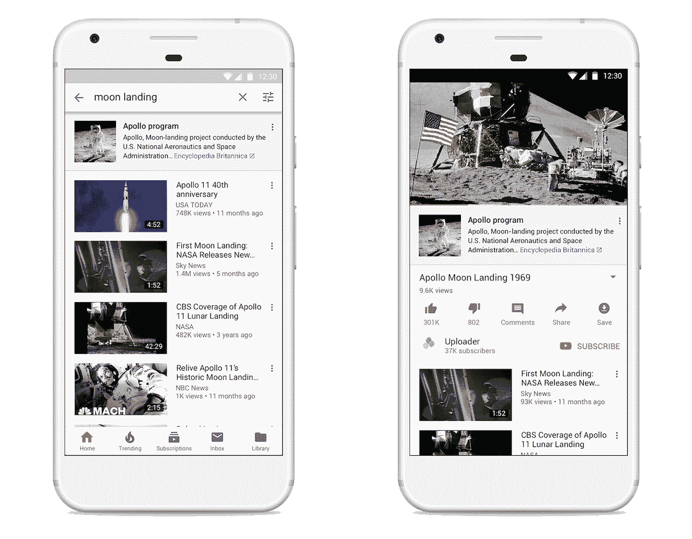

# YouTube 斥资 2500 万美元打击假新闻，以促进新闻报道和搜索结果中的更多内容

> 原文：<https://web.archive.org/web/https://techcrunch.com/2018/07/09/youtube-is-fighting-fighting-fake-news-with-25m-to-promote-journalism-and-more-context-in-search-results/>

# YouTube 正在用 2500 万美元打击假新闻，以促进新闻报道和搜索结果中的更多内容

YouTube [今天宣布了新的措施](https://web.archive.org/web/20230331231235/https://youtube.googleblog.com/2018/07/building-better-news-experience-on.html)来阻止阴谋论视频和假新闻在其平台上的传播，包括在热门话题的搜索结果中插入来自可信来源的上下文。在一篇博客文章中，YouTube 还表示，它正在与谷歌新闻倡议合作，该倡议由母公司[于今年早些时候发起，旨在支持记者和出版商](https://web.archive.org/web/20230331231235/https://www.blog.google/outreach-initiatives/google-news-initiative/announcing-google-news-initiative/)。

这包括从谷歌新闻倡议中拨款 2500 万美元，成立一个由新闻机构和媒体专家组成的工作组，为 YouTube 的新功能提供建议。成员已经包括 Vox 媒体、巴西广播电台 Jovem Pan 和今日印度，未来几周还会有更多成员加入。部分资金还将用于通过申请程序授予新闻机构的赠款，以帮助它们培训员工和建设其视频制作能力。这笔钱还将用于扩大与新闻出版商合作的 YouTube 团队。

YouTube 一直因阴谋论的泛滥而受到[的指责，这些阴谋论涉及历史话题，包括登月和 2016 年总统大选以及佛罗里达州桑迪胡克和帕克兰校园枪击案等新闻事件，其搜索和推荐算法尤其被指向更多观众推送有问题的视频。今年 3 月，YouTube 首席执行官苏珊·沃西基承诺推出新功能，使 YouTube 成为一个更可靠的信息来源](https://web.archive.org/web/20230331231235/https://www.nbcnews.com/tech/social-media/youtube-s-conspiracy-video-problem-just-getting-worse-researcher-says-n851296)[在西南偏南小组](https://web.archive.org/web/20230331231235/https://www.wired.com/story/susan-wojcicki-on-youtubes-fight-against-misinformation/)期间，他表示“这是假新闻和错误信息的一年，我们已经看到了向用户准确传递信息的重要性。”

类似于脸书试图通过在新闻提要中添加出版商和文章的信息来打击假新闻，YouTube 表示，它将在突发新闻话题的搜索结果中添加上下文，以帮助人们快速查看视频是否来自可信来源。搜索结果还将包括新闻文章的链接预览，因为记者通常在制作更多劳动密集型视频之前先写突发新闻，并提醒人们有关发展中事件的信息可能会迅速变化。

为了打击阴谋论，YouTube 将开始在视频旁边显示来自维基百科和大英百科全书等第三方来源的信息，这些视频涉及“经常被误导的既定历史和科学主题”，包括俄克拉荷马城爆炸案和登月。

其他新功能包括在 YouTube 应用程序中为 25 个美国媒体市场的电视屏幕提供当地新闻，以及添加头条新闻和突发新闻货架(用户在屏幕顶部看到的一排视频)，这些视频将在 YouTube 主页上突出显示新闻机构的视频。头条新闻和突发新闻功能已经在 17 个国家推出，包括美国、英国、法国、意大利、日本、印度、墨西哥、巴西、南非和尼日利亚。YouTube 称这一数字将在未来几个月翻倍。

该平台还支持 MediaWise，这是一个由波因特研究所(Poynter Institute)领导的非营利组织，旨在帮助青少年培养媒体和网络意识，并与约翰·格林、英格丽·尼尔森(Ingrid Nilsen)和马克·沃森(Mark Watson)等六位受年轻观众欢迎的 YouTube 创作者合作，“为数字扫盲带来意识，并帮助教育青少年。”