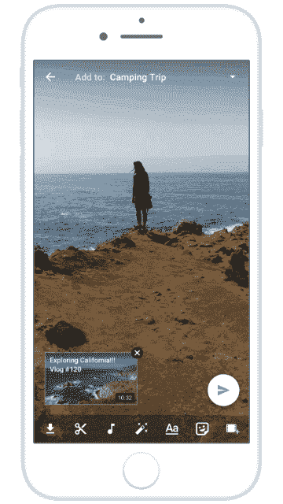
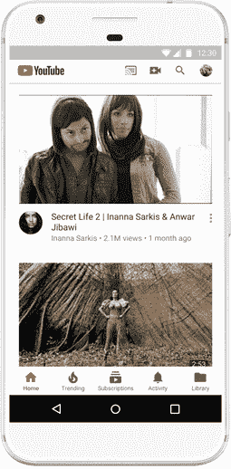

# YouTube 正在推出一种新的视频格式，名为“卷轴”

> 原文：<https://web.archive.org/web/https://techcrunch.com/2017/11/29/youtube-is-launching-its-own-take-stories-with-a-new-video-format-called-reels/>

甚至 YouTube 也在添加故事。Snapchat 推出的流行格式，随后被 Instagram、T2、Skype、脸书、T5、T6、Messenger、T7，甚至一些约会应用 T9 采用，现在正作为一项新功能进入 YouTube，该公司称之为“卷轴”需要澄清的是，Reels 是 YouTube 对故事的旋转，而不是一个精确的副本。与 Instagram 上的故事不同，影片不会出现在应用程序的顶部，而是出现在创作者频道的一个全新标签中。

今天[发布的公告中简要提到了 Reels beta 的推出](https://web.archive.org/web/20230324151551/https://youtube-creators.googleblog.com/2017/11/expanding-community-on-youtube.html)关于 YouTube 社区标签扩展到拥有超过 10，000 名订户的所有创作者。

我们向 YouTube 询问了关于 Reels 的更多细节，这些内容将很快引入测试版，供少数创作者反馈和进一步测试。

该公司告诉我们，Reels 的想法是在 YouTube 上引入一种新的视频格式，让创作者表达自己并吸引粉丝，而不必发布完整的视频。

相反，创作者通过拍摄几个长达 30 秒的快速移动视频，然后添加滤镜、音乐、文本等，包括新的“YouTube-y”贴纸，来制作新的卷轴。

与其他平台上的故事不同，YouTube 创作者可以制作多个卷轴，并且不会过期。

以下是创作者在发布时的卷轴外观，但请注意，格式可能会在公开发布前发生变化。

对于视频观众来说，卷轴可能不会像在 Messenger 或脸书上添加故事那样破坏体验，在那里它们不受欢迎。

由于卷轴被发布到创作者频道的一个单独标签上，类似于社区本身，观众可以选择是否观看这些新视频。

但是如果用户使用卷轴，那么 YouTube 会认为这是一个信号，表明你希望更经常地看到它们。YouTube 告诉我们，这可能会促使它们作为推荐出现在观众的 YouTube 主页上。

Reels 的到来是 YouTube 和 YouTube Community 为数不多的变化之一，YouTube Community 是去年秋天推出的社交平台[作为视频创作者吸引粉丝群的新方式。作为 YouTube 更大的社交网络中的一个迷你社交网络，Community 生活在一个创建者的频道中，允许他们使用文本、照片、gif、投票等来分享更新。](https://web.archive.org/web/20230324151551/https://techcrunch.com/2016/09/13/youtube-gets-its-own-social-network-with-the-launch-of-youtube-community/)

然后，观众可以像看视频一样对内容竖起大拇指或放下大拇指，并对帖子发表评论。

社区的另一个新特点是改变了帖子的工作方式和向浏览者显示的方式。现在，一个创作者的最积极的观众将会在他们的 YouTube 主页上看到社区帖子，即使他们没有订阅该频道。

YouTube 表示，通知现在也进行了优化，这样粉丝就不会收到每个新社区帖子的垃圾邮件。

社区最初推出测试版时只有少数几个 YouTube 创作者，包括[约翰&汉克·格林](https://web.archive.org/web/20230324151551/https://www.youtube.com/user/vlogbrothers/community)、 [AsapSCIENCE](https://web.archive.org/web/20230324151551/https://www.youtube.com/user/AsapSCIENCE/community) 、[游戏理论家](https://web.archive.org/web/20230324151551/https://www.youtube.com/user/MatthewPatrick13/community)、[唱游乐团](https://web.archive.org/web/20230324151551/https://www.youtube.com/user/karmincovers/community)、[牛逼之钥](https://web.archive.org/web/20230324151551/https://www.youtube.com/user/barelypolitical/community)、[克隆人](https://web.archive.org/web/20230324151551/https://www.youtube.com/user/thekloons/community)、[莉莉·辛格](https://web.archive.org/web/20230324151551/https://www.youtube.com/user/IISuperwomanII/community)、[彼得·霍伦斯](https://web.archive.org/web/20230324151551/https://www.youtube.com/user/peterhollens/community)、[罗西安娜·哈尔丝·罗哈斯](https://web.archive.org/web/20230324151551/https://www.youtube.com/user/missxrojas/community)、

今天，YouTube 详细介绍了一些测试人员迄今为止是如何使用 Community 的。比如 [Grav3yardgirl](https://web.archive.org/web/20230324151551/https://www.youtube.com/user/grav3yardgirl/community) 用社区让粉丝挑[接下来要拆箱什么](https://web.archive.org/web/20230324151551/https://www.youtube.com/channel/UCGwPbAQdGA3_88WBuGtg9tw/community?lb=UgzI2UTIYu2hxPlxS8t4AaABCQ)；[乐乐·庞斯](https://web.archive.org/web/20230324151551/https://www.youtube.com/channel/UCi9cDo6239RAzPpBZO9y5SA/community?lb=Ugztr0f9JmHdVEKo8kt4AaABCQ)发布了 gif 图片，作为她即将推出的视频的预告片；凯文·杜兰特在 NBA 比赛日分享照片。并且一些已经使用它发送流量到不同的信道和其他目的。

YouTube 没有说 Reels 何时会进入测试版，公开发布还要多久，或者哪些创作者将首先收到这种格式。