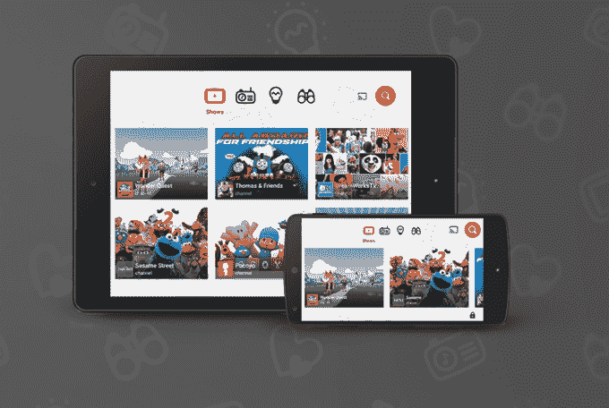
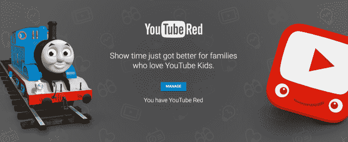

# YouTube Kids 来到智能电视 

> 原文：<https://web.archive.org/web/https://techcrunch.com/2017/04/25/youtube-kids-comes-to-smart-tvs/>

谷歌今天宣布，YouTube Kids(YouTube Kids)这款应用程序提供了一个对孩子更友好的 YouTube 过滤版本，现在首次在大屏幕上推出。YouTube Kids 以前是一个仅用于移动设备的应用程序，现在将在一系列智能电视上提供，包括 LG、三星和索尼的智能电视，这将使有小孩的家庭更容易获得该服务，而不必使用该应用程序的内置“播放”功能。

具体来说，该应用程序将出现在以下电视中:所有 2015-2017 年 LG webOS 电视(通过 LG 内容商店)；所有 2013-2017 款三星智能电视和蓝光播放器(通过三星应用商店)；并且，在一次固件更新之后，2016-2017 款索尼电视(安卓电视除外，即将推出)。

现在刚过两年，谷歌还提供了 YouTube Kids 应用程序吸引力的更新，指出该应用程序今天每周活跃用户超过 800 万，观看次数超过 300 亿次。

YouTube Kids 的目标是提供一个窗口，让孩子们了解更大的视频分享网站上更合适、更有教育意义和更有趣的内容，而不是让孩子们接触网站上更成熟的内容。

然而，与网飞或亚马逊等流媒体服务上的儿童类别不同，YouTube Kids 的内容是通过算法过滤的。就像任何无人监管的技术一样，这意味着它有时会出错。在这种情况下，家长们被要求标记该攻击性视频，以提醒公司并将其删除。

此外，出于同样的原因，选择打开该应用程序搜索功能的父母也可能会无意中让他们的孩子接触到不适当的内容。

应用程序[在其过滤器](https://web.archive.org/web/20221112033056/https://beta.techcrunch.com/2015/05/19/youtube-kids-app-reported-to-ftc-for-featuring-videos-with-adult-content/)失败时面临争议，这种情况一直持续到今天。例如，[BBC 在三月份](https://web.archive.org/web/20221112033056/http://www.bbc.com/news/blogs-trending-39381889)报道称，YouTube 托管了数千个视频，这些视频看起来像受欢迎的儿童卡通，但实际上是面向成人的模仿。报告称，YouTube Kids 应用程序过滤掉了一些此类令人不安的视频，但不一定能捕捉到所有视频，因为它依赖于自动化。

YouTube Kids 也受到了来自[消费者监督组织](https://web.archive.org/web/20221112033056/https://beta.techcrunch.com/2015/10/02/consumer-watchdog-groups-complain-updated-youtube-kids-app-still-exposes-children-to-deceptive-ads/)的抨击，这些组织向联邦贸易委员会投诉称，YouTube 没有像电视节目一样遵守同样的广告政策，这导致了欺骗性的广告行为。这些团体表示，YouTube Kids 充满了功能基本上类似于电视广告的视频，但没有披露——包括植入式广告、主机销售和公司制作的宣传视频。

YouTube 在广告和内容之间小心翼翼地划分着界限，[在自己的指导方针](https://web.archive.org/web/20221112033056/https://support.google.com/youtube/answer/6168681)中称，它不认为来自玩具公司的视频是“付费广告”，尽管它可能会播放孩子们吃糖果的视频，但它不接受来自糖果制造商的“付费广告”。

今天，联邦贸易委员会仍然有许多悬而未决的投诉没有解决，[包括](https://web.archive.org/web/20221112033056/http://www.commercialfreechildhood.org/advocates-file-ftc-complaint-against-googles-youtube-kids) [两起](https://web.archive.org/web/20221112033056/https://www.democraticmedia.org/filing/advocates-ftc-stop-googles-deceptive-and-unfair-practices-youtube-kids)集中在广告上，第[起](https://web.archive.org/web/20221112033056/http://www.commercialfreechildhood.org/federal-trade-commission-must-stop-influencer-marketing-targeting-kids-youtube-and-other-digital)集中在 YouTube 和 YouTube Kids 如何利用有影响力的人向儿童营销。

YouTube [去年夏天推出了无广告选项](https://web.archive.org/web/20221112033056/https://beta.techcrunch.com/2016/08/03/youtube-kids-rolls-out-an-ad-free-option/)，但它只移除了“付费广告”，而不是那些落入灰色地带的广告。

换句话说，YouTube Kids 只是 YouTube 应用程序的一个不错的替代品，在儿童安全方面远不如网飞的儿童区可靠。

该应用程序仍然需要父母的参与和监控，这意味着你有时必须踩住那些似乎只会通过鼓励孩子购买玩具来助长他们疯狂消费的渠道。(或者，更确切地说，利用这一点，让孩子们做家务，赚零花钱！)

由于增加了对智能电视的支持，YouTube Kids 现在可以在全球 26 个国家的 iOS、Android、Chromecast 和 now 电视平台上使用。