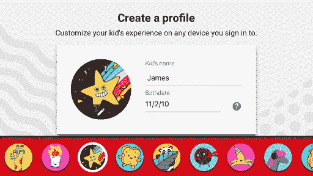

# YouTube Kids update 为孩子们提供自己的个人资料，扩展控制

> 原文：<https://web.archive.org/web/https://techcrunch.com/2017/11/02/youtube-kids-update-gives-kids-their-own-profiles-expands-controls/>

YouTube Kids 是 YouTube first [于 2015 年推出的一个对孩子友好、过滤程度更高的版本，目前正在进行显著升级。更新后的应用程序增加了几个新功能，旨在反映该应用程序目前日益老龄化的用户群，包括根据孩子的出生日期定制的个人资料，以及针对父母和孩子的额外安全控制。](https://web.archive.org/web/20230308071819/https://techcrunch.com/2015/02/23/hands-on-with-youtube-kids-googles-newly-launched-child-friendly-youtube-app/)

虽然 YouTube Kids [过去因没有完全锁定 YouTube 体验而受到抨击](https://web.archive.org/web/20230308071819/https://techcrunch.com/2015/10/02/consumer-watchdog-groups-complain-updated-youtube-kids-app-still-exposes-children-to-deceptive-ads/)，但总体而言，与让孩子们访问主应用程序相比，允许他们浏览 YouTube 是一种更安全的方式。

儿童应用程序设计有更简单的界面、有趣的音乐和精选的适合儿童的内容，这些内容来自梦工厂电视、吉姆·汉森电视、鹅妈妈俱乐部、会说话的汤姆和朋友、国家地理儿童、阅读彩虹和坦克引擎托马斯等出版商。

作为对早期投诉的回应，家长们后来被允许[关闭该应用的搜索功能，并设置他们自己的私人密码](https://web.archive.org/web/20230308071819/https://techcrunch.com/2015/10/01/youtube-addresses-complaints-about-inappropriate-content-in-updated-youtube-kids-app/)，而不是使用默认设置，即以单词形式拼出数字供家长输入。

在新版本中，父母现在可以用他们的谷歌帐户登录，以便为他们的孩子创建可定制的个人资料。

根据孩子的年龄，YouTube Kids 会改变它的外观。这不仅对有多个孩子的父母有用，而且因为 YouTube Kids 本身，默认情况下，看起来更像是一个为学龄前儿童而不是学龄人群设计的应用程序。

YouTube 表示，有了新的个人资料，年幼的孩子将看到一个使用较少文本的应用程序，而年长的孩子将在他们的主屏幕上有更多内容。

此外，有兄弟姐妹的孩子可以选择设置自己的密码，以防止其他人进入自己的帐户。(当然，如果需要的话，父母可以忽略这一点。)

该应用程序还为父母引入了一个新的设置过程，其中包括更详细的信息，以帮助他们做出与家长控制选项相关的正确选择，以及更多地了解该应用程序的总体情况。

例如，一个更长的介绍向父母解释说，YouTube 不会手动审查 YouTube Kids 中的视频，这意味着不适当的内容仍有可能通过其自动过滤器。它还详细说明了如何阻止和报告漏网的视频。

“请记住，我们的系统努力从应用程序中过滤出更成熟的内容。但是没有一个系统是完美的，”YouTube 儿童工程总监 Balaji Srinivasan 在今天的[博客文章](https://web.archive.org/web/20230308071819/https://youtube.googleblog.com/2017/11/introducing-kid-profiles-new-parental.html)中写道，他宣布了升级后的应用程序。

换句话说，YouTube Kids 肯定会说，它不会投入额外的工作人员来确保 YouTube Kids 100 的安全。它只是瞄准“足够好”

最后一个设置屏幕提供了一个更长的解释，说明父母为什么要打开或关闭搜索，让父母更好地了解与该决定相关的风险。

YouTube 表示，它现在正在研究一种方法，允许父母向应用程序添加更多内容，但没有透露细节。它还在考虑为青少年打造体验，重点是最吸引稍年长人群的类别。

尽管 YouTube Kids 可能并不完美，但事实证明它很受欢迎。该应用程序现已在 37 个国家上线，拥有超过 1100 万周活跃观众，应用程序观看次数超过 700 亿次。(然而，新的儿童档案目前仅在特定市场提供。完整的名单是[这里](https://web.archive.org/web/20230308071819/https://youtube.googleblog.com/2017/11/introducing-kid-profiles-new-parental.html)。)