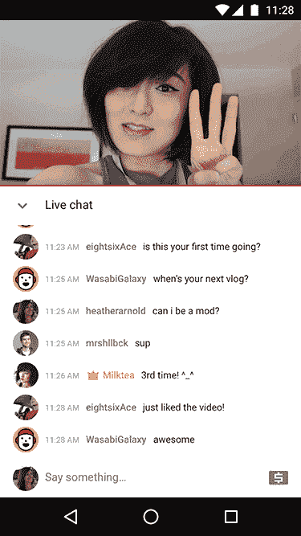

# YouTube 推出“超级聊天”，这是创作者从他们的直播中赚钱的一种方式 

> 原文：<https://web.archive.org/web/https://techcrunch.com/2017/01/12/youtube-launches-super-chat-a-way-for-creators-to-make-money-from-their-live-streams/>

# YouTube 推出“超级聊天”，这是创作者从他们的直播流中赚钱的一种方式

YouTube [今天宣布了一项新功能:超级聊天，旨在帮助创作者在直播过程中与粉丝联系的同时赚钱。这项功能让人想起流媒体网站 Twitch 的欢呼功能，该功能允许观众支付真钱，以便通过使用表情(动画图标)让他们的消息在聊天流中脱颖而出。)在 YouTube 的例子中，粉丝们可以用明亮的颜色突出他们的信息，并将他们的评论钉在视频流上。](https://web.archive.org/web/20230120202133/http://youtube.googleblog.com/2017/01/can-we-chat-hello-super-chat.html)

尽管实现方式与 Twitch 不同，但目标是一样的:这是一种让粉丝支付真金白银来换取关注的方式。(这与色情摄像头网站多年来在自己的聊天系统中使用的技术也没有太大区别，后者通常涉及代币的购买。)

正如 YouTube 在宣布新功能的[博客文章](https://web.archive.org/web/20230120202133/http://youtube.googleblog.com/2017/01/can-we-chat-hello-super-chat.html)中解释的那样，超级聊天将在长达五个小时的时间里保持在聊天的顶部，这给了消息大量的播放时间。

当然，创作者受益于这一功能，不仅因为他们能够更好地与更大的粉丝联系，还因为这是从他们的视频中产生收入的另一种方式。

随着超级聊天的推出，YouTube 正在推出一种 API，允许开发者从系统中访问实时购买数据。这个 API 将取代粉丝基金 API，后者将被关闭。

此次发布之前，YouTube 进行了一系列旨在改善创作者和观众体验的改革。本周早些时候，YouTube [宣布](https://web.archive.org/web/20230120202133/https://techcrunch.com/2017/01/11/youtube-improves-video-discovery-by-highlighting-new-talent-on-a-weekly-basis/)将开始在其趋势部分[每周展示新人才，而去年它推出了新的创作者中心](https://web.archive.org/web/20230120202133/https://techcrunch.com/2016/06/24/youtube-expands-creator-outreach-with-new-features-better-support/)，福利计划，改进的支持和其他工具，并与 [YouTube 社区推出了各种社交网络。](https://web.archive.org/web/20230120202133/https://techcrunch.com/2016/09/13/youtube-gets-its-own-social-network-with-the-launch-of-youtube-community/)

超级聊天今天将与顶级 YouTubers 进行测试，包括 [iHasCupquake](https://web.archive.org/web/20230120202133/http://www.support.google.com/youtube/?p=live_purchase) 、[伟大的图书馆(buzzbean11)](https://web.archive.org/web/20230120202133/https://www.youtube.com/user/BuzzBean11) 和[亚历克斯·瓦沙比](https://web.archive.org/web/20230120202133/https://www.youtube.com/user/alexxwassabi)。该公司表示，它将在月底面向 20 个国家的创作者和 40 多个国家的观众更广泛地推出。