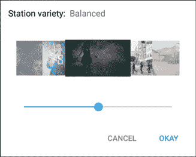

# YouTube 推出期待已久的音乐应用

> 原文：<https://web.archive.org/web/https://techcrunch.com/2015/11/12/youtube-music-app/>

自从 YouTube 成立以来，你可能一直在看它的音乐视频。这个平台也是想要成为音乐家的人的必去之地，但它从来没有迎合过特定的垂直市场。该团队上个月推出了用于游戏的 YouTube，今天又推出了用于 iOS 和 Android 的 YouTube 音乐。在 14 天的试用期内，增强的付费体验是免费的。之后，你可以放弃 YouTube Red 的 9.99 美元。

多年来，我都无法找到一首我喜欢的翻唱歌曲。这是 1991 年 R.E.M .的 MTV 不插电表演。(我老了，闭嘴。)除了蹩脚的 MP3，我唯一能找到的版本是 YouTube 上的一个版本:

https://www.youtube.com/watch?v=IP5Ln6480sA

可悲的是，它已经因为侵犯版权被踢出服务无数次了，但 YouTube 基本上是我唯一能找到这首歌的版本的地方，直到几年后它被正式发布。这个封面也有很棒的封面。无论谷歌和 YouTube 在搜索方面有多棒，这首歌总是被埋没，我不得不花时间去寻找。我上周玩的 YouTube 音乐应用程序将为我们所有人解决这个问题。

我花了一些时间与 YouTube 的音乐产品负责人 T. Jay Fowler 和 YouTube 的工程总监 Sowmya Subramanian 在一起。福勒来到 YouTube 之前，[将他的服务 MOG](https://web.archive.org/web/20230327055723/https://techcrunch.com/2014/06/01/mog-is-dead/) 卖给了 Beats，然后 Beats 又卖给了苹果。Subramanian 已经在谷歌工作了九年。他们的个人才能很好地融合在一起，因为 YouTube 音乐应用程序虽然听起来很容易制作，但却是一项壮举，福勒希望确保它与 Apple Music、Spotify 和 Pandora 等其他播放器有足够的区别。如果你正在阅读这篇文章，他们的品味和技术，以及他们的团队，造就了你今天可能会玩的东西。

这不是 Google Play 音乐的“替代品”，但可以肯定地认为这是销售更多歌曲和订阅的一种方式。迄今为止，YouTube 和谷歌已经向唱片业支付了超过 30 亿美元。所以，是的，这是生意。YouTube 音乐将帮助观众和听众获得某种形式的付费。

## 音乐是你的男朋友

YouTube 已经在一小部分用户中测试了一个名为 Music Key 的 Android 专用音乐测试版。他们的目标是观察重度音乐用户群如何与它以及整个 YouTube 互动。他们在自己关心的事情上获得了一些提示，从而为我们今天所看到的铺平了道路。Subramanian 告诉我，他们在测试期间了解到用户不喜欢广告，这并不奇怪。这导致了最近推出了的 [YouTube Red。](https://web.archive.org/web/20230327055723/https://techcrunch.com/2015/10/21/youtube-red/)

如果你订阅了 Red，你将可以在 YouTube 音乐中获得无广告的观看和收听、纯音频模式和离线播放。没有骰子？YouTube 将为您提供 14 天的免费试用，以获得该应用程序的增强版本。免费版本将会推出，它有广告，没有任何可能让你离开潘多拉的花里胡哨。但是你愿意吗？我说给它一些时间，先试一试。

## 定义音乐

Subramanian 的团队一直致力于调整算法，以提取特定于音乐垂直领域的内容，无论是官方视频、舞蹈组合还是封面。YouTube Music 做得非常好，它让你观看或收听官方视频，同时为你的下一部剧提供支持粉丝内容。

目标是让你不停地看和听。如果你想听一听，只找到今天早上在收音机里听到的一首歌，这种“永不放弃”的方法会很烦人。后仰？太棒了。

福勒称之为“参与而不是吃零食”，这是 YouTube 临时访问者的一个标志。“无尽的音乐体验。对用户来说是高回报低付出，”Subramanian 补充道。

## 永不停息的音乐

为了让你立即听下去，YouTube 音乐应用程序有几个精选区域，听起来很有趣。这不是典型的电台“前 40 名”，而是基于对平台上任何给定时刻的热点的了解而人为创建的列表。如果你愿意的话，这是流行歌曲。

当你启动这个应用程序时，你会看到一个个性化的主页，上面有一些非常基本的流派电台，这些电台会考虑到你的个人品味。请记住，您可能在登录时使用 YouTube，因此他们知道您观看和搜索了什么。

纯音频模式非常适合广播，因为如果你把手机放在口袋里，YouTube 音乐就会不停地播放。当你解锁你的设备时，你将会看到在给定时间特定音轨出现的地方正在播放的视频。该应用程序还为你制作了一个播放列表，可以根据你的习惯每天更新。

## 交战！

为了让你制作自己的播放列表，歌曲上的大拇指按钮会将它放入你喜欢的东西列表中。回到你喜欢的地方，深入挖掘，YouTube 会不断了解你喜欢什么。如果你非常喜欢调整你的体验，有滑块会给你更多的艺术家种类…或者更少。

当谈到音乐的社交方面时，团队告诉我，由于艺术家已经在平台上与他们的粉丝互动，这个应用程序只会让它变得更容易。围绕音乐还没有一个真正伟大的社会体验。苹果在 Ping 上失败了，苹果音乐只能播放，Spotify 一般，但仍然没有吸引我的普通朋友，作为一个社交的地方，YouTube 评论通常是一个粪坑。也许这种对高质量内容的新关注将赶走这些巨魔，并欢迎那些想谈论凯蒂·佩里演唱会有多棒的真正粉丝。

在一天结束的时候，你可能已经在 YouTube 上看或听音乐了。有了 YouTube 音乐应用程序，这种体验将会更加愉快。虽然它在挑选正确的内容方面并不完美，但这比在 YouTube 的大量劣质视频目录中寻找 R.E.M .翻唱歌曲的精华或翻唱歌曲的封面要好得多。

[gallery ids="1236553，1236554，1236555，1236556，1236557，1236558"]