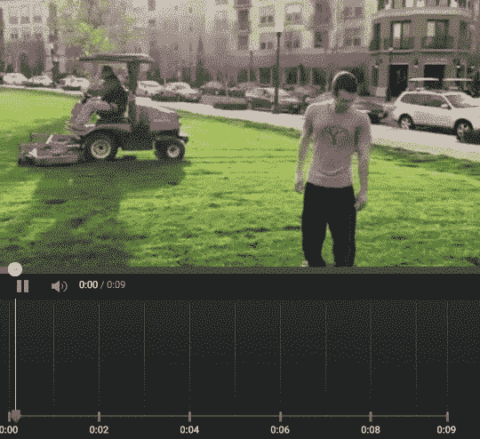

# YouTube 现在允许你模糊视频中的随机对象 

> 原文：<https://web.archive.org/web/https://techcrunch.com/2016/02/25/youtube-now-lets-you-blur-random-objects-in-videos/>

# YouTube 现在允许你模糊视频中的随机对象

早在 2012 年，YouTube 就增加了一项新功能，允许你自动[模糊视频中的所有人脸](https://web.archive.org/web/20221210071332/http://youtube-global.blogspot.com.es/2012/07/face-blurring-when-footage-requires.html)。今天，它将[更进一步](https://web.archive.org/web/20221210071332/http://youtubecreator.blogspot.com/2016/02/blur-moving-objects-in-your-video-with.html)。你现在可以在视频中的任何对象周围画一个矩形，然后 YouTube 会模糊它，并在它穿过场景时自动跟随它。

这意味着你现在可以轻易地模糊任何你不想让全世界都看到的敏感信息。例如，这可能是一个人或一个车牌号码。

“虽然这个工具的使用案例很多，但我们在构建这个功能时考虑到了视觉匿名。我们想给你一个简单的方法来模糊像人，联系信息或财务数据这样的东西，而不必删除并重新上传你的内容，”谷歌在今天的声明中说。

YouTube 将始终呈现模糊视频的预览，因此如果有些地方不太正常，您可以通过将矩形放在稍微不同的位置来重试。

谷歌表示，该工具使用了“新的创新技术”，允许它分析视频以“动态”跟踪物体。很有可能机器视觉的最新进展已经使这种工具成为可能。不过，我们还不能测试这个新特性，所以它在实践中的表现如何还有待观察。

