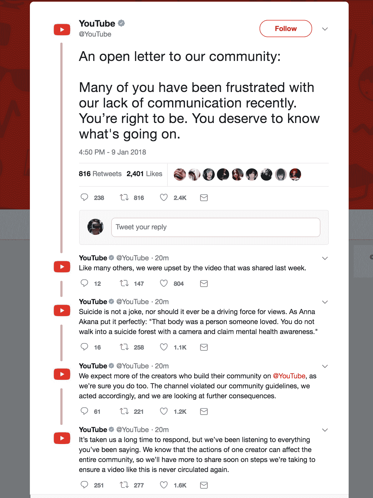

# YouTube 就罗根·保罗争议提供非道歉 

> 原文：<https://web.archive.org/web/https://techcrunch.com/2018/01/09/youtube-offers-non-apology-over-logan-paul-controversy/>

# YouTube 为罗根·保罗争议提供非道歉

YouTube 终于对那个恶心的罗根·保罗视频做出了回应。该网站在一系列推文中表示，“频道[罗根·保罗]违反了我们的社区准则，我们采取了相应的行动，我们正在考虑进一步的后果。”

[声明跨越五条推文](https://web.archive.org/web/20221025224019/https://twitter.com/YouTube/status/950847377816113153)，并在最后表示该网站将披露其为防止此类事件再次发生所采取的措施。但截至发稿时，罗根·保罗的频道仍在 YouTube 上，所以不管怎样。

【T2

上周，YouTube 明星罗根·保罗发布并删除了一段视频，该视频包含了在日本“自杀森林”拍摄的一名自杀受害者的大量镜头。该明星拥有 1500 万用户，是 YouTube 红色订阅服务的一部分

保罗在发布视频后不到 24 小时就删除了该视频，但此前已有约 600 万人观看了该视频，而且——据报道 YouTube 的审核团队也批准了该视频。

YouTube 的指导方针明确指出“发布暴力或血腥的内容，主要是为了令人震惊、耸人听闻或不敬，这是不允许的。”

[保罗已经第二次道歉](https://web.archive.org/web/20221025224019/https://www.youtube.com/watch?v=QwZT7T-TXT0)，但是现在的焦点必须是 YouTube 如何以及为什么没有删除该视频。