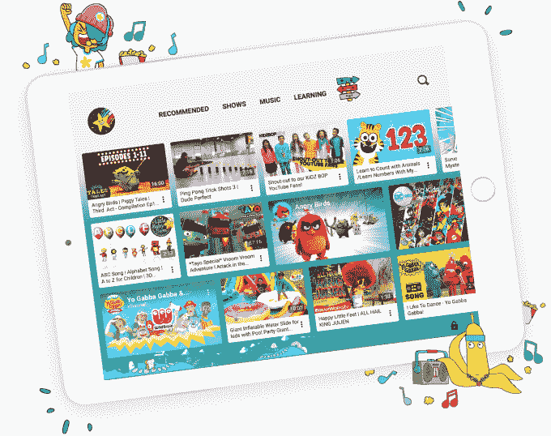
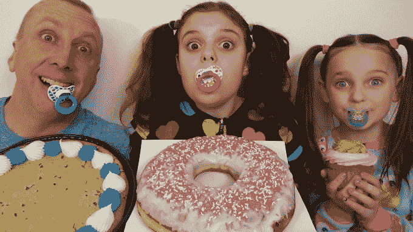

# YouTube 承诺在 2018 年向 10K 增加内容审核和其他执法人员

> 原文：<https://web.archive.org/web/https://techcrunch.com/2017/12/05/youtube-promises-to-increase-content-moderation-staff-to-over-10k-in-2018/>

既然其底线受到影响，YouTube 表示将开始采取额外措施来保护其广告商和创作者免受其网络上不适当内容的影响。在周一由 YouTube 首席执行官苏珊·沃西基撰写的[博客文章](https://web.archive.org/web/20230306203939/https://youtube.googleblog.com/2017/12/expanding-our-work-against-abuse-of-our.html)中，该公司表示将在 2018 年将其员工增加至 1 万人，以帮助更好地调节视频内容，并执行其他相关任务。*此前，这家视频分享网站爆出了一系列丑闻，涉及对针对儿童的[内容缺乏监管](https://web.archive.org/web/20230306203939/https://techcrunch.com/2017/11/22/youtube-tightens-rules-on-kid-related-content/)、[对儿童视频的淫秽评论](https://web.archive.org/web/20230306203939/http://www.bbc.com/news/technology-42110068)、[骇人的搜索建议](https://web.archive.org/web/20230306203939/https://www.buzzfeed.com/charliewarzel/youtubes-search-autofill-is-surfacing-disturbing-child-sex)等等。

**更新:YouTube 主动澄清其招聘人数。它的团队包括处理这些问题的不同专家，大多数是内容审查者。但这个数字还包括审查内容并采取行动的其他政策专家，建立和完善机器学习技术的工程师，以及培训我们的机器学习算法的政策专家。10K 的“内容评论”标题不准确，我们已经改正了。*

该公司一直受到指责，称其长期以来允许不良演员利用其推荐算法，向儿童播放并非针对年轻观众的视频。与此同时，它似乎培养了一群制作视频的创作者，这些视频将孩子们置于令人担忧甚至是剥削的境地。

例如，玩具怪胎频道(channel ToyFreaks)最近因其视频引起关注而被终止[,在视频中，一位父亲的年轻女儿不时在奇怪、令人不安和不恰当的情况下被拍摄。](https://web.archive.org/web/20230306203939/https://techcrunch.com/2017/11/17/youtube-terminates-exploitive-kids-channel-toyfreaks-among-broader-tightening-of-its-endangerment-policies/)

YouTube 曾表示，该频道的关闭是其儿童濒危政策收紧的一部分。T2 上个月也实施了新的政策来标记针对儿童的不当内容。

结果，它已经撤下了数千个儿童视频，[从近 200 万个视频和 5 万多个频道中删除了](https://web.archive.org/web/20230306203939/https://news.vice.com/story/youtube-kills-ads-on-50000-channels-as-advertisers-flee-over-disturbing-child-content)广告。

有政策是一回事，但有员工来实际执行政策是另一回事。

这就是为什么 YouTube 表示，它现在计划增加专注于这项任务的员工人数。虽然 Wojcicki 的博客帖子只提供了明年计划招聘的员工总数，但 BuzzFeed 的一份报告指出，这个“超过 10，000 人”的数字比目前的员工水平增加了 25%。

然而，YouTube 仍然严重依赖算法来帮助监管其内容。正如 Wojcicki 在一篇博客文章中指出的那样，YouTube 计划使用机器学习技术来帮助它“快速有效地删除违反我们准则的内容。”

同样的技术帮助 YouTube 标记了网站上的暴力极端主义内容，导致自 6 月以来删除了超过 15 万个视频。

“今天，我们删除的 98%的暴力极端主义视频都被我们的机器学习算法标记出来了，”Wojcicki 写道。“我们在机器学习方面的进步让我们现在能够在上传后的八小时内删除近 70%的暴力极端主义内容，在两小时内删除近一半的内容，我们还在继续加快速度，”她补充道。

现在的目标是将这些技术转向一个更困难(有时不太明显)的领域。

虽然有些内容更容易发现——比如孩子似乎很痛苦的视频，或者被父母以残酷的方式“恶作剧”的视频——但其他视频则存在于一个更加灰色的区域。

有太多的父母把他们的孩子拉进了他们对 YouTube 明星的追求中，很难区分什么是合适的，什么是不合适的。

需要提出的一个问题是，学龄前儿童或学龄儿童能在多大程度上真正同意参与妈妈或爸爸的日常视频？难道他们不应该自由玩耍，而不是不断地被指示表演各种短剧，或者让摄像机不停地对准他们吗？毕竟，这些频道不仅仅是偶尔播放的有趣视频——它们通常是父母的全职工作。美国有关于童工，特别是儿童演员的法律，但 YouTube 一直在这条线上跳舞，因为它“不是真正的电视”——这意味着它不必遵守电视规则[关于欺骗性广告](https://web.archive.org/web/20230306203939/https://techcrunch.com/2015/10/02/consumer-watchdog-groups-complain-updated-youtube-kids-app-still-exposes-children-to-deceptive-ads/)、[垃圾食品广告](https://web.archive.org/web/20230306203939/https://techcrunch.com/2015/11/24/youtube-kids-faces-further-ftc-complaints-related-to-junk-food-ads-targeting-young-children/)等等。

除了新的政策和增加员工的承诺，YouTube 还表示，它将创建定期报告，在报告中，它将透明地显示关于它收到的标志的汇总数据，以及它采取的删除违反其内容政策的视频和评论的行动。

最重要的是，就其业务而言， [YouTube 表示](https://web.archive.org/web/20230306203939/https://youtube.googleblog.com/2017/12/expanding-our-work-against-abuse-of-our.html)它将使用一套更严格的标准，结合更多的人工监管，更仔细地考虑哪些频道和视频有资格做广告。

“我们正在采取这些行动，因为这是正确的事情，”沃西基写道。“创作者制作难以置信的内容，建立全球粉丝基础。粉丝来到 YouTube 观看、分享和参与这些内容。想要接触这些人的广告商资助了这种创造者经济。这三个群体对 YouTube 的创意生态系统都至关重要——没有一个群体可以在 YouTube 上茁壮成长——这三个群体都值得我们尽最大努力。”

就我个人而言，如果 YouTube 切断创作者从儿童视频中赚钱的能力，我会很高兴。也许太年轻的明星们终于可以休息一下，被允许再次做回孩子。但我不会屏住呼吸。