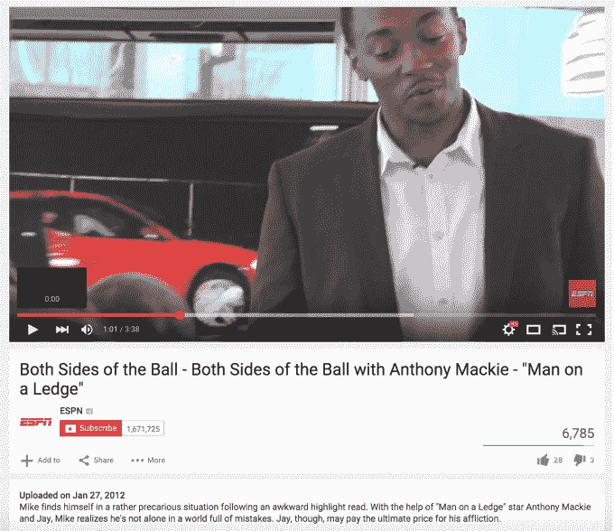
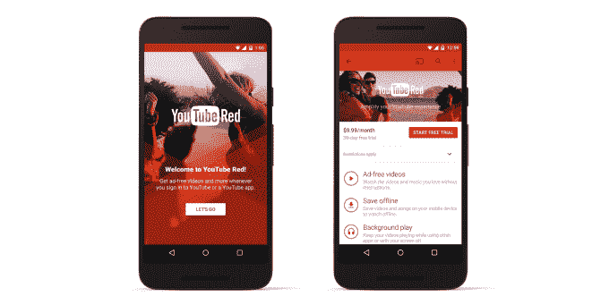

# YouTube 红色交易迫使 ESPN 撤下其视频

> 原文：<https://web.archive.org/web/http://techcrunch.com/2015/10/23/youtube-red-creators/>

即将推出的无广告订阅服务 YouTube Red 的影响已经开始显现。今天，ESPN 的大部分视频内容已经从美国的 YouTube 上撤下，因为该体育网络目前由于其内容的版权问题而无法参与 YouTube Red 服务。

虽然 TechCrunch 现在可以证实母公司迪士尼确实与 YouTube Red 有协议，但 ESPN 本身并没有获得通过 YouTube Red 等订阅视频服务分发其视频的许可，因为已经签订了其他合同——包括与各种分发合作伙伴的合同。

因为 YouTube 创作者必须签署 YouTube Red 的订阅协议[或者看到他们的视频被从 YouTube 上撤下](https://web.archive.org/web/20230405153304/https://techcrunch.com/2015/10/21/an-offer-creators-cant-refuse/#.s2agxy:Mqte)，ESPN 在许多频道上的许多内容现在在美国消失了。

ESPN YouTube 频道的变化最初是由 [Deadspin](https://web.archive.org/web/20230405153304/http://deadspin.com/espns-youtube-channels-are-going-dark-1738189787) 发现的，它发现 ESPN 的大多数频道都受到了影响，包括其主要频道以及其他受欢迎的频道，如 [Grantland](https://web.archive.org/web/20230405153304/https://www.youtube.com/channel/UCwLr_DYKR8aS0k4r8bB5I5Q) ， [First Take](https://web.archive.org/web/20230405153304/https://www.youtube.com/channel/UCIIKPy27YWW5yhc0qvr4KnA) ，以及 ESPN 的[NBA](https://web.archive.org/web/20230405153304/https://www.youtube.com/channel/UCVSSpcmZD2PwPBqb8yKQKBA)。总的来说，ESPN 的 13 个频道中有 11 个受到这个问题的影响，而只有 X-Games 和 Nacion ESPN 仍在直播。

正如 Variety 指出的，[ESPN 主要频道上的最新视频](https://web.archive.org/web/20230405153304/https://www.youtube.com/watch?v=5XZsiWkwN8o)是 2012 年 1 月的，因为 ESPN 的大部分更新内容现在都不见了。目前还不清楚 ESPN 撤下的内容是否会回到美国的 YouTube 上。

ESPN 提供了一份声明，称“ESPN 目前不属于红色服务。以前可以在免费的 YouTube 服务上看到的内容，将可以在整个 ESPN 数字产业中看到。”至少最后一部分对体育迷来说是个好消息。

根据 YouTube 发言人的说法，迪士尼确实签署了 YouTube Red 协议，但 ESPN 的权利和法律问题排除了在推出时成为 YouTube Red 的一部分。因此，从本质上来说，因为 ESPN 不能合法地在美国的订阅服务中拥有一些内容，所以它不会红，因此必须从美国的广告支持版本的 YouTube 中删除自己的视频，尽管它的一些内容在世界其他地方仍然可见。

本周早些时候，当 YouTube 被问及与 YouTube Red 相关的条款，特别是如果合作内容创作者不同意参与新的订阅服务会发生什么时，该公司淡化了潜在的影响，指出几乎所有的社区都接受了新协议。

一位发言人告诉 TechCrunch:“我们绝大多数的合作伙伴，代表了 YouTube 上近 99%的观看内容，都已经注册了。”“不更新条款的合作伙伴的视频将被设为私有，但我们仍致力于与这些合作伙伴密切合作，目标是让他们参与进来。”

换句话说，大多数创作者似乎都乐于选择获得广告或赞助之外的另一种收入来源，这就是他们今天如何将 YouTube 视频货币化的。据报道，在 YouTube Red 上，YouTube 将其订阅收入的 55%支付给视频出版商，与其分享的广告收入比例相同。(YouTube 早些时候表示，收入的“绝大部分”支付给了创作者，但实际上这只是其中的一小部分。)

但 YouTube 称其观看内容的 99%的创作者签署了红色协议，这是一个空洞的立场，因为创作者是被迫达成协议的，如果他们拒绝，就会带来毁灭性的后果。

看到网飞和 Spotify 的成功，YouTube 想推出订阅服务是可以理解的。每位用户的广告收入相对较少，如果 YouTube 和 creators 是每月 9.99 美元的付费用户，他们可以从每位用户身上获得更多收入。对于许多创作者来说，这笔交易是一件好事。YouTube 值得称赞的是，它没有为大型媒体公司提供比小型独立创作者更好的交易。

尽管如此，它认为该协议对大多数人有利，YouTube 根本无法理解其订阅服务中有任何内容缺失，这并不能证明它强迫创作者签署红色协议或删除他们的视频是合理的。某些创作者可能有其他交易，打算以不同的方式将他们的视频货币化，或者对 55%的支付感到不安，这使他们不想签署 Red。通过从顶级在线视频平台删除他们的内容来如此严厉地惩罚他们，似乎仍然是一种欺凌。