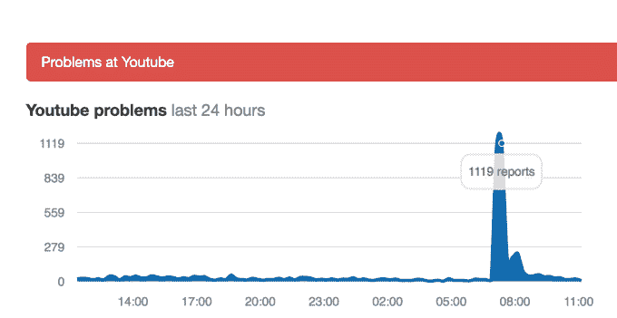

# YouTube 的 15 分钟中断归因于日常工程推动 

> 原文：<https://web.archive.org/web/https://techcrunch.com/2016/06/22/youtubes-15-minute-outage-attributed-to-routine-engineering-push/>

# YouTube 的 15 分钟中断归因于日常工程推动

今天早上全球 YouTube 中断 15 分钟的原因是一次例行的工程推动，而不是黑客或 DDOS 攻击。这个问题已经得到解决，但令人惊讶的是，谷歌拥有的服务在历史上是多么可靠。停机时，访问该网站的用户会遇到“500 内部服务器错误”、黑屏或其他错误消息。

根据第三方宕机跟踪服务，宕机似乎对所有市场的影响程度不同，这可以解释为什么一些人在社交媒体上抱怨宕机，而另一些人则发现网站正常工作。

[DownDector.com](https://web.archive.org/web/20221210065923/http://downdetector.com/status/youtube)在美国东部时间上午 7:26 左右标记了停机开始，并在停机高峰期看到了数千份报告。

谷歌没有证实是什么导致了这个问题，但最初看起来可能与其云基础设施有关。

YouTube 宕机后不久，Spotify 也遇到了间歇性问题。这是值得注意的，因为 Spotify [在二月份将](https://web.archive.org/web/20221210065923/https://news.spotify.com/us/2016/02/23/announcing-spotify-infrastructures-googley-future/)转移到了谷歌的云平台上——这是谷歌战胜亚马逊网络服务的一大胜利。谷歌云平台也在谷歌内部使用，为搜索和 YouTube 等自己的服务提供支持。

那么，人们自然会认为这两次断电是有联系的。然而，据知情人士透露，今天上午的中断是 YouTube 特有的。这个问题很快得到了解决，因为 YouTube 在全球各地都有工程人员，包括在 EMEA 地区。

谷歌发言人向我们证实了 YouTube 的中断，称“在今天的一次例行工程推进中，YouTube 中断了大约 15 分钟。这个问题已经得到解决，YouTube 运行良好。