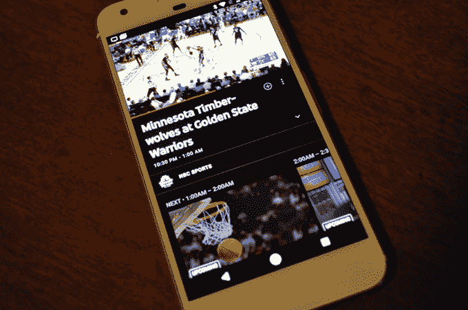
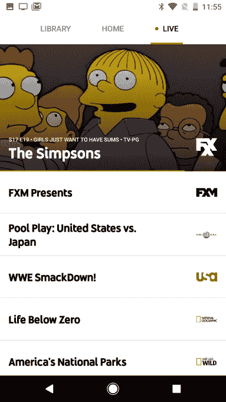

# YouTube 的直播电视流媒体服务在美国五个城市上线，每月 35 美元 

> 原文：<https://web.archive.org/web/https://techcrunch.com/2017/04/05/youtubes-35-live-tv-streaming-app-is-now-available-in-five-us-cities/>

回到二月份，YouTube 宣布推出 YouTube TV ，这是一个 35 美元的电视流媒体服务，它希望能杀死你的有线电视盒。当时，他们没有说具体的发布时间，只是说“很快”

“很快”，似乎是指今天。今天早上，YouTube 将在美国五个主要城市推出这项服务。

[YouTube TV](https://web.archive.org/web/20221206094334/https://tv.youtube.com/) 将一些更受欢迎的美国有线电视频道——ABC、Fox、CBS、NBC、CW、迪士尼、SyFy、ESPN 和 40 多个频道——整合到一个应用程序中。它的月费为 35 美元，你可以在最多三个设备上同时直播六个账户。*(更新:这个帖子最初说最多六个设备同时；是三个，不是六个。)*

唉，围绕有线电视行业这个现有的庞然大物开展工作需要一段时间……因此，YouTube TV 将随着时间的推移在不同地区推出，从今天在旧金山、洛杉矶、纽约、芝加哥和费城推出开始。

* * *

谷歌发给我一个 YouTube 电视应用的预发布版本，我在发布前花了一点时间。不够做一个全面的回顾，但足够做一些思考。

该应用程序设计良好，直观。它只由三个选项卡组成:主页、图书馆和直播。Home 是你的标准“我们认为你应该看的东西”页面，Library 是你可以找到你保存的电影和节目的地方(稍后会有更多内容)，Live 是一个很大的列表，列出了 YouTube 电视目前提供的每个频道上正在播放的所有内容。

这个直播界面特别华而不实；当你滚动屏幕时，每个频道的直播预览几乎会立即出现在顶部。这感觉很像是切换频道，看看有线电视盒里有什么——在这个挑选任何你想点播观看的东西的时代，这个概念似乎正在逐渐消失。作为一个五年前就放弃有线电视订阅的人，我忘记了打开某个频道，让它在背景中喋喋不休是多么自然的感觉。我也忘了白天的电视节目有多可怕。

在 YouTube 能够解决一些帧速率问题之后，视频质量相当稳定。即使是快速运动和动作电影看起来也相当不错。

不想一直用手机或平板看电视？正如你对谷歌制作的视频应用程序的期望，它支持 Chromecast——就像所有支持 chrome cast 的东西一样，它超级简单。轻触 Chromecast 图标，选择您希望在哪个电视上播放视频，一切就绪。

有一个内置的“无限 DVR”功能，可以让你点击任何节目来记录它的任何和所有未来的实例。对于不在 Hulu/etc 上的体育或节目来说，这是一个不错的选择。(或者那些做 Hulu/等的。播出一周后再看)——但除了这些情况，如果我打算提前计划在直播后观看某个节目，我可能会转向其他地方。

(在一个简单的设计中有一个奇怪的地方:如果你想浏览某个频道的节目，首先要点击搜索栏。这不是我想到的第一个地方，但它确实有用。)

那么，你应该报名吗？

如果你是那些很久以前抛弃有线电视而转向网飞/Hulu/等的人之一。如果没有回头看，你可能不会错过太多。

然而，如果你为了时不时地看现场直播(新闻/体育/等等)而被每月的有线电视账单束缚住了。)*和*你所在的地区有 YouTube 电视*和*它有你看的频道，值得一看的。第一个月是免费的，如果你支付一个月的费用，他们会附赠一个 chrome cast……它的建议零售价为 35 美元，所以第二个月也有点免费。

这款应用今天应该会在 iOS 和 Android 上推出。