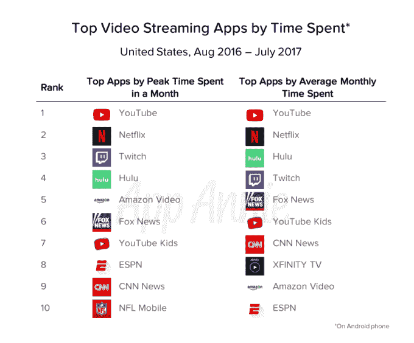
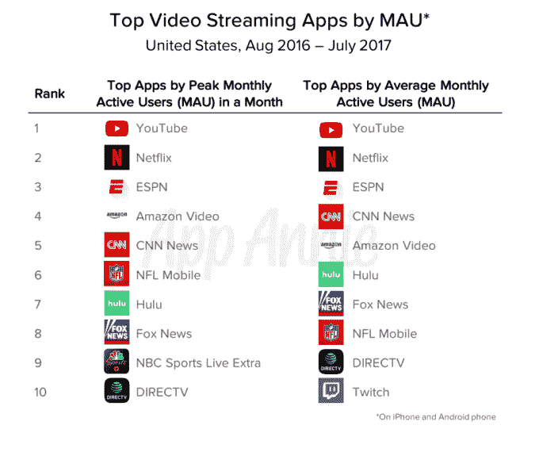
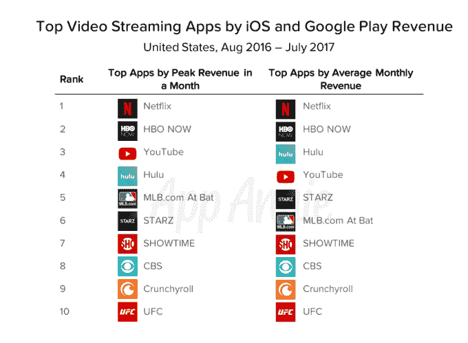

# 按每月用户数、花费时间计算，YouTube 的应用程序正在主宰移动视频

> 原文：<https://web.archive.org/web/https://techcrunch.com/2017/09/13/youtubes-app-is-dominating-mobile-video-by-monthly-users-time-spent/>

App Annie 今天发布的新数据显示，去年 7 月，美国人在 Android 上观看 YouTube 视频的时间接近 10 亿小时。这是一个月内在任何一个流媒体视频应用上花费的最长时间。该数字是展示人们消费视频内容方式转变的又一个数据点——更少在客厅，更多在传统付费电视连接上，更多在移动设备上。

在移动领域，YouTube 正在扼杀它。

事实上，在截至 2017 年 7 月的 12 个月里，消费者在安卓系统上使用前 10 大视频流媒体应用程序的总时间为 120 亿小时，仅 YouTube 的安卓应用程序就占了约 80%，即 95 亿小时。

App Annie 表示，这 120 亿美元的数字也比去年增长了 45%，并且还在继续增长。

按每月高峰时间计算，YouTube 在排名前五的竞争对手中遥遥领先，包括网飞、Twitch、Hulu 和亚马逊视频。更值得注意的是，YouTube Kids 在峰值时间上排名第七，这表明 YouTube 推出过滤版服务的计划正在为其庞大的视频网络提供更多的观众。

按平均花费时间来看，YouTube 仍然高居榜首，网飞再次紧随其后。

然而，当你按月活跃用户调查视频流媒体应用时，排名靠前的应用就变得大不相同了。

YouTube 和网飞仍然分别排名第一和第二，但名单上的其他人——无论是每月峰值用户还是平均每月用户——都扩大到了其他类型的视频应用，如提供新闻和体育的应用。

YouTube Kids 没有进入月活跃用户排名前十的应用。

App Annie 解释说，这表明它的用户群高度参与，每个用户都在应用上花费数小时，但它的总体受众较少。同样的原则也适用于 Hulu，它是平均月活跃用户数排名第六的视频流媒体应用，在 iOS 和 Android 系统的月活跃用户数排名第七。

现在，YouTube 正准备进一步扩大其影响力。

该公司今年[推出了](https://web.archive.org/web/20230404204622/https://techcrunch.com/2017/04/05/youtubes-35-live-tv-streaming-app-is-now-available-in-five-us-cities/) YouTube TV，这是一个 Sling TV 的竞争对手，它让消费者通过一个专门的应用程序以每月 35 美元的价格观看直播电视并录制到云 DVR 上。截至 8 月份，这项服务已经覆盖了 T4 一半的美国家庭，并且还在继续扩大。

除了广告，YouTube 还通过 [YouTube Red](https://web.archive.org/web/20230404204622/https://www.youtube.com/red) 赚钱，这是一项可选服务，提供离线访问视频、无广告体验、音乐背景播放和原创节目等优质功能。这也帮助 YouTube 登上了收入排行榜的榜首，它在一个月内的峰值收入排名第三位(包括 iOS 和 Android)，在一个月内的平均收入排名第四位。

然而，网飞和 HBO NOW 在这两个收入排行榜上都击败了 YouTube，Hulu 的平均收入也略高于 YouTube。

报告还指出，在截至 7 月份的 12 个月中，美国用户在所有前 10 大视频应用中的支出超过 5.7 亿美元。这比去年同期增长了 80 %,这可能也是为什么人们迅速将过去花在有线电视上的钱重新分配到其他地方的另一个原因。