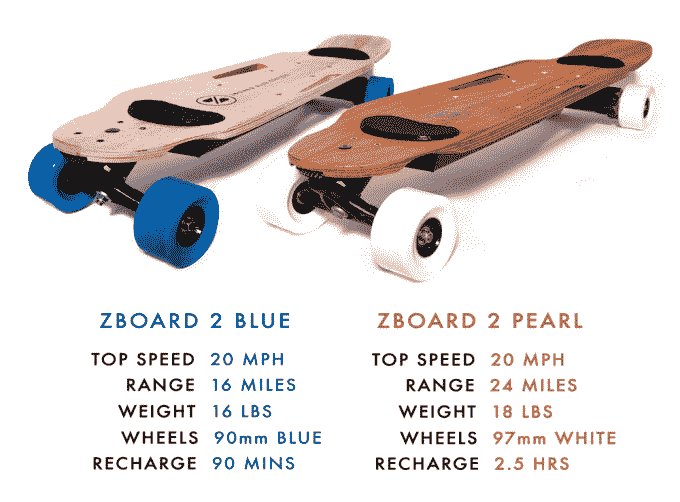
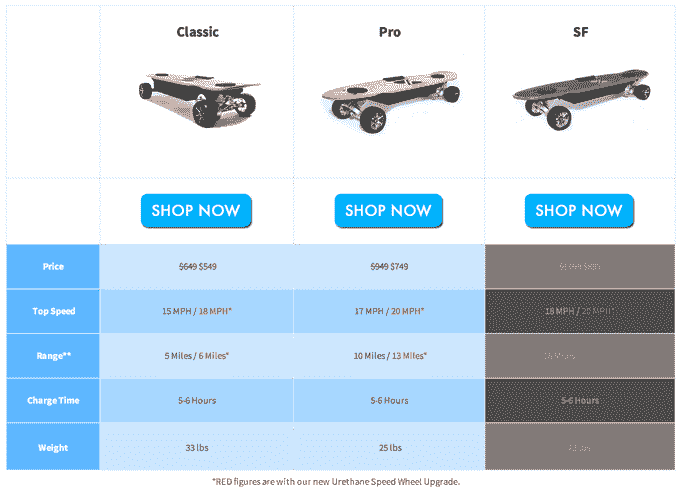

# ZBoard 新推出的脚触发电动滑板走得远但感觉不稳定 

> 原文：<https://web.archive.org/web/https://techcrunch.com/2015/01/06/zboards-new-foot-triggered-electric-skateboards-go-far-but-feel-unstable/>

# ZBoard 新推出的脚触发电动滑板走得远但感觉不稳

没有什么比在骑电动滑板时不用踢推更令人兴奋的了。现在，ZBoard 凭借其新一代更大电池的汽车，为这一梦想增加了更多的轻松巡航里程。但一个核心设计问题仍然毒害着 ZBoard 体验:你笨拙地用脚在甲板上触发来控制加速和刹车，这与物理定律相冲突。

新的 999 美元的 ZBoard Blue 重 16 磅，每次充电可行驶 16 英里，而更高级的 1199 美元的 ZBoard Pearl 重 18 磅，在需要充电前可行驶 24 英里。两者都可以通过[到【Indiegogo 打折预购。以下是 ZBoard 2s 与 ZBoard 旧款的对比:](https://web.archive.org/web/20221007025931/https://www.indiegogo.com/projects/zboard-2-the-most-advanced-electric-skateboard)

 

为了安全，前灯和尾灯是不错的选择。在面板上雕刻出的把手孔使得 ZBoard 比它的竞争对手 Boosted Board 更容易携带。但是基本的接口缺陷仍然存在。

要在 ZBoard 上前进，你踩下前面的扳机。然而，每当你在任何事情上加速时，动量就会把你推回去。这使你在向前伸展时不太稳定，但你的体重会向后转移。类似地，通过按下后面的扳机来刹车会使你的体重向前移动。这种不稳定性是由这样一个事实加剧的:当你骑着马去触击扳机时，你必须拖着脚或者滑动你的脚。ZBoard 的创始人告诉我，这不是一个问题，因为如果你向前伸展，但当你加速时，你的重量转移回来，你的重量再次回到板的中心。我不同意，虽然，并发现所有的转变有点粗略，而飞行在无情的沥青。

如果你主要是以轻松的速度在平坦荒芜的道路上骑行，平衡不会是太大的问题。但是如果你要在有汽车和行人的繁忙街道上骑车，爬山，或者转弯，你可能会发现 ZBoard 有点不稳。

新的 ZBoards 也只有一个电机连接到一个后轮，而不是两个后轮，如果车轮离开地面，这可能会导致它失去加速器或制动牵引力。只有 500 瓦的功率，他们不能为特别陡峭的山坡供电。

如果安全是你最关心的问题，双电机无线手持遥控助力板可能会让你在导航时更加精确，同时让你的双脚牢牢站稳。但每次充电的里程只有 5 英里左右，在你到达目的地之前，升压可能会耗尽蒸汽。只要你能操纵它，新的 ZBoards 可能会有足够的范围让你去你需要去的地方。