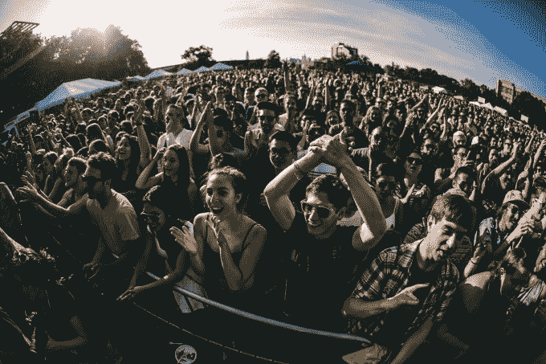
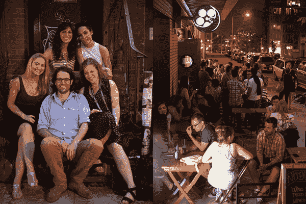

# Zealot Networks 收购了位于布鲁克林的媒体和活动公司 north side Media Group 

> 原文：<https://web.archive.org/web/https://techcrunch.com/2015/06/04/zealot-networks-buys-brooklyn-based-media-and-events-company-northside-media-group/>

丹尼·扎平的[狂热者网络](https://web.archive.org/web/20221007113400/http://www.zealotnetworks.com/)合并了洛杉矶新媒体的浮华和布鲁克林的时髦，收购了位于布鲁克林的媒体和活动迷你帝国[北区媒体集团](https://web.archive.org/web/20221007113400/http://www.northsidemediagroup.com/)。

由 Scott 和 Daniel Stedman 兄弟创建的 Northside Media 出版了 [L 杂志](https://web.archive.org/web/20221007113400/http://www.thelmagazine.com/)、 [Brooklyn 杂志](https://web.archive.org/web/20221007113400/http://www.bkmag.com/)，并组织了 [Northside Festival](https://web.archive.org/web/20221007113400/http://www.northsidefestival.com/) 等活动，这是一个为期六天的音乐、艺术、电影和技术盛会(类似于 SXSW)。

自 2000 年代中期以来，这两家公司一直是布鲁克林的支柱和支持者(推而广之，也是威廉斯堡的支柱和支持者)，并利用他们不断扩大的出版和活动平台来宣传他们对该区的愿景，即“一个国际形容词，意思是‘下一步是什么’。”

现在，由于与 Zealot 的合并，这两家公司有机会将这种敏感性带给更广泛的观众。

“我们真的专注于围绕基于激情的社区建立一家娱乐和媒体公司，无论是在网上还是在现实世界中，”Maker Studios 的前首席执行官扎平说。

在 Zealot，扎平一直在进行一连串的收购，建立了一个代理和媒体资产组合。

“我们在 Zealot 有一个三阶段计划，”Zappin 说。第一阶段是建立人才管理机构、品牌和广告公司 [Lord Danger](https://web.archive.org/web/20221007113400/http://lorddanger.com/) ，以及现在的 Northside Media。今年下半年，Zappin 打算制作更多内容，并构建公司的数字出版网络。

> 我们是一家社区建设公司，对我们理解和钦佩的社区充满热情。斯科特·斯特德曼

通过收购 Northside(现金和 Zealot 股权的组合)，Stedman 兄弟仍将使用他们建立的品牌，但会将 Northside 的内容和活动带入新的地域。

Scott Stedman 说:“对我们来说……在我们成立之初，我们的核心是一家本地媒体公司和一家地区媒体集团。“我们已经将我们的业务从一个区域性媒体集团转变为一家公司，该公司利用相关社区，为他们开发产品，并在任何相关的地方应用这些产品。”

该公司无疑取得了长足的进步。最初是一份免费的每周印刷杂志，专注于并迎合新抵达布鲁克林(更具体地说是威廉斯堡、绿点和后来的布什威克)的 L-train 特遣队，现在是一家多媒体公司，在纽约和芝加哥赞助[食品和文化活动](https://web.archive.org/web/20221007113400/http://taste-talks.com/)，经营两家杂志和网站，并在布鲁克林举办[文化节](https://web.archive.org/web/20221007113400/http://www.northsidefestival.com/)。

“我们是一家社区建设公司，对我们理解和钦佩的社区充满热情，”斯特德曼说。

在 Zealot 的支持下，Stedman 希望通过开发国际版的 Northside festival 和将公司的季刊《Brooklyn magazine》转变为月刊来发展这个社区。

“因为传统的媒体收入模式已经变得令人困惑，这迫使公司真正评估人们消费媒体的方式。斯特德曼说:“出版商正试图采取一种更全面的方法，为这些不同的社区提供体验。

