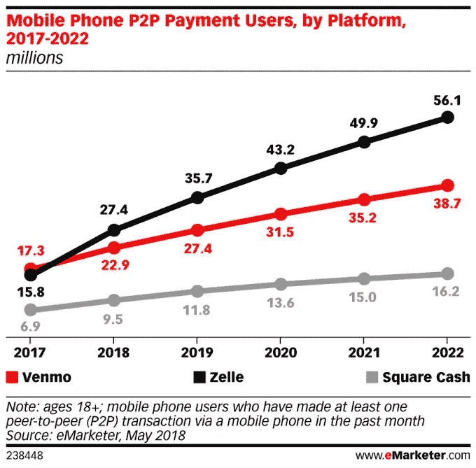
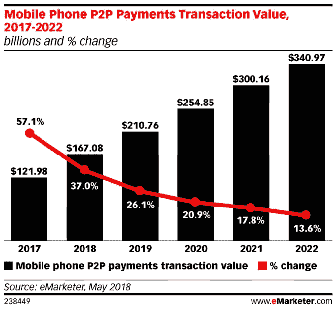

# Zelle 预测今年将超过 Venmo 

> 原文：<https://web.archive.org/web/https://techcrunch.com/2018/06/15/zelle-forecast-to-overtake-venmo-this-year/>

根据 eMarketer 的最新预测，尽管对骗子采用新支付服务有些担忧，但新支付服务 [Zelle](https://web.archive.org/web/20221025222644/https://www.zellepay.com/) 今年将超过竞争对手 Venmo。该公司预计 Zelle 在 2018 年将增长 73%以上，在美国达到 2740 万用户，超过 Venmo 的 2290 万用户。Square Cash 将有 950 万用户。

这种增长不一定归因于用户偏好，而是普遍存在。

Zelle 得到了 30 多家美国银行的支持，这是他们从包括 Venmo、PayPal 和 Square Cash 在内的其他支付应用中赢得用户的手段。几年来，这些银行一直想开发自己的替代应用，但直到最近这些努力才获得了动力。Zelle [网站](https://web.archive.org/web/20221025222644/https://www.zellepay.com/partners)现在声称有 100 多家金融机构参与，还有处理器合作伙伴 CO-OP Financial Services、FIS、Fiserv 和 Jack Henry，以及网络合作伙伴 VISA 和 MasterCard。

参与的银行现在将 Zelle 集成到他们自己的网站和移动应用程序中，这意味着用户在使用他们现有的银行应用程序时可以找到 Zelle。在很多情况下，他们不会直接去寻找。

eMarketer 预测分析师辛迪·刘(Cindy Liu)解释说:“新应用面临的主要障碍之一是建立信任和大量受众。“但 Zelle 已经跳过了采用的早期阶段，因为它具有嵌入到参与银行现有应用程序中的优势，”她说。

今年早些时候，Zelle 表示，它以每天 10 万名消费者的速度注册用户，并声称它在 2017 年处理了 2.47 亿笔支付，总额为 750 亿美元。这是 P2P 支付市场的一大块。

Emarketer 的预测估计，2018 年美国 p2p 移动支付用户总数将增长 30%，达到 8250 万人，占美国智能手机用户的 40.5%。它还预计 p2p 移动支付的总交易额今年将增长 37%，达到 1670.8 亿美元。到 2021 年，这一数字将超过 3000 亿美元。

这就给所有的服务留下了空间来开拓他们的市场份额，即使 Zelle 最终领先。