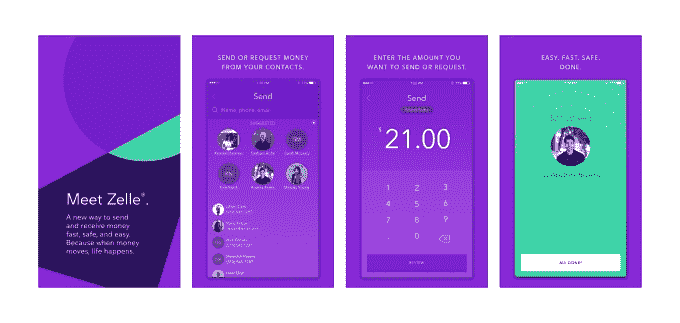
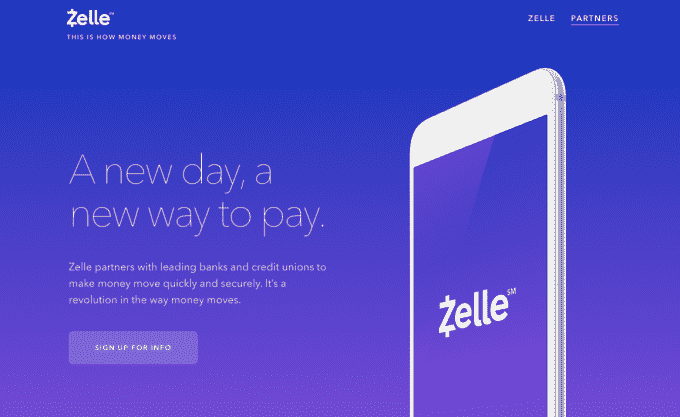

# 美国银行 Venmo 的竞争对手 Zelle 将于下周发布其移动应用 

> 原文：<https://web.archive.org/web/https://techcrunch.com/2017/09/08/zelle-the-u-s-banks-venmo-rival-will-launch-its-mobile-app-on-monday/>

得到 30 多家美国银行支持的贝宝竞争对手[Zelle](https://web.archive.org/web/20221208105118/https://beta.techcrunch.com/2017/06/12/zelle-the-real-time-venmo-competitor-backed-by-over-30-u-s-banks-arrives-this-month/)，正准备在 9 月 12 日星期二推出其独立的移动应用。此举旨在让美国银行业在个人对个人支付业务中获得立足点，在这一领域，他们正在被 PayPal、Venmo、Square Cash 等服务以及很快将推出的由 Apple Pay 支持的[苹果 iMessage 所取代。](https://web.archive.org/web/20221208105118/https://beta.techcrunch.com/2017/06/05/you-can-now-send-your-friends-money-inside-imessage/)

尽管银行一直都提供即时转账的功能，但迄今为止，这一过程更为繁琐。例如，用户可能需要朋友的账号和路由信息等详细信息。这导致了替代汇款方式的诞生，比如今天的支付应用，你只需要知道用户名、电话号码或电子邮件等信息。

同样，Zelle 的新应用程序将允许用户只使用他们的电话号码或电子邮件向他们的联系人发送和请求金钱。它还可以与美国 Visa 和 MasterCard 银行借记卡一起使用，即使用户的银行尚未加入 Zelle 的支付网络。

该网络自 2011 年以来一直在工作，当时美国银行、富国银行和摩根大通首次合作开发一种数字支付解决方案，允许他们的客户通过当时名为 clearXchange 的合资企业相互汇款。该财团拖拖拉拉，但去年加快了势头，并更名为消费者友好的“Zelle”。

今年 6 月，Zelle [宣布](https://web.archive.org/web/20221208105118/https://beta.techcrunch.com/2017/06/12/zelle-the-real-time-venmo-competitor-backed-by-over-30-u-s-banks-arrives-this-month/)将在参与金融机构的移动银行应用程序中提供。据运营 Zelle 网络的大型银行牵头的财团预警服务(Early Warning Services)称，到目前为止，已有 13 家银行和信用社在自己的移动应用程序中增加了对 Zelle 的支持，还有 17 家银行计划与 Zelle 连接。

自推出以来，Zelle 表示，受支持的银行和信用合作社的新客户注册量增加了 300%，平均每天有超过 50，000 名新客户注册 Zelle。更大的计划是将 Zelle 带给美国 8600 万移动银行消费者。

在周一推出的新应用中，Zelle 用户将能够免费向对方发送即时资金，前提是双方都注册了 Zelle。

然而，如果收件人无法通过他们的银行或信用合作社访问 Zelle，交易将需要 1 到 3 天才能完成。但与 PayPal 和 Venmo 不同的是，转账会更快地打到对方的银行账户上——收款人无需经过最后的“转账到银行”步骤就能获得资金。

Zelle network 已经拥有相当大的用户群，可以进行即时支付。今年上半年，通过预警连接的银行处理了 1 亿笔即时支付，总计 336 亿美元——主要是在 Zelle 推出之前。

然而，Venmo [去年处理了](https://web.archive.org/web/20221208105118/http://www.marketwatch.com/story/paypal-partnerships-pay-off-and-venmo-could-take-off-next-2017-04-26)176 亿美元的移动支付，并且这个数字还在增加。在 Q2，Venmo [的交易额达到 80 亿美元](https://web.archive.org/web/20221208105118/https://www.recode.net/2017/7/26/16044528/venmo-8-billion-transaction-volume-growth-rate-chart)，是去年同期的两倍。今年上半年，Venmo[的支付总额为](https://web.archive.org/web/20221208105118/https://in.reuters.com/article/us-usa-banks-payments-zelle/u-s-banks-move-to-broaden-reach-of-zelle-instant-payments-app-idINKCN1BJ1GO)148 亿美元。

同样拥有 Venmo 的 PayPal 一直在努力应对 Zelle 的威胁。它在 6 月份宣布，它还将向 PayPal 和 Venmo 提供即时银行转账服务，但将收取 0.25 美元的固定费用。到目前为止，只有 PayPal 上线了这项新功能。

更正:应用程序在周二发布，而不是周一。为这个错误道歉。