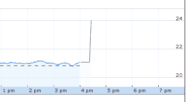

# Zendesk 股价上涨 12%,此前其第三季度收益超出预期，第四季度收益高于市场预期 

> 原文：<https://web.archive.org/web/https://techcrunch.com/2015/11/03/zendesk-spikes-12-after-its-q3-earnings-top-expectations-and-its-q4-guidance-lands-above-street-estimates/>

# Zendesk 股价上涨 12%,此前其第三季度收益超出预期，第四季度收益高于华尔街预期

今天，Zendesk [公布了其第三季度的财务表现，包括 5570 万美元的收入和调整后的每股收益为负 0.05。](https://web.archive.org/web/20221209141449/http://investor.zendesk.com/ir-home/financial-reports/financial-releases/financial-releases-details/2015/Zendesk-Announces-2015-Third-Quarter-Results/default.aspx)

投资者此前预计该公司收入为 5224 万美元，每股亏损 0.09 美元。在常规交易中上涨了大约一个百分点，在盈利击败之后，Zendesk 在盘后交易中上涨了 12%以上。

此前，Zendesk 曾引导投资者预计第三季度营收在 5100 万美元至 5300 万美元之间。该公司有记录的业绩比去年同期增长了 64%。投资者往往会为这种增长欢呼。

Zendesk 本季度亏损。使用正常的会计技术，该公司亏损 1880 万美元，或每股 0.22 美元。上面提到的调整后的每股亏损为 410 万美元。少了，但还是物质。

该公司为其第四季度提供了指导:

分析师曾预计该公司第四季度总收入约为 5745 万美元。因此，Zendesk 是他们的最爱。

总而言之，Zendesk 不仅超出了第三季度的预期——内部和外部都是如此——还提前为该日历年的最后一个财政期设定了指导。投资者对它的股票做了如下的事情:

或者，用非 GAAP 术语来说，这是 Zendesk 回顾的跟踪估计:

