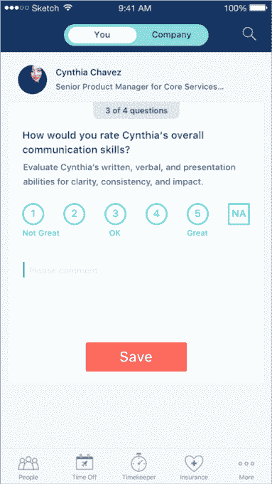

# Zenefits 推出绩效管理工具 

> 原文：<https://web.archive.org/web/https://techcrunch.com/2017/10/11/zenefits-rolls-out-a-performance-management-tool/>

# Zenefits 推出了一个性能管理工具

当我们最后一次看到 Zenefits 时，该公司基本上将其最初的核心卖点之一——保险经纪——交给了合作伙伴。自从更名推出以来，Zenefits 似乎一直在遵循点滴更新的方式，许多初创公司试图为核心员工体验创造一个“家”。

如今，随着员工绩效跟踪系统的推出，这一趋势得以延续。该系统是公司内部开发的，旨在为小企业的人力资源提供一站式服务。这包括评论、目标，该公司表示，最终还将纳入签到和同行评议。在较小的公司，这些可能经常看起来是疏忽或事后想法，但 Zenefits 似乎希望简化流程，并将这些复杂的企业行为引入较小的企业。

该公司在大规模更名过程中放弃保险经纪业务的部分原因也是为了帮助它与公司一起成长。随着创业公司和小企业变得越来越大，开始与当地经纪人或其他提供商合作处理他们的保险更有意义。首席执行官杰伊·富尔切当时表示，这是一个症结，导致公司从平台中毕业的潜在风险，可以这么说，因为他们可能认为这是一种入门费。

首席运营官·杰夫·卡尔说:“我们的客户多次提出这一要求，今年对 Q2 的 300 多名客户进行了调查，其中超过 93%的客户对这一领域感兴趣。“随着客户将 Zenefits 视为他们的人力资源合作伙伴，而不仅仅是他们的经纪人，我们希望确保我们能够提供更多功能。”

因此，随着 Zenefits 与这些小企业一起成长，随着组织结构图变得越来越大，他们会越来越多地要求这样的工具。Zenefits 越来越多地利用合作伙伴来处理一些它不想处理的细节问题。但如果它想融入企业和人力资源经理的日常使用案例和活动，它还需要确定一些应该自己摘下的低挂果实。