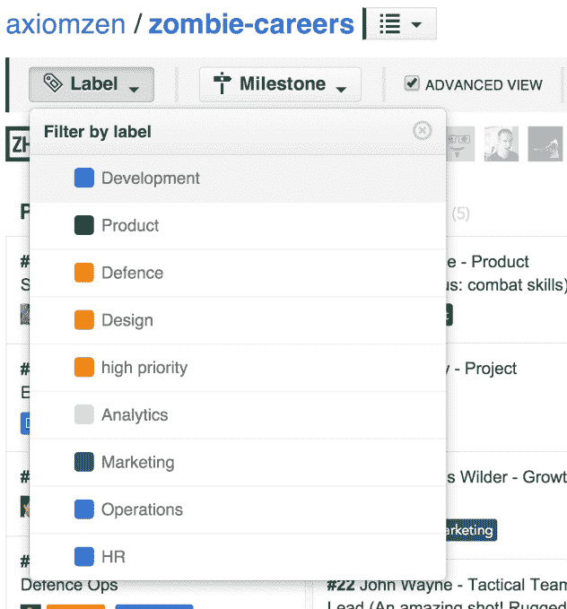

# ZenHub 帮助工程团队管理他们的 GitHub 项目

> 原文：<https://web.archive.org/web/https://techcrunch.com/2014/10/27/zenhub-helps-engineering-teams-manage-their-github-projects/>

# ZenHub 帮助工程团队管理他们的 GitHub 项目

GitHub 现在足够受欢迎，其他公司也开始围绕它构建服务。ZenHub 是最新的一个项目，旨在让使用 GitHub 变得更快更容易。通过 ZenHub，团队可以获得与 GitHub 深度集成的项目管理服务，并为他们提供类似于 [Trello](https://web.archive.org/web/20230322053941/http://trello.com/) 的拖放任务板、任何类型文件的轻松上传(GitHub 的界面默认只允许上传图像文件)和+1 按钮，用于提供关于提交、拉请求、建议和评论的快速反馈。

 ZenHub 是由位于 [Axiom Zen](https://web.archive.org/web/20230322053941/https://axiomzen.co/) 的团队开发的，这是一家科技孵化器和创业铸造公司，在温哥华和三藩市设有办事处。它现在只能作为 Chrome 的扩展版本使用，但是该团队承诺在不久的将来也会推出 Firefox 插件。这项服务对个人开发者、非营利组织和开源项目是免费的。将它用于商业项目的团队将不得不付费。

重点主要是开发人员，但易于使用的界面也允许业务用户在 GitHub 中管理他们的工作流程，这可能会消除公司对任何其他第三方管理工具的需求。

虽然这项服务今天正式推出，但在测试阶段，该团队已经与 300 多家公司签约。一些更著名的用户包括 NBC News、微软、Xamarin 和房地产初创公司 Retsly 的团队，Retsly 最近被 Zillow 收购。“Zenhub 确实帮助我们的团队优化了 GitHub 中的敏捷工作流，而没有增加托管项目管理工具经常带来的额外流程和开销，”Retsly 的联合创始人凯尔·坎贝尔(Kyle Campbell)在今天的一次采访中说。

其他工具，如开源项目 [Waffle.io](https://web.archive.org/web/20230322053941/https://waffle.io/) (甚至微软，现在通过其 Visual Studio 工具支持 Git)也为 GitHub 上的开发人员提供了一套类似的工具。然而，与 ZenHub 不同的是，他们倾向于更直接地关注开发人员，而 ZenHub 似乎在项目管理方面有更大的野心。